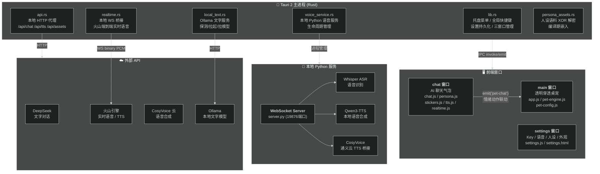
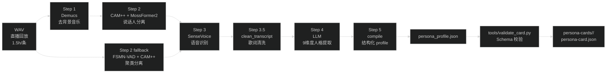

# 元元桌宠 · AI 角色扮演体验分析报告与改进路线图

> 本文档基于对仓库当前代码（`src/`、`src-tauri/`、`shared/`、`scripts/`）的通读式评审产出，**不包含任何代码改动**，仅供后续立项决策参考。所有诊断与建议均标注了对应的代码位置，避免空泛建议。
>
> 实时语音、自然打断、流式管线和情绪语音的深入调研已拆分到 [《实时语音与情绪语音优化路线图》](./roadmap-realtime-voice.md)。本文件只保留角色扮演视角下的摘要，避免两份技术方案漂移。

---

## 目录

1. [现状总览](#1-现状总览)
2. [分方向问题诊断](#2-分方向问题诊断)
3. [具体可行特性建议清单](#3-具体可行特性建议清单)
4. [优先级与路线图](#4-优先级与路线图)
5. [风险与注意事项](#5-风险与注意事项)
6. [其他优化建议与特性想法](#6-其他优化建议与特性想法)
7. [变更日志](#7-变更日志)
8. [人设蒸馏管道参考文档](#8-人设蒸馏管道参考文档)

---

## 1. 现状总览

### 1.1 架构速览



> **图例**：实线箭头表示数据/指令流。前端窗口通过 Tauri IPC 与 Rust 主进程通信，主进程代理所有外部 API 调用并管理本地服务生命周期。chat 窗口通过 `pet-chat` 事件驱动主窗口桌宠的动作和表情。

**关键约束**：`src/ai/persona.js`、`stickers.js`、`tts.js`、`persona-assets.js` 由 `scripts/sync-ai.mjs` 从上游同一作者维护的 web 工程 `kxyy_ai_clone` **单向同步而来**（`realtime.js`/`pcm-worklet.js`/`avatars.js` 是桌面端专属，不参与同步）。这意味着：**对这几个文件的任何"契约级"改动（新增导出函数签名、改变 system prompt 结构）都需要考虑下次 `sync-ai` 时是否会被覆盖**，这是贯穿本报告的重要工程约束。

### 1.2 AI 能力矩阵

| 能力 | 云端选项 | 本地选项 | 代理落点 | 备注 |
|---|---|---|---|---|
| 文字对话 | DeepSeek (`deepseek-chat`/`deepseek-reasoner`) | Ollama (`qwen3:8b/14b/32b`) | `api.rs::proxy_chat` | 流式 SSE，`Settings.text_provider` 切换 |
| 看图(VL) | 通义千问 VL (`qwen3-vl-plus`) | Ollama VL (`minicpm-v:8b` 等) | `api.rs` | 先识图转文字描述，再走文字模型人设化 |
| 语音合成 | 火山引擎 / CosyVoice(通义云) | 本地 Qwen3-TTS (PyTorch/MLX) | `api.rs::/api/tts` 转发 | 三选一，`Settings.realtime_backend` |
| 实时语音通话 | 火山端到端实时语音大模型 | 本地 Qwen3-TTS + Whisper + 当前文字 provider / CosyVoice 通义云桥接 | `realtime.rs`（火山）或本机 Python WS（本地/CosyVoice） | 0.2.15 起复用 `textProvider`；0.2.18 起使用有界句级管线与严格有序播放；0.2.19 起本地/CosyVoice 协商 managed 下行身份；0.2.20 起 Worklet-only 本地/CosyVoice 支持 candidate-bound 临时提示；0.2.21 起 CosyVoice、0.2.22 起 macOS MLX Qwen 可独立协商 24k PCM 单路真流式；0.2.23 起 debug 区可复制有界隐私安全诊断 JSON；0.2.24 仅补未接线的 VAD adapter/synthetic provenance 纯状态基础，线上仍用 RMS；Windows/Linux Qwen/legacy/火山保持原路径；朗读与通话**共用同一个语音后端选择** |
| 长期记忆 | — | `localStorage`（按昵称分档） | `persona.js` | 仅浏览器本地，无跨设备同步 |
| 会话摘要 | 复用文字模型 | 同上 | `persona.js::updateRollingDigest` | 滚动摘要覆盖超窗口旧对话 |
| 人设语料 | — | 编译期加密嵌入 | `persona_assets.rs` | **单一人设**，见 2.1 |

### 1.3 三窗口与联动机制

- **main**：透明穿透桌宠，`pet-engine.js`（webmeji 移植）驱动帧动画，`pet-config.js` 用 `registerPet()` 注册角色（固定动作集：`walk/sit/dance/trip/forcethink/pet/drag/falling/fallen/climbSide/climbTop/hangstillSide/hangstillTop/jump`）。
- **chat**：AI 聊天气泡，`chat.js` 单文件承担了 UI 渲染、请求编排、TTS 队列、实时通话、记忆落盘、debug 面板等几乎全部逻辑（1300+ 行）。
- **settings**：表单式配置页，`src-tauri/src/lib.rs` 的 `Settings` struct 是唯一配置源（camelCase serde 持久化到 `settings.json`），新增设置项必须 **Rust struct + `AiSettingsInput` + 前端 html/js** 三处联动才能生效。
- **联动信道**：`chat.js` 在对话各阶段 `emit("pet-chat", {type, emotion})` → `app.js::handlePetChat` → `mapEmotionToAction` 把情绪词映射到桌宠已有动作（`EMOTION_ACTION` 表，仅 6 类动作、约 15 个情绪词覆盖）。

### 1.4 角色（形象）与人设的关系（易混淆点）

- **形象（roster）**：`shared/roster.json` 定义 `kxyy-cyber` / `kxyy-miaojiang` 两套桌宠外观，只是换皮肤/贴图，与说话内容无关。
- **人设（persona）**：`src/ai/persona-assets.js`（开发明文）→ 加密 → `persona_assets.rs` 解密下发的**唯一一份**"开心元元"人设语料（system prompt + few-shot + 直播场境规则等）。
- **当前二者完全独立且人设是单例**——切换形象不会切换人设，也没有切换人设的入口。这是"多角色扮演"能力的核心限制，详见 2.1。

---

## 2. 分方向问题诊断

### 2.1 角色扮演深度

| 现状 | 具体缺口（代码证据） | 影响 |
|---|---|---|
| AI 只会等用户先说话 | `src/ai/persona.js` 的 `PROACTIVE_HINT` 常量已经写好 `welcome`（观众刚来）、`comeback`（离开又回来）、`idle`（沉默主动搭话）三套完整 prompt 模板，`buildMessages()` 支持 `proactiveKind` 参数；但**全仓搜索确认 `src/chat.js` 仅在两处传入 `proactiveKind`：`"followup"`（1406行）与 `"pat"`（1464行）**，`welcome`/`comeback`/`idle` 从未被调度过。 | AI 角色扮演最有代入感的"主动找你聊天"能力已经在逻辑层写好，只差桌面端一个触发调度器，是全项目**性价比最高的技术债**。 |
| **直播场景"下班感"过重——对话被直播间框死** | `computeLiveContext()`（第 399-497 行）每轮对话都向 system prompt 注入详细的直播状态机：周一休息日、20:30 开播时间表、PK/打野/梳妆/唱歌/回家段等环节阶段、"距开播还有 X 小时"倒计时等。虽然 `OFF_AIR_NOTE`（第 394 行）已在下播时段禁止播报直播状态，但 system prompt 仍以直播为核心场景构建上下文——AI 每轮都能"看到"这些状态，倾向于用"刚开播呢""一会要下播了""还没开播呢""今天周一休息"作为话头或回应的一部分。用户期望以主播**身份**像朋友日常唠嗑，而非每轮都被提醒"你现在在直播间里"。<br><br>**更新（2026-07-12）**：`computeLiveContext()` 已重构——硬编码的 `20:30` 开播时间和固定阶段流程（PK→打野→唠嗑→跳舞→梳妆→唱歌→回家段）均改为由 `lore.open_time` / `lore.live_stages` 驱动，抽取 `guessStage()` 独立函数。主播侧行为已参数化，但"淡化直播场景、切换为日常聊天模式"的整体体验目标仍需在 P0 中完成 system prompt 层面的语境调整。 | 体验是"在直播间里跟主播聊天"，而非"跟主播像朋友一样聊天"。直播间状态作为默认上下文过于强势，深层原因是 `computeLiveContext` 的逻辑设计之初就是为了给 AI 提供"现在该干什么"的直播脚本，而非"现在跟朋友聊什么"的日常话题提示。**已参数化但未淡化——仍待 P0 工作。** |
| 单一固定人设 | 语料链路：`persona-assets.js`(明文) → `encrypt-assets.mjs`(XOR) → `persona-assets.enc`(编译期 `include_bytes!` 嵌入) → `persona_assets.rs`(运行时解密) → `/api/assets` 一次性下发。整条链路**只支撑一份人设**，没有"人设 ID"概念，也没有存储多份语料的数据结构。<br><br>**更新（2026-07-12）**：`persona_assets.rs` 已重构为"编译期默认 + 运行时动态覆盖"双通道架构——通过 `load_card_from_file()` 从 `persona-cards/<card_id>/persona-card.json` 动态加载人格卡覆盖编译期嵌入的默认值。`Settings.persona_card_id` + `set_persona_card` IPC 命令已在 Rust 侧就绪，**但前端（设置页）尚缺人格卡选择/切换 UI**，暂无法让最终用户直接操作。 | 无法做"多角色切换"（例如同时提供温柔系/毒舌系/职场系人设供用户选），扩展新角色卡需要改代码重新编译，而非配置文件级操作。**后端已支持动态加载，前端 UI 待补齐。** |
| 长期记忆仅"事实/承诺/话题"三类，无结构化元数据 | `persona.js` 的 `memory` 结构只有 `facts`（纯字符串数组）/`promises`/`topics_recent`/`sessions`，无情感状态（好感度、亲密度、当前心情）字段；每条 `fact` 没有时间戳、重要性、提及次数等元数据，无法实现"最近提过就暂时跳过"的冷却逻辑。 | 记忆是"知道什么"，不是"关系如何"；也无法区分"刚记住的事"和"半年前的事"。 |
| **记忆重复提起——同一件事被反复唠叨** | `renderMemoryBlock()`（第 305-328 行）每次将全部 `facts` 注入 system prompt，没有"最近 N 轮已提过"的冷却机制；`SUMMARIZE_SYSTEM`（第 797 行）抽取新事实时也没有"避免与已有事实语义重复"的约束。典型表现：用户说过"去看电影"后，AI 在多轮对话中反复问"你去看电影了没有"——那条 fact 一直在 prompt 里，LLM 每次都想"关心一下"。 | 用户产生"这 AI 怎么老提同一件事"的厌烦感，严重破坏真人唠嗑的真实感。 |
| 观众画像三档但无法自主创建新角色关系模板 | `resolveUserProfile()` 只处理"本人 ππ 完整画像 / 自填字段 / 默认元宝"三种，`persona_relationship`/`persona_facts` 等字段是**扁平文本框**，非结构化数据。 | 关系设定难以复用/导出/分享。 |
| 深聊模式已有但触发面窄 | `detectDeepIntent()` 靠正则匹配"你觉得/展开说"等固定句式，非语义理解。 | 用户换种问法（比如"哎我最近很烦"这种没有疑问词的话）大概率不会触发深聊，体验不稳定。 |

### 2.2 互动玩法

| 现状 | 具体缺口 | 影响 |
|---|---|---|
| 表情包是唯一"轻互动"载体 | `src/ai/stickers.js` 只做"按情绪挑图 + 标记解析"，无游戏化机制（无每日限量、无用户收集/解锁概念）。 | 表情包用完即完，没有持续互动钩子。 |
| 无任何小游戏/任务/签到系统 | 全仓搜索 `songs.js`/"点歌"/签到/成就 关键词均无命中（`CLAUDE.md` 提到"上游若有 songs.js 类似模块"仅为类比说明，本仓库未同步该模块）。 | 用户与桌宠的日常互动强度完全依赖纯聊天，容易新鲜感衰减快。 |
| 拍一拍是唯一的"轻量主动触发"交互 | `chat.js::triggerPat()`，双击头像 + 2.5s 冷却，仅触发一条俏皮回复。 | 交互形式单一，缺少更多"低成本高频"的轻互动（比如摸头、投喂、拖拽反馈之类桌宠层面已有的 `pet`/`drag` 动作，未与聊天玩法结合）。 |
| 无时间驱动的仪式感事件 | `computeLiveContext()` 已经在模拟"直播时间表"（开播/PK/唱歌/下播各阶段），证明"时间驱动内容"这个模式在人设层是成熟的，但没有延伸到**用户侧的日历事件**（生日提醒已有 `birthdayHint()` 但只服务于"元元自己生日"，没有"记住用户生日"的对称能力）。 | 已有时间驱动叙事的技术模式，只服务于 AI 角色单方面叙事，未用于经营用户关系。 |
| **桌宠动作池有限、无养成/成长系统** | `pet-config.js` 仅 14 种固定动作（walk/sit/dance/trip/forcethink/pet/drag/falling/fallen/climbSide/climbTop/hangstillSide/hangstillTop/jump），`pet-engine.js` 的待机动作池 `ORIGINAL_ACTIONS` 只有 walk/spin/sit/dance/trip 五种随机轮换；`playReaction()` 支持外部触发但 `mapEmotionToAction` 仅映射到 6 个动作，无"根据好感度解锁新动作"或"桌宠外观/配件随互动而变化"的养成机制。鼠标悬停触发 `pet` 动画（抚摸）、拖拽触发 `drag` 动画——这两种物理交互已有但未与对话内容绑定（比如 AI 提到"抱抱"时桌宠不做对应动作）。 | 桌宠作为视觉符号的互动深度远低于 AI 聊天本身的对话深度，两只"各玩各的"。养成系统是桌宠类产品最经典的长线粘性机制，当前完全空白。 |

### 2.3 语音/多模态体验

| 现状 | 具体缺口 | 影响 |
|---|---|---|
| 火山实时通话已有快速打断信号，本地通话确认仍偏晚 | 本地后端已用较高 RMS 门槛建立 candidate 并让前端立即 duck/暂停，约 1.05 秒 soft-end/reopen 后提交整段 Whisper；只有 ASR 验证通过才 confirmed 并清空旧回复，误触会 rejected/resume。0.2.24 已补 512-sample 组帧、概率迟滞、generation/fallback 与 synthetic-only manifest 的未接线基础。 | 两阶段让声已有可跑测版本，但 confirmed 仍受句尾和整段 Whisper 限制；真实 scorer、live 接管、candidate 超时、adaptive endpoint 与真实声学 p95 仍待实验。 |
| **本地 ASR 仅支持 Whisper，缺少用户情绪信号** | SenseVoiceSmall 的已发布 checkpoint 支持普通话、粤语、英语、日语、韩语，并输出 SER/AED 标签；官方基准称同参数量下快于 Whisper-Small 5 倍以上、快于 Whisper-Large 15 倍以上。它不是原生真流式，第三方伪流式方案会牺牲精度。 | 适合作为 final ASR + 用户情绪确认层，不应直接承担快速 VAD 或被描述成无损流式替代。 |
| 文字 TTS 已部分情绪化，实时链路仍缺统一编排 | 火山文字 TTS 已传 emotion；CosyVoice 已传自然语言 instruction 和 rate；Qwen3-TTS Base 保持复刻音色但官方不支持 instruction。火山端到端路径主要依赖人设和会话级说话风格。 | 需要统一的 provider-neutral `SpeechStyle`，再按后端能力映射；不能继续把所有后端概括成“没有情绪参数”。 |
| 情绪→动作映射粗粒度 | `app.js::EMOTION_ACTION` 表把 ~15 个情绪词压缩进 6 个既有动作（dance/pet/spin/trip/sit/forcethink），例如"开心""得意""点赞""期待"全部映射为同一个 `dance`。 | 情绪表达的动作区分度低，观感上"AI 情绪很丰富，桌宠动作很单一"。 |
| 表情包与桌宠动作是两条独立通道 | 聊天气泡里出现的 GIF 表情（`stickers.js`）与主窗口桌宠动作（`pet-engine.js`）分别由 `extractSticker()` 和 `mapEmotionToAction()` 各自解析同一个 `[表情:xx]` 情绪词，**逻辑重复但未真正联动**——桌宠动作只是"看起来像"在配合表情，实际是同源不同步的两次独立映射。 | 两个系统各自维护一份情绪词表，容易出现"聊天窗口发了个'尴尬'表情，桌宠却在跳舞"的不一致（因为两表映射规则不保证一致，`EMOTION_ACTION` 与 `stickers.json` 里的情绪词集合本身就没有强制对齐机制）。 |

完整诊断、目标指标、事件契约和实施顺序见 [《实时语音与情绪语音优化路线图》](./roadmap-realtime-voice.md)。

### 2.4 生态/可扩展性

| 现状 | 具体缺口 | 影响 |
|---|---|---|
| 新增桌宠形象已有清晰流程 | `CLAUDE.md`"Adding a pet"章节：改 `roster.json` + `registerPet()` + 素材目录，流程明确。 | 形象扩展性尚可，但**只是换皮肤**，不涉及人设/性格差异。 |
| 新增人设**无任何配置化流程** | 人设是编译期加密嵌入的单一文件，普通用户/社区作者**无法在不改 Rust 代码、不重新编译的情况下**提供新人设。对比"形象"扩展的低门槛，人设扩展门槛極高。 | 这是生态可扩展性的最大瓶颈：桌宠皮肤易扩展，但"性格"完全不可扩展，导致社区难以贡献除画风外的内容。 |
| 表情包扩展依赖上游同步脚本 | `sync-ai.mjs` 同步表情素材与清单，本仓库自身没有独立的"新增表情包"工作流（脚本设计目标是保持与上游一致，非供最终用户自定义）。 | 用户想加自己喜欢的表情包目前无正规途径。 |
| 无插件/扩展点设计 | 全仓无 plugin/extension 相关目录或接口约定。 | 若想支持第三方小功能（如自定义小游戏），目前没有可挂载的扩展契约。 |

### 2.5 工程与体验打磨

| 现状 | 具体缺口 | 影响 |
|---|---|---|
| `chat.js` 单文件过重 | 1300+ 行涵盖 UI、请求编排、TTS 队列、通话状态机、debug 面板、记忆落盘等职责，无拆分模块边界。 | 后续新增"主动性调度""好感度系统"等功能会进一步堆积到这一个文件，可维护性下降。 |
| persona 纯函数缺少自动化测试，且无 lint | 实时语音已有不依赖账户/麦克风/模型的 JS、Python、Rust 确定性测试，但 `persona.js` 的拆条、记忆和主动性判定仍缺少专门单测；仓库也没有 lint。 | 实时语音基础有回归保护；后续角色扮演改动仍应先补 persona 纯函数测试。 |
| 设置页是长表单，无人设/角色管理视图 | `settings.html` 六个 `<section>` 平铺，没有"角色卡管理""记忆浏览器"这类可视化管理入口；清空记忆只有一个按钮，无法查看/编辑具体记忆条目。 | 用户对 AI"记住了什么"缺乏可见性和可控性，信任感打折扣。 |
| 本地模型跨平台维护成本高但已有良好抽象 | `voice_service.rs`/`local_text.rs` 已经做了较完善的探测/拉起/日志回传，是本项目工程质量较高的部分，值得复用其模式（状态机 + `-status` 事件推送）扩展到新功能。 | 非缺口，是可复用的**正向资产**，新功能应尽量复用这套"本地服务生命周期管理"范式而非另起一套。 |

---

## 3. 具体可行特性建议清单

> 复杂度分级：**小**（1 个文件内小范围改动，纯前端逻辑，1 天内）／**中**（跨 2-3 个文件，可能涉及新 `Settings` 字段，2-5 天）／**大**（涉及 Rust 端新能力/新窗口/新本地服务，1-2 周+）

### 3.1 角色扮演深度

| 特性 | 说明 | 价值 | 涉及文件 | 复杂度 |
|---|---|---|---|---|
| **接入 idle/welcome/comeback 主动性调度** | 在 `chat.js` 新增一个轻量计时器/状态机：窗口打开时判定是"首次打开(welcome)"还是"隔了一段时间再打开(comeback)"；聊天窗口保持打开且用户静默超过阈值（如 90s）触发一次 `idle`。复用已有的 `getProactiveUserTrigger()` / `PROACTIVE_HINT` / `buildMessages({proactiveKind})`，无需改 `persona.js`。 | 直接激活已经写好但沉睡的"AI主动找你聊天"能力，是投入产出比最高的一项，能立刻让互动感从"你问我答"变成"她也会主动搭话"。 | `src/chat.js`（新增调度逻辑）；只读依赖 `src/ai/persona.js` | 中 |
| **人设情感状态（好感度/心情）字段** | 在 `memory` 结构追加 `affinity`（数值好感度）与 `mood`（当前心情枚举），由 `updateMemoryAfterSession()` 的总结 LLM 调用顺带产出，渲染到设置页或聊天窗口一个小指示器。 | 把"记忆"从"知道什么事"升级为"关系状态"，为后续好感度玩法（3.2）打基础。 | `src/ai/persona.js`（扩展 `memory` schema 与总结 prompt）、`src/chat.js`（读取展示） | 中 |
| **多人设配置化（人设包）** | 设计一个"人设包"JSON 格式（system prompt + few-shot + 直播场境规则等，结构对齐现有 `assets` 形状），支持用户在设置页导入/切换；默认仍保留内置加密人设为"官方默认包"，新增人设包以**明文本地文件**形式存放（不加密，因为是用户自制内容，无版权顾虑）。 | 从"单一人设"跃升到"可切换人设"，是长期生态价值最大的一项，但需要设计新的存储/加载/切换机制，改动面较大。 | `src-tauri/src/lib.rs`(新 `Settings.persona_pack_id` 字段+IPC)、`src/ai/persona.js`(`loadAssets()` 增加来源分支)、`src/settings.html/js`(管理 UI) | 大 |
| **结构化关系画像编辑器** | 把 `personaFacts`/`personaJokes` 等自由文本框升级为"标签式"结构化输入（类似待办列表：facts 逐条可增删而非一个 textarea），复用现有 `renderUserBlock()` 渲染逻辑，只改前端输入方式。 | 降低用户填写门槛，减少格式错误（当前多行文本框容易出现空行/格式不一致）。 | `src/settings.html/js` | 小 |
| **语义化深聊触发（补充正则方案）** | 在现有 `detectDeepIntent()` 正则基础上，增加一个轻量判定：若上一条 AI 回复已经很短且用户新消息字数明显长（如 >40 字且无明显情绪词），也判定为深聊倾向，作为正则的补充而非替换。 | 提升深聊模式触发的召回率，成本很低。 | `src/ai/persona.js::detectDeepIntent` | 小 |
| **淡化直播场景、切换为"主播日常聊天"模式** | 修改 `computeLiveContext()`：**仅保留时间/星期/日期等纯时间信息**，去掉全部直播状态机（开播时间表、环节阶段、PK/打野/梳妆/唱歌进度、周一休息提醒、"距离开播还有X小时"等）。改为注入一个"日常状态提示"：告知 AI 现在是几点、星期几，不用主动聊直播——但被问起时可以自然地聊直播相关话题。同时在 system prompt 中强调：**你是主播，但你现在是以朋友身份聊天，不是在工作**。这一调整可以直接让 AI 从"直播打工人"视角切换到"日常闲聊的朋友"视角。 | 解决用户最核心的体验痛点——AI 不再每轮围绕直播间状态说话，聊天更自然、更松弛。"主播"身份作为背景保留，但日常以朋友唠嗑为主。改动集中在单一函数内，副作用可控。 | `src/ai/persona.js::computeLiveContext` | 中 |
| **记忆元数据化 + 冷却 + 去重** | 三步改进：① **Fact 元数据化**：将 `facts` 从 `string[]` 升级为 `{text, first_seen, last_mentioned, mention_count}[]`，在 `renderMemoryBlock` 中实现冷却逻辑——`mention_count >= 2` 且最后一次提及在最近 3 轮内的 fact 自动跳过不注入 prompt。② **抽取去重**：在 `SUMMARIZE_SYSTEM` 中增加"若新事实与已有事实语义重复/高度相近，请写 clear、不要重复抽取"的约束。③ **prompt 注入策略优化**：`renderMemoryBlock` 不再全量注入，改为优先级排序：最近 3 次会话内新增的 + 从未在对话中被提及过的 fact 排前面；已被反复提及的事实排后面或暂不注入。 | 解决"AI 老提同一件事"的厌烦问题，同时保持记忆的有效性——AI 仍然记得，但不会每轮都拿出来说。P0 级别体验问题，改动仅在 `persona.js` 内部，且向后兼容（读取旧格式 `string[]` 自动升级为带元数据格式）。 | `src/ai/persona.js`（`memory` schema、`renderMemoryBlock`、`updateMemoryAfterSession`、`SUMMARIZE_SYSTEM`） | 中 |
| **扩展记忆层级：事实/承诺/观点/偏好** | 在现有 `facts`/`promises`/`topics_recent` 之外，增加 `opinions`（用户对某些事物的看法）和 `preferences`（从对话中抽取的用户偏好/习惯，区别于手动填写的 `userProfile.preferences`）。这两类信息来自对话自然抽取，不需要用户主动填写。同时重构 `SUMMARIZE_SYSTEM` 的 JSON schema 使其产出更结构化的分类。 | 让 AI 从"知道用户几件事"升级为"了解用户是个什么样的人"——这是角色扮演是否像"熟人"的关键区别。 | `src/ai/persona.js`（`memory` schema、`SUMMARIZE_SYSTEM`） | 中 |

### 3.2 互动玩法

| 特性 | 说明 | 价值 | 涉及文件 | 复杂度 |
|---|---|---|---|---|
| **好感度系统（轻量版）** | 基于 3.1 的 `affinity` 字段，设定几个阈值（如 0-100 分 5 档：初识/熟悉/朋友/挚友/知己），不同档位解锁不同 few-shot 语气或专属表情/称呼变化，通过 `renderMemoryBlock()` 注入 system prompt 告知模型当前关系档位。 | 给长期互动一个"看得见的进展"，是角色扮演类产品最经典且验证有效的粘性机制。 | `src/ai/persona.js`（好感度计算与渲染）、`src/chat.js`（UI 展示，如气泡区角标） | 中 |
| **每日签到 / 每日一句** | 每天首次打开聊天窗口时，AI 主动发一条"今日签到"话术（可复用 welcome 主动性调度的触发点，见 3.1 第一条），签到累计天数存本地，达到里程碑（7/30/100天）触发特殊台词。 | 低成本、高频的召回钩子，实现上直接搭在"welcome 主动性"这个基建之上，几乎是零增量成本的延伸功能。 | `src/chat.js`（签到计数逻辑，`localStorage`） | 小 |
| **摸头/投喂互动扩展拍一拍机制** | 桌宠动画已有 `pet`（抚摸触发）动作，`app.js` 已监听鼠标悬停触发抚摸动画；可扩展"投喂"手势（比如往桌宠拖拽一个食物图标触发进食动画+专属台词），复用现有 `drag`/`pet` 动作与 `triggerPat()` 的"主动回复"模式。 | 利用已有动画资源做低成本的新互动形式，不需要新美术资源。 | `src/app.js`（新增手势判定）、`src/chat.js`（对应台词触发，仿 `triggerPat`） | 中 |
| **记住用户生日/纪念日并主动庆祝** | 对称于现有 `birthdayHint()`（AI 单方面生日提示），在观众画像里加"用户生日"字段，到期时通过主动性调度（3.1）触发专属祝福话术。 | 用已验证的"时间驱动叙事"模式（`computeLiveContext` 同款思路）反过来服务用户关系，实现成本低。 | `src/ai/persona.js`（新 hint 函数）、`src/settings.html`（画像新增字段） | 小 |
| **点歌/小彩蛋指令** | 用户输入特定指令（如"唱首歌"）时，AI 按人设里已有的"唱歌梗"（`computeLiveContext` 提到的"回家段唱马马嘟嘟骑/虫儿飞"）给出对应彩蛋台词+可选表情，不需要真实音频合成新内容，纯 prompt 层彩蛋。 | 低成本复用已有人设梗，制造"懂梗"的惊喜感。 | `src/ai/persona.js`（新增触发词识别与 hint） | 小 |
| **桌宠养成系统（轻量版）** | 基于好感度系统（3.1），当好感度跨越阈值时解锁：① 新桌宠动作（如 `eat` 进食动画、`sleep` 打盹动画、`wave` 挥手动画，素材需配套新增）；② 专属称号/称呼变化（如从"元宝"升级到"老朋友"）；③ 徽章展示（在主窗口桌宠旁或 chat 窗口角标展示小图标）。新增一个 `src/ai/pet-affinity.js` 模块管理养成逻辑，保持与 `persona.js` 的 `affinity` 字段联动但职责分离。 | 桌宠类产品最经典的长线粘性机制（参考 QQ 宠物、旅行青蛙），让"每天来看看元元"有可量化的进展感。 | `src/ai/pet-affinity.js`（新增）、`src/pet-config.js`（新增动作注册）、`src/app.js`（好感度驱动的动作解锁） | 大 |
| **投喂/小游戏互动增强** | 在桌宠主窗口增加右键菜单或快捷按钮：① "投喂"——拖拽或点击零食图标到桌宠上，触发进食动画 + AI 回复一条俏皮话（复用 `triggerPat` 模式）；② "猜拳"——在 chat 窗口发"来猜拳"，AI 识别后启动一轮剪刀石头布（纯 prompt 层，AI 出拳 + 判定胜负 + 小情绪反馈）；③ "骰子"——让 AI 掷骰子（在 `system prompt` 中告知"当用户要你掷骰子/猜拳时，用 [动作:xxx] 标记触发桌宠动画"）。 | 利用既有基础设施做低成本新互动，不需要新美术资源（猜拳/骰子是纯文本玩法），但能明显提升"和桌宠玩"的趣味性。 | `src/chat.js`（小游戏指令识别）、`src/ai/persona.js`（新增 hint 模板） | 中 |
| **桌宠待机动作多样性扩展** | 扩展 `pet-config.js` 的 `ORIGINAL_ACTIONS` 池：增加权重化随机（walk 高权重、trip 低权重），新增几个低成本的"装饰性"动作（如 `blink` 眨眼——单帧切换即可模拟、`lookAround` 左右张望——用 walk 的少数帧即可）。同时区分"用户正在聊"与"用户静默"两套待机行为：聊天时可以用更安静的 sit/stand，静默时可以更多 walk/dance。 | 不增加新素材也能丰富桌宠的"活物感"。当前轮换池只有 5 种动作，观感很快重复。 | `src/pet-config.js`、`src/pet-engine.js`（待机行为逻辑） | 小 |
| **与对话内容联动的桌宠动作触发** | 在 `chat.js` 新增一个"AI 回复文本解析 → 触发桌宠特定动作"的钩子：当 AI 回复中出现 `[动作:xxx]` 标记时（如 `[动作:抱抱]` → 播放 pet 动画、`[动作:生气]` → 播放 sit + 转身背对），桌宠执行对应动作。与现有 `[表情:xx]` 标记并行但独立——表情控制聊天窗口 GIF，动作控制主窗口桌宠。 | 让桌宠"演"出 AI 说的内容，而非只是一个在屏幕边缘走动的装饰品。这是"角色扮演≠纯聊天"的核心体验增量。 | `src/chat.js`（解析与事件发送）、`src/app.js`（新增动作映射）、`src/ai/persona.js`（在 system prompt 中教会 AI 使用新标记） | 中 |

### 3.3 语音/多模态体验

| 特性 | 说明 | 价值 | 涉及文件 | 复杂度 |
|---|---|---|---|---|
| **统一情绪→动作/语音映射表** | 把 `app.js::EMOTION_ACTION` 与 `stickers.json` 的情绪词集合合并为一份权威映射（可放在 `shared/` 下新建 `emotion-map.json`，Rust 与前端共用，类似 `roster.json` 的模式），扩大动作覆盖粒度（例如给"生气"和"害怕"分开映射而非都用 `trip`）。 | 解决当前"两套独立映射易不一致"的问题，是 2.3 诊断的直接对症方案，且复用了项目已有的"共享 JSON 供 Rust+前端"模式（`roster.json` 先例）。 | 新建 `shared/emotion-map.json`、改 `src/app.js`、`src/ai/stickers.js` | 中 |
| **两阶段自然打断** | 先将播放迁移到可暂停/恢复/清空的 AudioWorklet；疑似人声在 150–250ms 内降音，400–700ms 内经神经 VAD 确认后取消全管线，误触则恢复缓冲。 | 同时解决本地抢话和“为了防误触只能延迟数秒”的矛盾，是实时语音最高优先级。 | 详见 [实时语音专项路线图](./roadmap-realtime-voice.md) P1 | 大 |
| **打断后的自然对话上下文** | 0.2.20 已在实际启用 Worklet 的本地/CosyVoice 上按 candidate 绑定精确 source sample 快照；同 candidate confirmed、当前登记句段已播放至少 1 秒时，只向下一次 LLM 请求注入固定临时提示。提示不进 history/recap/长期记忆/日志；legacy、旧端和火山无提示降级。仍不恢复字、音素或部分句文本。 | 避免模型把用户未听到的尾句视为已知，也避免机械化“你打断我”话术。 | 详见 [实时语音专项路线图](./roadmap-realtime-voice.md) 4.6 | 中 |
| **统一 `SpeechStyle` 与情绪后端映射** | 供应商无关地记录 emotion/intensity/pace/source/confidence；火山映射 emotion/角色风格，CosyVoice 映射 instruction/rate，Qwen Base 验证多情绪参考 prompt，CustomVoice 作为可选高表现力模式。 | 保持复刻音色优先，同时允许用户选择更强的情绪表现力。 | 详见 [实时语音专项路线图](./roadmap-realtime-voice.md) 第 5 节 | 大 |
| **SenseVoice final ASR + SER 实验** | 先作为句尾识别、用户情绪和音频事件确认层，与独立神经 VAD 配合；不宣称原生真流式，也不在基准通过前替换 Whisper。 | 以可回退方式补全用户语音情绪，降低直接迁移风险。 | 详见 [实时语音专项路线图](./roadmap-realtime-voice.md) 5.4 | 中 |
| **桌宠"待机闲聊气泡"** | 桌宠长时间无互动时，除了聊天窗口内的 idle 主动性（3.1），可让主窗口的桌宠本体偶尔冒出一个极简小气泡（不打开完整聊天窗口，走独立小 IPC/事件），降低"必须点开聊天才有存在感"的门槛。 | 提升桌宠作为"活物"的持续存在感，与聊天窗口的主动性形成互补而非重复。 | `src/app.js`(新气泡渲染)、`src-tauri/src/lib.rs`(可能需要新增极简 IPC) | 大 |

### 3.4 生态/可扩展性

| 特性 | 说明 | 价值 | 涉及文件 | 复杂度 |
|---|---|---|---|---|
| **人设包导入/导出（配套 3.1 多人设）** | 设计一份"人设包"标准 JSON schema 文档 + 校验器，允许用户从文件导入/导出，为社区分享人设卡打基础（本地文件形式，不做云端商店，符合当前隐私优先风格）。 | 是生态扩展性的核心解锁点：一旦人设可配置化，社区自制内容成为可能。 | 依赖 3.1 的多人设机制；新增 `docs/persona-pack-schema.md` 说明文档 | 大（与 3.1 共享工作量） |
| **表情包自定义目录** | 允许用户在设置页指定一个本地文件夹作为"自定义表情包"来源，启动时扫描合并进 `stickers.js` 的 `byEmotion` 索引（用户自定义表情与内置表情共存，按情绪词归类）。 | 用较小改动打开表情包这一最直观的可扩展性入口。 | `src/ai/stickers.js`(支持外部清单合并)、`src-tauri/src/lib.rs`(新增 `Settings.custom_sticker_dir` + 文件系统读取 IPC) | 中 |
| **社区形象素材规范化文档** | 当前 `CLAUDE.md`"Adding a pet"已有流程说明，可进一步整理成独立 `docs/creating-a-pet.md`（面向非本仓库维护者的社区向文档，附素材尺寸/命名规范/示例），降低第三方贡献新形象的门槛。 | 纯文档工作，零代码风险，直接提升现有能力的可发现性。 | 新建 `docs/creating-a-pet.md` | 小 |

### 3.5 工程与体验打磨

| 特性 | 说明 | 价值 | 涉及文件 | 复杂度 |
|---|---|---|---|---|
| **`chat.js` 按职责拆分模块** | 将通话状态机（`callSession`相关约200行）、debug 面板逻辑（`apiDebug`/`textGenDebug`/`ttsUsageDebug`相关约300行）拆成 `src/ai/call-ui.js`、`src/ai/debug-panel.js` 等独立模块，`chat.js` 仅保留编排逻辑。 | 降低后续新增功能（主动性调度、好感度系统等都会往 `chat.js` 堆）带来的维护成本，是承接本报告其它建议的**地基工作**。 | `src/chat.js` 拆分为多文件 | 中 |
| **引入最小化测试覆盖** | 为 `src/ai/persona.js` 里的纯函数（`splitReply`/`shouldDoFollowup`/`isBadFollowupReply`/`computeLiveContext`/`detectDeepIntent` 等）补充轻量单测（如 Vitest），这些函数无副作用、纯输入输出，测试成本低但回归保护价值高。 | 本报告建议的多数功能（好感度、主动性调度、深聊判定优化）都会修改这些纯函数，测试可以显著降低"改一处、坏三处"的风险。 | 新增 `package.json` devDependency + `src/ai/*.test.js` | 中 |
| **记忆浏览器（设置页新增视图）** | 设置页新增一个只读面板，展示当前 `localStorage` 里各昵称的 `facts`/`promises`/`topics_recent`，支持单条删除（而非现有"清空长期记忆"一刀切）。 | 直接提升用户对"AI 记住了什么"的信任感与可控性，对应 2.5 诊断中的可见性缺口。 | `src/settings.html/js`（新增 UI，直接读写 `persona.js` 已导出的 `loadAllMemory`/`saveAllMemory`） | 小 |
| **错误提示分级与自诊断面板增强** | 现有 `checkApiReady()`/`svcState` 启动状态栏已有一定的健康检查雏形，可扩展为更详细的"上一次失败原因"持久化展示（比如 API 超时 vs Key 无效 vs 网络问题分开提示），复用 `voice_service.rs` 已经很成熟的"状态+日志回传"模式。 | 复用项目内已验证有效的工程模式（`voice_service.rs` 状态机），减少用户排障时打开开发者工具的需求。 | `src/chat.js`（`updateStartupStatus` 逻辑增强） | 小 |

---

## 4. 优先级与路线图

### P0（快速见效，1-2 周内可完成，建议优先做）

| 特性 | 来源 | 理由 | 兼容 | 状态 |
|---|---|---|---|---|---|
| 接入 idle/welcome/comeback 主动性调度 | 3.1 | 逻辑已在 `persona.js` 写好，只缺 `chat.js` 侧调度，投入产出比最高 | **低** | `- [ ]` |
| **淡化直播场景、切换为"主播日常聊天"模式** | 3.1 | 用户最核心的体验痛点——AI 不再每轮说"开播/下播/还没开播"，聊天更自然。`computeLiveContext()` 已参数化解耦（开播时间/阶段流程由 lore 驱动），**剩余工作：system prompt 层面淡化直播语境** | **中** | `- [~]` 🔧 进行中（2026-07-12 已参数化） |
| **记忆元数据化 + 冷却 + 去重** | 3.1 | 解决"AI 老提同一件事"的厌烦问题，P0 体验优先级 | **中** | `- [ ]` |
| 每日签到 / 每日一句 | 3.2 | 直接搭在主动性调度基建之上，几乎零增量成本 | 低 | `- [ ]` |
| **桌宠待机动作多样性扩展** | 3.2 | 不增加新素材也能丰富桌宠"活物感"，纯前端改动 | 低 | `- [ ]` |
| 记住用户生日并主动庆祝 | 3.2 | 复用已验证的时间驱动叙事模式，成本低 | **中** | `- [ ]` |
| 记忆浏览器（设置页） | 3.5 | 纯 UI 层，直接提升信任感 | 低 | `- [ ]` |
| 点歌/小彩蛋指令 | 3.2 | 纯 prompt 层彩蛋，无需新架构 | 中 | `- [ ]` |
| 社区形象素材规范化文档 | 3.4 | 纯文档工作，零代码风险 | 无 | `- [ ]` |
| **人设蒸馏验证**（阶段 1） | 新增 | 从 5 条直播回放 WAV 蒸馏元元人格模式，对照当前 system prompt 的差距。框架已就绪 `scripts/persona-distill/`，只需放入测试 WAV 即可跑 | 无（新增工具） | `- [x]` ✅ 2026-07-11 |
| **人格卡后端基础设施** | 新增 | `persona_assets.rs` 双通道架构（编译期默认 + 运行时动态覆盖）、`persona_card_id` 设置项、`list_persona_cards` / `set_persona_card` IPC、`persona.js` 新增 `renderPersonalityDimensions()` 注入蒸馏 9 维度、构建脚本 `update-persona` | 低 | `- [x]` ✅ 2026-07-12 |
| **`computeLiveContext` 参数化解耦** | 新增 | 硬编码 `20:30` → `lore.open_time`；硬编码阶段流程 → `lore.live_stages` + `guessStage()` 独立函数；周日特殊活动逻辑保留 | 中 | `- [x]` ✅ 2026-07-12 |

### P1（中期，需要新设置项或跨文件改动，2-6 周）

| 特性 | 来源 | 依赖关系 | 兼容 | 状态 |
|---|---|---|---|---|---|
| 人设情感状态（好感度/心情）字段 | 3.1 | 无前置依赖 | **中** | `- [ ]` |
| 扩展记忆层级：事实/承诺/观点/偏好 | 3.1 | 可与情感状态字段合并实施 | 中 | `- [ ]` |
| 好感度系统（轻量版） | 3.2 | 依赖上一条 | 中 | `- [ ]` |
| 统一情绪→动作/语音映射表 | 3.3 | 无前置依赖，建议尽早做以避免情绪词表继续分裂 | 低 | `- [ ]` |
| **两阶段自然打断与播放缓冲** | 3.3 | AudioWorklet ring、candidate/confirmed/rejected 已有测试版；0.2.24 已补未接线的 VAD adapter/synthetic provenance 基础，仍待真实 scorer、公开许可声学回放与 live 调参 | 中 | `- [~]` 🔧 测试版（0.2.11+） |
| **SenseVoice final ASR + SER 实验** | 3.3 | 先验证中文识别、情绪标签、加载资源和与 VAD 的组合；不直接替换默认 Whisper | 低 | `- [ ]` |
| 结构化关系画像编辑器 | 3.1 | 无 | 低 | `- [ ]` |
| 打断后的可听上下文与反馈话术 | 3.3 | 0.2.20 已完成 Worklet/local/CosyVoice candidate-bound、>=1 秒、one-shot 临时提示；字/音素位置、部分文本恢复、legacy/火山 parity 仍未实现 | 低 | `- [x]` ✅ 基础完成（0.2.20） |
| **与对话内容联动的桌宠动作触发**（`[动作:xxx]` 标记） | 3.2 | 建议在情绪映射表统一后做 | 中 | `- [ ]` |
| `chat.js` 按职责拆分模块 | 3.5 | 建议在做更多功能前先完成，作为地基 | 无 | `- [ ]` |
| 表情包自定义目录 | 3.4 | 无 | 低 | `- [ ]` |
| 摸头/投喂互动扩展 | 3.2 | 建议在情绪映射表统一后做 | 低 | `- [ ]` |
| 猜拳/骰子小游戏 | 3.2 | 依赖好感度系统的基础设施 | 低 | `- [ ]` |
| 引入最小化测试覆盖 | 3.5 | 建议尽早引入，越晚补测试成本越高 | 无 | `- [ ]` |

### P2（长期探索，架构级改动，需先做技术验证）

| 特性 | 来源 | 说明 | 兼容 | 状态 |
|---|---|---|---|---|
| 多人设配置化（人设包） | 3.1 | **后端已完成**：`persona_assets.rs` 双通道架构、`persona_card_id` 设置项、IPC 命令均已就绪。**剩余工作**：前端设置页人格卡选择/切换 UI、`persona.js` 热切换支持（当前需重启 App） | **高** | `- [~]` 🔧 进行中（2026-07-12 后端就绪） |
| 人设包导入/导出 | 3.4 | 与上一条共享工作量，建议合并规划 | 高 | `- [ ]` |
| 桌宠养成系统（轻量版） | 3.2 | 依赖好感度系统（P1）作为数值基础，需新增美术素材、`pet-affinity.js` 模块 | 低 | `- [ ]` |
| Qwen Base 多情绪参考 prompt + CosyVoice 流式情绪 | 3.3 | 0.2.21 已落 CosyVoice、0.2.22 已落 macOS MLX Qwen provider PCM 传输层；仍依赖统一 `SpeechStyle`、真实 provider/设备 TTFA 验证和音频 A/B 基准，复刻音色优先 | 低 | `- [~]` 🔧 传输层测试版（0.2.22） |
| 桌宠"待机闲聊气泡" | 3.3 | 需新 IPC/窗口设计，建议在主动性调度（P0）验证用户接受度后再做 | 低 | `- [ ]` |
| **人格卡系统与一键打包工具** | 新增 | 基于 `scripts/persona-distill/tools/pack.py` 实现素材→蒸馏→校验→打包的完整自动化。`persona-cards/` 目录已就绪，Schema v1 已定义。**App 侧加载机制已完成**（`load_card_from_file` + IPC），未来可独立成仓库 | 低 | `- [~]` 🔧 进行中（2026-07-12 后端加载就绪，前端UI待补） |

---

## 5. 风险与注意事项

1. **上游同步契约风险（贯穿全项目最大的结构性约束）**
   `src/ai/persona.js`/`stickers.js`/`tts.js`/`persona-assets.js` 由 `scripts/sync-ai.mjs` 从上游 `kxyy_ai_clone` 单向同步。任何在这些文件里新增的**导出函数签名变化**或**数据结构变化**（如 `memory` 增加 `affinity` 字段），下次执行 `npm run sync-ai` 时都可能被上游版本覆盖或产生冲突。建议：
   - 若改动必须发生在这些文件内，优先采用"新增字段/新增导出函数"而非"修改已有签名"，降低合并冲突概率；
   - 涉及深度改动（如 P2 的多人设架构）时，应评估是否要将该部分逻辑**移出同步范围**（放进桌面端专属文件，参照 `realtime.js`/`pcm-worklet.js` 的先例），从架构上避免被下次同步覆盖。

2. **隐私原则的一致性**
   当前所有 Key、画像、记忆、参考音频路径均只存本机，不上传第三方。本报告所有建议（包括"人设包导入/导出"）均设计为**本地文件级操作**，未引入云同步/账号体系，以保持项目现有隐私承诺。若未来确实需要云端能力（如跨设备记忆同步），应作为**显式可选项**单独评审，不应默认开启。

3. **跨平台本地模型维护成本**
   `voice_service.rs`/`local_text.rs` 已经为本地语音/文字模型建立了较完善的"探测→拉起→健康检查→日志回传"范式，是项目工程质量较高的部分。**任何新增本地能力（如本地 TTS 情绪化参数）都应复用这套范式**，而不是另起一套生命周期管理逻辑，避免维护成本线性叠加。

4. **`Settings` struct 改动的联动成本**
   `src-tauri/src/lib.rs` 的 `Settings` 是唯一配置源，新增任何设置项（如 `custom_sticker_dir`、`persona_pack_id`）都需要同步改动三处：Rust `Settings` struct（含 `#[serde(default)]`）、`AiSettingsInput`（保存入口结构体）、以及前端 `settings.html`+`settings.js`（表单渲染与保存逻辑）。建议在排期时把这类改动的"三处联动"计入工作量，而非只计算前端部分。

5. **`chat.js` 持续膨胀的风险**
   本报告 P0/P1 中多项功能（主动性调度、签到、好感度展示、记忆浏览器触发）自然的实现落点都是 `chat.js`。若不先做 3.5 的模块拆分，`chat.js` 会在多轮迭代后进一步失控。**建议将"`chat.js` 拆分"提前到 P0 之后立即执行**，作为后续功能开发的地基，而不是放在 P1 靠后位置"有空再做"。

6. **persona 测试覆盖不足的回归风险**
   实时语音已具备 JS/Python/Rust 确定性测试，但 `persona.js` 里的纯函数（`splitReply`/`shouldDoFollowup`/`detectDeepIntent` 等）仍是本报告多项角色扮演功能的共同修改目标。多人协作或多轮迭代仍可能出现“改好感度逻辑时不小心破坏拆条逻辑”这类隐性回归；建议至少覆盖这批纯函数的单测后，再推进相应 P1/P2 功能。

7. **形象与人设解耦的产品定位问题（非技术风险，但影响决策）**
   若推进"多人设配置化"（P2），需要提前想清楚产品定位：人设切换是否要与形象切换绑定（比如"选了赛博元元形象就必须用赛博人设"），还是保持当前"形象与人设正交"的设计（任意形象搭配任意人设）。这是一个产品设计决策，会直接影响 P2 的数据结构设计，建议在启动该项前先与用户对齐一次。

---

## 6. 其他优化建议与特性想法

> 以下建议未列入 3.1-3.5 的完整条目中，或属于跨方向的综合性建议、或属于"锦上添花"级别的体验优化。

### 6.1 对话体验

| 建议 | 说明 | 价值 |
|---|---|---|
| **闲聊话题建议系统** | 在设置页新增一个"话题建议"面板，当用户不知道聊什么时提供随机话题卡片（从人设 lore 中抽取可聊的话题种子，如"问元元最近学了什么新歌""让她吐槽一下今天的外卖"），点击即自动发出一条引导消息。 | 解决"不知道该聊什么"的冷启动问题，降低互动门槛。可以做成一组 JSON 配置文件，支持社区贡献话题集。 |
| **上下文感知的快捷回复** | 在 chat 窗口底部加 3 个动态快捷按钮，根据当前 AI 最后一句话的语义自动生成 3 个可能的回复方向（如 AI 问"你吃了吗"，快捷回复可以生成"吃了""还没""你呢"），点击即发送。技术上用 LLM 的 cheap/summary 调用或本地规则生成，不增加主流式调用。 | 让打字不方便时（如在用触控板或单手操作）也能快速参与对话。 |
| **多轮对话中的"话题回溯"** | 在会话摘要（`rollingDigest`）中增加话题图结构：记录每轮对话的话题标签和话题切换点，允许用户在聊天中点击"回到刚才那个话题"——系统自动将相关上下文注入下一轮 prompt。 | 让"刚才聊到哪了"有自动化的解决方案，而非依赖用户自己翻聊天记录。 |

### 6.2 桌宠表现力

| 建议 | 说明 | 价值 |
|---|---|---|
| **桌宠"跟随鼠标/注视"效果** | 在桌宠主窗口实现简单的"视线跟随"：根据鼠标位置微调桌宠朝向（左右翻转已有 `updateImageDirection`），或增加一个视线偏移像素效果。纯 CSS/Canvas 运算，不需要新素材。 | 极低成本的"活物感"提升，类似早期 Windows 桌面宠物的经典体验。 |
| **天气/时间联动桌宠外观** | 如果用户允许桌面端获取系统时区/天气信息（可选），桌宠可以在不同天气/时间表现不同：雨天打伞、深夜打哈欠、冬天穿厚衣服。技术上只需要在已有的 frame 素材中按条件切换不同变体（如 `sit_rainy` vs `sit`），不需要新的动画逻辑。 | 让桌宠更像一个"真实存在于你桌面的小生命"，而非纯聊天窗口的附属装饰。 |
| **多桌宠共处（双开）** | 支持同时显示两个桌宠形象（如主桌面一个 + 副屏幕一个），各自独立闲逛但偶尔互动（如碰面时短暂同步播放一个互动动画）。技术上 `pet-engine.js` 已经以实例化方式工作，创建第二个实例风险可控。 | 满足用户想把两个不同形象的桌宠放在桌面的需求，也是"多角色"最直观的低成本实现方式。 |

### 6.3 工程与隐私

| 建议 | 说明 | 价值 |
|---|---|---|
| **会话导出/导入（纯文本备份）** | 提供"导出本次对话为 Markdown"和"导入历史对话"功能，纯本地文件操作，不涉及云端。让用户可以把有趣的对话分享给别人，或换电脑时迁移记忆。 | 隐私友好的数据可移植性，也是社区分享"和元元的有趣对话"的基础设施。 |
| **Token 用量可视化** | 在设置页或 chat 窗口底部增加一个"本月 API 费用估算"仪表盘，基于 `usage` 事件的 token 数和各 provider 的官方单价自动计算（已有 `TurnMeter` 估计算法在 `realtime.rs` 可参考）。 | 对使用云端 API（DeepSeek/火山）的用户有实际价值——知道自己花了多少钱，避免账单惊吓。 |
| **本地模型的"一键安装"体验优化** | 当前已有 `setup-qwen3-tts.ps1`（Windows）和 `voice_service.rs` 的自动探测/拉起，可进一步做成"设置页里点一个按钮 → 自动检测 Python/CUDA/平台 → 自动建 venv + 装依赖 + 下载模型 → 全程进度条"，类似 LM Studio 的体验。 | 让非技术用户也能用上本地模型，是"隐私优先"定位下扩大用户群的关键。 |
| **对话断线自动重连与排队恢复** | 当前 chat 窗口关闭后对话历史依靠 `localStorage` 持久化，但重开后是从头开始的"新会话"。可以设计为：关闭窗口时自动保存"中断点"，下次打开时可选"继续上次对话"或"开始新对话"，并在 system prompt 中注入中断会话的摘要。 | 解决"关掉窗口再打开就是陌生人"的体验断层，尤其对移动办公/频繁切换窗口的用户很重要。 |

### 6.4 特色小玩法

| 建议 | 说明 | 价值 |
|---|---|---|
| **"今天的心情"日记** | 每天首次聊天时，AI 主动问一句"今天心情咋样？"，用户回复后 AI 简短回应并记录下来（存入 memory 的 `daily_mood` 字段）。一周/一个月后可以生成一份"心情曲线"小结。 | 极低实现成本的"情感陪伴"功能，也是吸引用户每天回来聊天的日常锚点。 |
| **"怼一下"模式** | 偶尔触发一个"元元毒舌模式"：用户主动开启（或好感度超过某个阈值后自动解锁），AI 用更调侃、更损的语气聊天（如"你今天穿这啥啊"、"又在摸鱼是吧"），但保持在幽默/朋友互损范围内。技术上就是在 system prompt 中切换一套更毒舌的 few-shot 示例。 | 增加角色扮演的"多面性"，让长期用户不会觉得 AI 永远是一种语气，新鲜感更持久。 |
| **"深夜电台"模式** | 晚间（22:00-2:00）AI 自动进入更温柔/催眠的语气模式，可以主动提议"我给你唱首歌吧"或"我给你讲个故事"，并发起一段纯语音通话。通过 `computeLiveContext` 的时间感知即可实现，不需要额外硬件能力。 | 利用"深夜"这个天然的高情感密度时段，打造差异化的陪伴体验。 |

### 6.5 人设蒸馏：660条回放采样策略指南

> 本节回答一个核心问题：有 660 条直播回放，是否需要每条都跑完整蒸馏管道？

#### 结论：不需要。15-30条精选样本足够。

蒸馏管道的目标是提取**稳定的语言模式**（口头禅、句式、方言特征、互动习惯等），而非穷举所有可能的说话内容。语言模式具有**统计饱和性**——通常 5-10 条不同场景的录音就能覆盖 95%+ 的口头禅、句式和方言词；新增回放主要带来新的**话题内容**而非新的**表达模式**。

**资源核算**：

| 方案 | 样本量 | 预估耗时（RTX 5080） | 覆盖效果 |
|------|--------|---------------------|----------|
| 全量跑 | 660条 | ~330 小时（14天不间断） | 边际收益极低 |
| 精选采样 | 15-30条 | ~7.5-15 小时 | 覆盖 95%+ 语言模式 |

#### 推荐采样方案

按以下三个维度分层采样，每层各取 2-3 条：

| 维度 | 分类 | 每类建议量 | 说明 |
|------|------|-----------|------|
| **内容类型** | PK/打野 | 2-3 条 | 高能互动，口头禅密度高 |
| | 唠嗑/闲聊 | 2-3 条 | 自然说话状态，情感模式丰富 |
| | 唱歌/回家 | 2-3 条 | 收尾段、哄睡歌、松弛态 |
| | 梳妆/开场 | 2-3 条 | 高观赏环节、固定话术 |
| | 吃播/测评 | 1-2 条 | 描述性语言、"整""搁"等方言高频 |
| **时间跨度** | 早期（2025-07~09） | 3-5 条 | 风格尚未定型 |
| | 中期（2025-10~11） | 3-5 条 | 涨粉期、训粉前后变化 |
| | 近期（2025-12~） | 3-5 条 | 转型后风格 |
| **情绪多样性** | 高能/兴奋 | 3-5 条 | 情绪词、感叹词密度最高 |
| | 平静/日常 | 3-5 条 | 基础语气基线 |
| | 低落/感性 | 2-3 条 | 少见情绪模式 |

#### 停止条件

跑完一批后，检查 `output/distillation/` 下各维度 txt 文件：

- **可以停止**：9 个维度中 ≥ 7 个有丰富内容（非"未观察到""本段未出现"），且连续 2 条新回放未产生新维度发现
- **需要加量**：超过 3 个维度标记为"未观察到足够样本"
- **快速验证**：只看 `stuttering`（规则引擎，最快）和 `catchphrases`（LLM 提取，约 2 分钟）两个维度的产出质量

#### 实操建议

1. **先跑 5 条**（覆盖 PK/唠嗑/唱歌/梳妆/吃播各 1 条），作为基线
2. **对照 comparison_report.json**，看蒸馏发现与现有 system prompt 的重合度
3. **若重合度高（>80%）**：现有 system prompt 已经很准，再跑 5-10 条不同时期作为补充即可
4. **若某维度数据稀疏**：针对该维度加量（如情感模式不足 → 加 2-3 条高能/感性场次）

---

## 7. 变更日志

### 7.1 项目开发时间线（基于 git 提交历史自动生成）

> 最后更新：2026-07-10，基于 `git log --all` 的全部 49 条提交记录。

#### 7.1.1 项目总体统计

| 指标 | 数值 |
|---|---|
| **项目周期** | 2026-07-01 ~ 2026-07-12（约 11 天） |
| **总提交数** | 49 次 |
| **贡献者** | Aaron Fang (45) / aaronfang (4) — 同一作者 |
| **发布版本** | v0.2.0 ~ v0.2.11（共 12 个版本） |
| **功能提交 (feat)** | 18 次 |
| **修复提交 (fix)** | 13 次 |
| **CI/工作流 (ci)** | 7 次 |
| **杂项 (chore)** | 5 次 |
| **文档 (docs)** | 4 次 |
| **构建 (build)** | 1 次 |
| **重构 (refactor)** | 1 次 |
| **变更范围** | 197 个文件，+17,933 行，-83 行 |

#### 7.1.2 每日提交活跃度

```
2026-07-01: ████████████████ 4 commits   ← 项目初始化
2026-07-02: ████████████████████████ 6 commits   ← Tauri 2 迁移 + AI 聊天 + 加密人设
2026-07-03: ████████ 2 commits                    ← 深聊模式
2026-07-04: ████████████████████████████████ 9 commits   ← 实时语音 + 本地语音后端（最活跃）
2026-07-05: ████ 1 commit                         ← 体验优化
2026-07-06: ████████████ 3 commits                ← Qwen3-TTS 跨平台
2026-07-07: ████████████████████████ 7 commits    ← 语音健壮性 + CI/CD
2026-07-08: ████████████████████████████████████ 10 commits  ← CI 优化 + 启动探测（最活跃）
2026-07-09: ████████████████████████ 6 commits    ← Ollama 离线 + VL 解耦
2026-07-10: ████ 1 commit                         ← 生命周期修复 + roadmap 文档
2026-07-11: ████████████████████████ 人设蒸馏管道 + 人格卡工具链（本地变更，未打 tag）
2026-07-12: ████████████████████████ 人格卡后端加载 + liveContext 参数化（本地变更，未提交）
```

#### 7.1.3 版本迭代时间线

| 版本 | 发布日期 | 主要变更 |
|---|---|---|
| v0.2.0 | 07-02 12:13 | 迁移到 Tauri 2、内存/CPU 优化、双平台打包发布 |
| v0.2.1 | 07-02 22:37 | 加密人设语料、优化聊天体验 |
| v0.2.2 | 07-03 12:22 | 新增深聊模式（`detectDeepIntent`） |
| v0.2.3 | 07-04 01:17 | 实时语音通话（火山端到端）、头部图标、macOS 隐藏 Dock |
| v0.2.4 | 07-04 22:16 | 本地语音后端（Whisper + TTS）、语音音量控制、TTS 共用逻辑重构 |
| v0.2.5 | 07-04 22:43 | 修复表情包面板打开报错 |
| v0.2.6 | 07-04 23:30 | 修复播报期间误打断及后半句丢失 |
| v0.2.7 | 07-05 15:43 | 文字与语音同步出现、Windows 隐藏语音服务黑窗、参考音持久化 |
| v0.2.8 | 07-06 16:02 | 本地 Qwen3-TTS 跨平台化（Windows/Linux PyTorch qwen-tts） |
| v0.2.9 | 07-06 16:20 | 兜底参考音改用 15s 版本 |
| v0.2.10 | 07-06 17:10 | 修复 Windows setup-qwen3-tts.ps1 校验步骤误报 |
| v0.2.11 | 07-07 20:57 | 本地语音健壮性 + macOS 托盘/音频播放修复 |
| — | 07-07~09 | 期间无新版本号发布，主要做 CI/CD 优化、Ollama 离线聊天、VL 分组解耦、生命周期修复 |
| — | 07-10~12 | 人设蒸馏管道 + 人格卡系统（Schema v1、打包工具链、后端双通道加载、liveContext 参数化） |
| **roadmap** | 07-10 14:11 | 基于全仓代码评审产出初版 roadmap（`docs/roadmap-ai-roleplay.md`） |

> **版本节奏观察**：07-04 一天内发布 v0.2.3~v0.2.6 共 4 个版本，属于实时语音能力的密集迭代期。07-07 后不再频繁打版本号，转为基建（CI/CD、本地模型支持）和体验打磨，标志着项目从「功能冲刺」进入「稳定化」阶段。

#### 7.1.4 详细提交日志

| 哈希 | 日期 | 作者 | 描述 |
|---|---|---|---|
| b1055a1 | 2026-07-01 22:53 | aaronfang | feat: 元元桌宠 macOS/Windows 跨平台桌面版 |
| 65e4da4 | 2026-07-01 23:04 | aaronfang | feat: 添加应用图标并配置 macOS 打包 |
| 5e5b4d7 | 2026-07-01 23:14 | aaronfang | fix: 修正素材相对路径导致桌宠不显示 |
| f41493b | 2026-07-01 23:44 | aaronfang | build: 新增 Windows 图标与 GitHub Actions 打包发布流程 |
| 4a02707 | 2026-07-02 12:13 | Aaron Fang | feat: 迁移到 Tauri 2 并优化内存/CPU，新增双平台发布流程 (v0.2.0) |
| 5a2bf15 | 2026-07-02 13:12 | Aaron Fang | feat: 支持多显示器选择所在屏幕 |
| a78ac3e | 2026-07-02 17:30 | Aaron Fang | feat: 新增 AI 聊天/设置/表情包/TTS 功能 |
| 6d8fc55 | 2026-07-02 17:35 | Aaron Fang | docs: 更新 README，补充 AI 聊天功能说明 |
| 589457f | 2026-07-02 22:37 | Aaron Fang | feat: 加密人设语料并优化聊天体验 (v0.2.1) |
| 2b74619 | 2026-07-02 22:38 | Aaron Fang | chore: 同步 Cargo.lock 版本号至 0.2.1 |
| 404be45 | 2026-07-03 12:14 | Aaron Fang | feat(ai): 新增深聊模式支持观众深入讨论 |
| b20873e | 2026-07-03 12:22 | Aaron Fang | chore(release): v0.2.2 |
| 4c02419 | 2026-07-04 01:17 | Aaron Fang | feat: 实时语音通话、头部图标与 macOS 隐藏 Dock (v0.2.3) |
| 091a074 | 2026-07-04 01:27 | Aaron Fang | docs: 补充 CLAUDE.md 中实时语音、头部图标与 macOS 隐藏 Dock 说明 |
| 43124be | 2026-07-04 15:56 | Aaron Fang | feat: 支持本地语音后端与语音音量控制 |
| 29aef76 | 2026-07-04 21:57 | Aaron Fang | feat(voice): 重构TTS共用逻辑并增强安全性 |
| 960aae8 | 2026-07-04 22:16 | Aaron Fang | chore(release): v0.2.4 |
| 2dde736 | 2026-07-04 22:16 | Aaron Fang | fix: 修正 Cargo.toml 版本号尾逗号导致无法解析 |
| 7a3b9de | 2026-07-04 22:43 | Aaron Fang | fix(chat): 修复表情包面板打开时报错 (v0.2.5) |
| 28b11b3 | 2026-07-04 23:29 | Aaron Fang | fix: 修复播报期间误打断及后半句丢失问题 |
| 701bbe0 | 2026-07-04 23:30 | Aaron Fang | chore(release): v0.2.6 |
| d3aae3d | 2026-07-05 15:43 | Aaron Fang | feat: 文字与语音同步出现、Windows 隐藏语音服务黑窗、修复参考音持久化 (v0.2.7) |
| def5c55 | 2026-07-06 16:02 | Aaron Fang | feat: 本地 Qwen3-TTS 跨平台化 (Windows/Linux PyTorch qwen-tts) (v0.2.8) |
| af77ef4 | 2026-07-06 16:20 | Aaron Fang | fix: 兜底参考音改用 15s 版本并移除 30s (v0.2.9) |
| c0bd1cc | 2026-07-06 17:10 | Aaron Fang | fix: 修复 Windows setup-qwen3-tts.ps1 校验步骤误报 SyntaxError (v0.2.10) |
| 06d5509 | 2026-07-07 20:57 | Aaron Fang | fix: 本地语音健壮性与 macOS 托盘/音频播放修复 (v0.2.11) |
| 2d61274 | 2026-07-07 21:02 | Aaron Fang | docs(release): 补充 v0.2.11 更新说明并回填 v0.2.8~v0.2.10 changelog |
| 4463247 | 2026-07-07 21:43 | Aaron Fang | fix(tray): 消除 Windows 下 unused_mut 警告 |
| e4af634 | 2026-07-07 21:43 | Aaron Fang | fix(realtime): 静默 Webview2 探活请求，避免握手错误日志刷屏 |
| d0bc2c6 | 2026-07-07 22:42 | Aaron Fang | ci: 增 PR/push 三平台构建校验工作流 |
| 75ca711 | 2026-07-07 23:17 | Aaron Fang | docs(readme): 改写「发布」章节，移除硬编码 changelog，文档化自动 changelog 流程 |
| e17cb77 | 2026-07-07 23:18 | Aaron Fang | ci(release): tag 触发时自动从 git log 生成 changelog，加 verify 预检四处版本号一致性 |
| 7f7f39a | 2026-07-08 10:23 | Aaron Fang | ci(ci): push to main 加 paths-ignore 过滤，纯文档/脚本/配置改动不消耗 CI 分钟 |
| a9296b9 | 2026-07-08 10:28 | Aaron Fang | ci(ci): 砍掉 macos-x86_64 target，单次 push 消耗从 ~630 min 降到 ~330 min |
| 9303398 | 2026-07-08 11:37 | Aaron Fang | ci: 临时停用 tag 自动触发 release，避免超出 Actions 免费额度 |
| d57c524 | 2026-07-08 11:43 | Aaron Fang | ci: 恢复 tag 自动触发 release（依赖预算硬性兜底，无需手动停用） |
| eb03ad4 | 2026-07-08 12:38 | Aaron Fang | ci: 推 tag 仅自动构建 Windows，macOS 改为手动按需构建 |
| 50f28fc | 2026-07-08 17:33 | Aaron Fang | fix(pet-engine): force pet to bottom position before reaction modes |
| a32ff3b | 2026-07-08 17:33 | Aaron Fang | feat(chat): add startup status bar and improve API proxy robustness |
| f7825af | 2026-07-08 17:33 | Aaron Fang | feat(settings): add voice backend status probing on page load |
| 25faaeb | 2026-07-08 17:33 | Aaron Fang | feat(backend): add probe_voice_backend, HF mirror, and GPU backend improvements |
| 46ed10f | 2026-07-08 17:33 | Aaron Fang | feat(setup): support non-interactive GPU voice setup on Windows |
| 231ca1b | 2026-07-09 00:24 | Aaron Fang | fix(voice-service): 修复 macOS lsof 端口清理选择器 bug，消除跨平台警告 |
| 735a858 | 2026-07-09 00:24 | Aaron Fang | feat(chat): 支持本地文字模型（Ollama）离线聊天，兜底无网络场景 |
| 330ae54 | 2026-07-09 17:15 | Aaron Fang | refactor(voice): 移除 GPU 本地语音后端(IndexTTS-2/CosyVoice3)，本地端口迁移至 19876+ |
| 6186734 | 2026-07-09 17:16 | Aaron Fang | feat(settings): 新增独立视觉模型分组，看图服务商与文字服务商解耦 |
| 50e5edc | 2026-07-09 17:16 | Aaron Fang | fix(persona): 强化昵称一致性，防止模型误用「元宝」统称当作具体观众名字 |
| 4cf3cbc | 2026-07-09 17:21 | Aaron Fang | chore: 忽略 CodeBuddy IDE 项目数据 |
| a60e201 | 2026-07-10 00:13 | Aaron Fang | fix(lifecycle): 退出时清理语音子进程，修复 macOS dev Dock 菜单卡死 |

#### 7.1.5 功能模块发展轨迹

| 时间节点 | 模块 | 里程碑事件 |
|---|---|---|
| 07-01 晚 | 🏗️ 项目骨架 | 桌宠框架 + 双平台打包发布 |
| 07-02 下午 | 💬 AI 聊天 | 聊天/设置/表情包/TTS 四大模块上线 |
| 07-02 晚 | 🛡️ 人设安全 | 人设语料 XOR 加密嵌入，编译期保护 |
| 07-03 午 | 🧠 深聊模式 | 正则驱动的深聊触发 `detectDeepIntent` |
| 07-04 凌晨 | 🎙️ 实时语音 | 火山引擎端到端实时语音通话 |
| 07-04 全天 | 🐍 本地语音 | Whisper ASR + TTS 本地后端 + 音量控制 |
| 07-05 | ✨ 体验打磨 | 文字语音同步、Windows 黑窗隐藏 |
| 07-06 | 🌍 跨平台 TTS | Qwen3-TTS 从 macOS 扩展到 Windows/Linux |
| 07-07 | 🛠️ 稳定性 + CI | 语音健壮性修复 + 三平台构建校验 + 自动 changelog |
| 07-08 | ⚙️ CI 优化 + 启动探测 | CI 成本优化（630→330 min）、voice backend 状态探测 |
| 07-09 | 🏠 离线 + 解耦 | Ollama 本地文字模型、VL 独立分组、移除废弃语音后端 |
| 07-10 | 📋 路线图 | 生命周期修复 + 全仓评审产出 AI 角色扮演 roadmap |
| 07-11 | 🎭 人格蒸馏 | 5条回放管道跑通 + 人格卡 Schema v1 + 打包/校验/转换工具链 |
| 07-12 | 🔌 人格卡加载 | 双通道架构（编译期默认+运行时动态）、IPC命令、personalityDimensions注入、liveContext参数化 |

### 7.2 Roadmap 条目变更日志

> 每完成一个 roadmap 条目后，在此记录：日期、做了什么、涉及哪些文件。与上面 P0/P1/P2 checklist 联动——勾选的同时在此留下一行记录，方便回溯。

| 日期 | 条目（对应 checklist） | 变更摘要 | 涉及文件 |
|---|---|---|---|
| 2026-07-10 | 文档初始化 | 基于全仓代码评审产出初版 roadmap | `docs/roadmap-ai-roleplay.md`（新建） |
| 2026-07-10 | 文档完善 | 新增直播场景淡化、记忆元数据化、SenseVoice 调研、桌宠互动扩展、其他优化建议 | 同文件 |
| 2026-07-10 | 架构图升级 + checklist | 架构速览改为 Mermaid 节点图；P0/P1/P2 表格加入 checkbox | 同文件 |
| 2026-07-10 | 项目历史梳理 | 基于 49 条 git 提交自动生成开发时间线与变更日志 | 同文件 |
| 2026-07-11 | 蒸馏验证完成 | 5条回放完整管道跑通，产出 `persona_profile.json` + `comparison_report.json` | `scripts/persona-distill/output/` |
| 2026-07-11 | 人格卡系统 | 设计 JSON Schema v1，创建 `convert_from_assets.py` / `validate_card.py` / `pack.py` 工具链，生成首张人格卡 | `persona-cards/`, `scripts/persona-distill/schema/`, `scripts/persona-distill/tools/` |
| 2026-07-11 | 蒸馏文档 | 新增第8节"人设蒸馏管道参考文档"（架构图、技术选型、模块清单、性能基准、配置指南、Schema速查、FAQ） | 同文件 |
| 2026-07-11 | 采样策略 | 新增6.5节"660条回放采样策略指南" | 同文件 |
| 2026-07-12 | 人格卡后端基础设施 | `persona_assets.rs` 重构为双通道架构（编译期默认 + 运行时动态覆盖），新增 `load_card_from_file()` / `list_cards()` / `reset_to_default()`；`lib.rs` 新增 `persona_card_id` 设置项 + `list_persona_cards` / `set_persona_card` IPC 命令；启动时自动加载已保存人格卡 | `src-tauri/src/persona_assets.rs`、`src-tauri/src/lib.rs`、`src-tauri/Cargo.toml` |
| 2026-07-12 | 人格维度注入 system prompt | `persona.js` 新增 `renderPersonalityDimensions()`，将蒸馏管道的 9 维度数据（口头禅/句式/情绪/方言等）自然语言化后注入 system prompt；`loadAssets()` 新增 `personalityDimensions` 字段 | `src/ai/persona.js` |
| 2026-07-12 | `computeLiveContext` 参数化 | 硬编码 `20:30` → `lore.open_time` 可配置；硬编码阶段流程（PK/打野/唠嗑/跳舞/梳妆/唱歌/回家段）→ `lore.live_stages` 驱动 + `guessStage()` 独立函数；周日特殊活动逻辑保留 | `src/ai/persona.js` |
| 2026-07-12 | 构建脚本更新 | `encrypt-assets` 改为指向 `scripts/build-persona-enc.mjs`；新增 `distill` / `validate-card` / `update-persona` npm 脚本；`.gitignore` 新增 persona-distill 本地产物忽略规则 | `package.json`、`.gitignore` |
| 2026-07-21 | 实时语音专项调研 | 新增实时语音与情绪语音专项路线图；修正 CosyVoice/火山 TTS 情绪能力、SenseVoice 已发布范围和本地打断时序结论；补充两阶段打断、流式管线、`SpeechStyle` 与验证指标 | `docs/roadmap-realtime-voice.md`、本文件 |
| 2026-07-12 | Roadmap 更新 | 同步最近修改到 roadmap：更新 2.1 诊断（人设链路/直播场景）、P0 新增完成项、P2 状态更新、7.2 变更日志 | 同文件 |

---

## 附：本次评审的证据来源清单

- `src/ai/persona.js`（1015 行，人设/记忆/主动性核心逻辑）
- `src/chat.js`（2066 行，聊天窗口控制器）
- `src/ai/stickers.js`（128 行，表情包系统）
- `src/ai/realtime.js`（实时通话前端）
- `src/app.js`（桌宠联动、情绪动作映射）
- `src/pet-config.js`（桌宠角色注册）
- `src-tauri/src/lib.rs`（1346 行，主进程/设置/IPC）
- `src-tauri/src/api.rs`（本地 AI 代理）
- `src-tauri/src/voice_service.rs`（本地语音服务生命周期）
- `shared/roster.json`、`src/stickers/stickers.json`
- `README.md`、`CLAUDE.md`（项目自述与架构说明）

---

## 8. 人设蒸馏管道参考文档

> 本章节是 `scripts/persona-distill/` 工具链的完整参考文档。目标：(1) 方便后续查阅和维护；(2) 为在其他项目中复用提供指导；(3) 为未来抽成独立仓库做准备。

### 8.1 管道架构



### 8.2 技术选型与决策理由

| 步骤 | 技术 | 替代方案 | 选择理由 |
|------|------|----------|----------|
| 去背景音乐 | **Demucs htdemucs** (4源分离) | UVR, Spleeter, Open-Unmix | 开源 SOTA，人声分离质量最优，Hybrid Transformer 架构，支持 CUDA 加速 |
| 说话人分离 | **CAM++ 声纹嵌入** + **FSMN-VAD** + **MossFormer2_SS_16K** 语音分离 | pyannote-audio, SpeechBrain, WhisperX | CAM++ 中文说话人识别 SOTA，MossFormer2 提供帧级语音分离精度，组合优于单一 diarization 方案 |
| ASR | **SenseVoice** (FunASR) | Whisper (openai/whisper), Faster-Whisper | 已发布 Small checkpoint 覆盖中/粤/英/日/韩，内建情感识别(SER)、音频事件检测(AED)、ITN；官方同参数基准快于 Whisper-Small 5 倍以上、Whisper-Large 15 倍以上 |
| LLM 蒸馏 | **DeepSeek-chat** (API) | Ollama qwen3:14b, llama.cpp GGUF | 性价比最高，支持 9 维度并行提取，中文理解能力强；本地模型可通过 config.yaml 切换 |
| 口吃提取 | **规则引擎** (正则) | LLM 提取 | LLM 对口吃模式幻觉率高，规则引擎准确且零 API 成本 |
| 歌词清洗 | **多信号叠加** (口语标记 + 古风词 + 歌词短语 + 句式) | 纯规则/纯 LLM | 直播间背景歌曲歌词碎片是核心噪声，多信号策略平衡了召回率和精度 |

### 8.3 模块清单

#### 主控与配置

| 文件 | 行数 | 角色 |
|------|:---:|------|
| `pipeline.py` | 788 | CLI 主控脚本，提供 `run`/`denoise`/`diarize`/`extract-anchor`/`transcribe`/`distill`/`compile`/`clean`/`isolation`/`status` 子命令 |
| `config.yaml` | ~200 | 全局配置：路径、模型选择、LLM 引擎、维度定义、阈值 |
| `setup.ps1` | ~200 | Windows 一键安装：Python 自动检测、GPU 适配 (RTX 50→cu128)、venv 创建 |

#### 管道步骤

| 文件 | 行数 | 角色 |
|------|:---:|------|
| `steps/denoise.py` | 153 | Step 1: Demucs 人声分离，自动 SR 检测 + torchaudio patch |
| `steps/extract_anchor.py` | 632 | Step 2 增强版: VAD + CAM++ sub-chunk + MossFormer2 TSE |
| `steps/diarize.py` | 351 | Step 2 fallback: FSMN-VAD + CAM++ 聚类说话人分离 |
| `steps/isolation.py` | 518 | Step 2 中间件: 3s 子窗口级声纹匹配 (解决长段混合) |
| `steps/transcribe.py` | 169 | Step 3: SenseVoice ASR + 情感标签 + ITN |
| `steps/clean_transcript.py` | 298 | Step 3.5: 歌词碎片清洗 (v2 多信号策略) |
| `steps/distill.py` | 648 | Step 4: LLM 9 维度提取 (支持 DeepSeek/Ollama/llama.cpp，分块+合并) |
| `steps/extract_stuttering.py` | 136 | 独立口吃规则引擎 (正则提取 → 结构化 JSON) |
| `steps/compile.py` | 273 | Step 5: 蒸馏结果编译为 persona_profile.json + 对比报告 |

#### 提示词

| 文件 | 行数 | 角色 |
|------|:---:|------|
| `prompts/extraction.yaml` | ~400 | 9 个维度的 LLM 提取 prompt + merge prompt，均含背景歌词过滤指示 |

#### 工具链（NEW）

| 文件 | 角色 |
|------|------|
| `tools/pack.py` | 一键打包：扫描 WAV → 蒸馏管道 → compile → validate → 导出人格卡 |
| `tools/convert_from_assets.py` | 将 `persona-assets.js` 转换为人格卡 JSON |
| `tools/validate_card.py` | 基于 jsonschema 的人格卡 Schema 校验器 |

#### 调试脚本

| 文件 | 用途 |
|------|------|
| `_debug_tse.py` | MossFormer2 输出结构调试 |
| `_diag_sim.py` | CAM++ 相似度分布诊断 |
| `_match_tracks.py` | 独立 CAM++ 声纹匹配 |
| `_postprocess_tse.py` | TSE 后处理：边界裁剪 |
| `_run_tse.py` | 一体脚本：分离 + 匹配 |
| `_test_rule.py` | 口吃规则引擎独立测试 |

### 8.4 性能基准

**测试环境**: RTX 5080 (24GB VRAM, sm_120 Blackwell), Python 3.11 + torch 2.11 cu128

| 步骤 | 单条 1.5h 回放耗时 | 显存峰值 | 瓶颈 |
|------|-------------------|----------|------|
| Demucs 降噪 | ~8 分钟 | ~4 GB | GPU |
| extract_anchor | ~12 分钟 | ~8 GB | GPU (MossFormer2) |
| SenseVoice ASR | ~30 秒 | ~2 GB | CPU I/O (读取分块) |
| 歌词清洗 | ~2 秒 | — | CPU |
| LLM 蒸馏 | ~3 分钟 | — | 网络 (DeepSeek API) |
| compile | ~1 秒 | — | CPU |
| **合计** | **~23 分钟/条** | **~12 GB** | — |

> 注：原文预估 30 分钟含测试迭代开销，稳定跑约 23 分钟/条。

**660 条全跑**: ~253 小时 (约 10.5 天连续)
**15-30 条采样**: ~5.8-11.5 小时 (一晚可完成)

### 8.5 配置调优指南

#### 切换 LLM 引擎

在 `config.yaml` 中修改 `distill.engine`:

```yaml
distill:
  engine: "deepseek"      # deepseek | ollama | llamacpp
  deepseek:
    model: "deepseek-chat"
    api_key: "${DEEPSEEK_API_KEY}"
  ollama:
    model: "qwen3:14b"
    base_url: "http://localhost:11434"
  llamacpp:
    server_url: "http://localhost:8080"
```

#### 增删提取维度

在 `config.yaml` 中修改 `distill.dimensions`:

```yaml
distill:
  dimensions:
    - catchphrases
    - sentence_style
    - emotional_pattern
    - interaction
    - dialect
    - self_reference
    - audience_address
    - stuttering   # 此维度使用规则引擎，非 LLM
    - topic_preference
```

对应的 prompt 定义在 `prompts/extraction.yaml`。

#### 调整说话人分离阈值

```yaml
extract_anchor:
  similarity_threshold: 0.38   # CAM++ 余弦相似度匹配阈值
  chunk_duration_s: 300         # 分块大小 (秒)
  margin_ms: 300                # 边界裁剪余量

diarize:
  similarity_threshold: 0.6     # fallback 模式阈值
  max_segment_ms: 30000         # 最大段长
```

### 8.6 人格卡 Schema v1 速查

完整的 JSON Schema 定义在 `scripts/persona-distill/schema/persona-card.schema.json`。

**最小有效人格卡**（手工创建）:

```json
{
  "meta": {
    "card_id": "my/character",
    "name": "我的角色",
    "schema_version": "1.0"
  },
  "identity": {
    "name": "我的角色",
    "gender": "男",
    "persona_type": "streamer"
  },
  "system_prompt": "你是「我的角色」——一位..."
}
```

**功能完整的蒸馏人格卡**（管道产出）:

除了上述字段，还包含 `few_shot` (对话示例)、`lore` (背景知识)、`corrections` (事实修正)、`personality_dimensions` (9 维度蒸馏数据)、`source_materials` (素材清单)。

### 8.7 常见问题与排障

#### Q: torchcodec DLL 报错怎么办？

A: `steps/_patch_torchaudio.py` 在 cu128 环境下自动 patch `torchaudio.save` 为 soundfile。如果报错，确认：
1. Python 3.10-3.13 (不是 3.14)
2. torch 用 cu128 索引安装: `pip install torch --index-url https://download.pytorch.org/whl/cu128`
3. 在 pipeline 启动后检查是否打印了 `[patch] torchaudio.save -> soundfile` 日志

#### Q: Demucs 报 "sample rate too low" 警告？

A: `steps/denoise.py` 已自动处理——低采样率音频会用 `librosa.resample` 上采样到 44100Hz。警告可忽略，不影响结果。

#### Q: extract_anchor 内存溢出？

A: MossFormer2_SS_16K 显存峰值约 8 GB/块。如果 24GB 显存不够，在 `config.yaml` 中减小 `chunk_duration_s` (默认 300→120 秒)。

#### Q: distill 步骤 LLM 返回空？

A: 检查 API key 是否有效、网络是否连通。本地 Ollama 需先确认模型已拉取：`ollama pull qwen3:14b`。

#### Q: 如何在其他项目中复用此管道？

A: 将 `scripts/persona-distill/` 目录整体复制即可——它不依赖项目其他部分。然后：
1. 运行 `setup.ps1` (Windows) 安装依赖
2. 修改 `config.yaml` 中的 `paths.wav_dir` 和 `paths.reference_wav`
3. 在 `prompts/extraction.yaml` 中调整维度 prompt 适配目标角色
4. 运行 `python pipeline.py run --dir your_wav_dir/`

---

## 8.8 变更日志

- 2026-07-24 / 0.2.24：新增纯标准库的 512-sample 有界 PCM 组帧、显式概率迟滞、generation/reset/reentrant/fallback 隔离与 deterministic fake scorer 测试；synthetic-only manifest v1 校验既有合成规则的路径、大小、hash、许可和 16k mono 元数据，明确不含录音。本版未接 `Session`，不含 Silero/ORT，不改变 RMS、ring、endpoint 或 provider 协议。
- 2026-07-24 / 0.2.23：实时通话新增当前/最近会话诊断 JSON 复制入口，固定枚举实际协商模式，保留最多 8 轮 latency 与 p50/p95、candidate/endpoint/播放队列指标；导出不含 Key、persona、文本、路径或 PCM。此版只补真实设备验证基础，不提前调整 VAD、ring 或 provider 协议。
- 2026-07-24 / 0.2.22：macOS Apple Silicon 的 MLX Qwen + Worklet 复用 `provider-pcm-v1`，按官方 0.32 秒生成 chunk 逐次 pull 并下发；取消后同线程 close/reset，Windows/Linux PyTorch、旧 runtime、legacy 与火山整句/原路径降级。HTTP TTS 增加 2 项实际 Future 生命周期 admission；真实 MLX TTFA、接缝和取消资源恢复待设备实测。
- 2026-07-24 / 0.2.21：CosyVoice + Worklet 新增双向 `provider-pcm-v1`，按官方字段请求 24k raw PCM 并单路有界下发；stream end 精确校验 samples/chunks，失败/取消不进入可听历史。Qwen/legacy/旧端/火山降级不变；真实账号字节序、TTFA 与听感仍待实验。
- 2026-07-24 / 0.2.20：Worklet-only 本地/CosyVoice 新增双向 `candidate-snapshot-v1`、candidate-bound 精确播放样本快照与 >=1 秒 one-shot 临时打断提示；提示不持久化、不恢复部分文本，legacy/旧端/火山无提示降级。
- 2026-07-23 / 0.2.19：本地/CosyVoice 实时通话新增可降级的 managed 下行音频身份与严格顺序/样本校验；火山协议、隐藏打断提示、字/音素恢复和真正 TTS streaming 均未改变。
