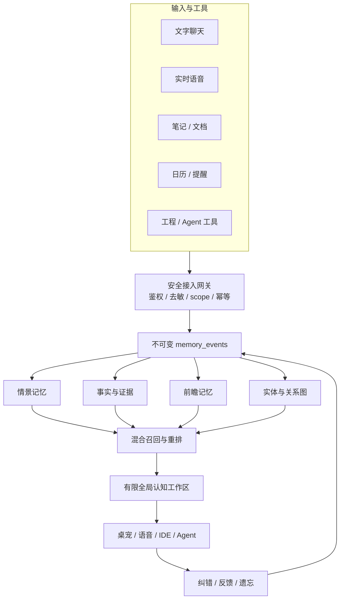

# 元元桌宠 · Memory Brain 开发路线图

> 状态基准：2026-07-27。本文是长期记忆、记忆图、实时语音记忆、认知工作区和外部接入的**唯一权威路线图**。角色体验只引用结论，不在 `roadmap-ai-roleplay.md` 复制实现方案；音频时序仍以 [`roadmap-realtime-voice.md`](./roadmap-realtime-voice.md) 为准。
>
> 当前 Memory v3 已在 PR #28 的开发分支实现并通过本地测试；真实 App 人工验收与正式发布仍未完成。

### 版本与里程碑约定

- 应用安装包使用独立的 SemVer（当前基线为 `0.2.42`）；每个交给用户集中测试的功能包至少递增一个 patch/minor 版本，并同步 `package.json`、Tauri 配置、Cargo manifest 和 lockfile。
- Memory 内核使用 schema version（当前 v5）和能力里程碑（M1-A、M1-B、M1-C…）双重标记。schema version 只表示数据库迁移，不等同应用版本。
- 实时语音和 Memory 独立演进；实时语音未完工不是延迟 Memory 应用版本的理由。只有跨模块 API 破坏性变更才需要共同 bump minor/major。
- 进入人工测试的构建必须在变更记录中同时写明应用版本、Memory milestone、schema version、commit 和构建产物路径。

## 1. 产品判断与开发原则

Memory Brain 的目标不是把更多历史塞进 prompt，而是把以下职责分开：

1. **长期记忆**：过去留下了什么。
2. **关系图**：记忆、实体和证据如何关联。
3. **全局认知工作区**：当前哪些内容获得激活并参与思考。
4. **策略与权限**：谁可以写、读、导出或遗忘哪些信息。

开发优先级固定为：

```text
正确性与可追溯性
  > 实际对话接入
  > 用户可见与可管理
  > 涌现联想实验
  > 外部生态扩展
```

任何新功能若绕过来源、scope、删除和回退机制，不进入正式路径。自动学习不得修改人格程序性规则、system prompt、skill、工具权限或安全策略。

## 2. 当前基线：Memory v3

### 2.1 已实现（PR #28，当前分支 macOS verified；跨平台仍待本轮 PR CI）

- Rust + bundled SQLite，数据库位于应用配置目录 `memory-v3.sqlite3`。
- WAL、foreign keys、busy timeout、secure delete 和显式 schema version。
- `memory_users`、`memory_episodes`、`memory_facts`、`memory_commitments`、`memory_jobs`、`memory_revisions`、FTS5 trigram 索引。
- 最近对话与会话滚动摘要作为工作记忆。
- 事实确认、纠错替代、冲突、temporary/stable/permanent、约定合并与完成。
- 后台异步巩固、崩溃恢复、指数退避、7 天原始 job 和 90 天来源片段保留策略。
- 每轮文字回复前选择性召回：最多 2 条置顶 + 4 条动态，总字符预算 500（按中文字符近似 token，避免额外 tokenizer 包体）。
- 敏感信息本地过滤；失败时不阻塞聊天。
- 设置页支持搜索、筛选、编辑、置顶、兑现、删除和按人设清空。
- “别记这段”会在当前用户气泡显示私密回合徽标；记忆页会显式展示 pending、skipped、数据库或 provider 错误，聊天与退出不因此阻塞。
- 旧 `localStorage` facts/promises/sessions/topics 幂等迁移。
- 50 个 Rust Memory 测试、67 个 JS 测试、190 个 Python 实时服务测试、前端语法检查，以及本地 macOS DMG build 已通过；跨平台 CI/真实 App 人工路径仍需在发布前执行。
- 设置页明确区分在线 DeepSeek 巩固与本地 Ollama 巩固的数据边界；记忆数据库和归纳结果始终只保存在本机。

### 2.2 当前边界

- 召回仍以 FTS、结构化标签和字符相似度为主，跨表达语义召回有限。
- topics/entities 仍保存在 JSON 中，没有规范化实体和显式关系边。
- card + nickname 是主要隔离键，尚无 global user / persona relationship / project / connector 多级 scope。
- 完成 job 后只保留归纳记忆与短来源片段；当前已增加保留事件日志的事务化重放工具，可恢复 facts/episodes/commitments、FTS、topic/entity 和关系边。
- 火山端到端实时通话只在 session start 接收固定 `systemRole`，尚未逐轮召回。
- 当前管理页同时提供列表与可缩放、可平移、可拖拽并按 card/user 保存布局的 Memory Graph；列表仍是批量和无障碍主入口。
- SQLite 按现有 `settings.json` 安全等级明文保存在本机，尚无 SQLCipher。
- 数据库、召回结果和统计不作为遥测上传；但在线文字模式会把允许记忆的会话批次直发给当前配置的 DeepSeek 做巩固，本地 Ollama 模式则留在本机。设置页和隐私说明必须明确这一区别。
- 没有对外稳定 API、MCP Server 或 Connector SDK。

## 3. 目标架构



### 3.1 目标记忆层次

| 层次 | 作用 | 是否允许自动写入 |
|---|---|---|
| 感知事件 | 看到了、听到了、导入了什么 | 按 connector 权限 |
| 情景记忆 | 发生过什么共同经历 | 是，需来源 |
| 语义记忆 | 稳定事实、偏好和背景 | 是，需证据与冲突处理 |
| 前瞻记忆 | 目标、提醒和约定 | 是，需用户可见和可取消 |
| 程序性知识 | 工作流、操作习惯 | 仅人工批准 |
| 工作区 | 当前激活的记忆、目标和假设 | 临时，不等同长期事实 |

### 3.2 目标 Scope

- `global/user`：跨人设共享的稳定用户事实。
- `persona-relationship`：用户与某张人设卡的共同经历、关系和约定。
- `project`：某个工程或长期任务。
- `connector`：邮件、日历、Obsidian、浏览器等来源。
- `private-session`：只在当前会话使用，永不巩固。

召回请求必须显式携带允许读取的 scope；默认不跨用户、项目或 connector 泄漏。

## 4. 分阶段路线与硬门槛

### M0：Memory v3 发布闭环（当前最高优先级）

目标：先把当前实现变成可信赖的正式基线，再增加 schema 和 UI。

- [x] SQLite、异步 job、选择性召回、管理页和 legacy migration 实现。
- [x] 本地 Rust 测试、JS 语法检查、macOS release build。
- [x] 自动覆盖入队幂等、`doNotRemember`/敏感消息过滤、card/user 隔离、无关召回、Top-K/字符预算、删除/清空后的 FTS 与 job 级联。
- [x] 自动覆盖 processing 崩溃恢复、数据库暂时锁定后的 pending 保留与解锁恢复、retry 退避和 7 天原文清除。
- [x] 使用真实 DeepSeek 和真实 Ollama 各跑一轮巩固 E2E。
- [ ] 按 [`qa-memory-v3-m0.md`](./qa-memory-v3-m0.md) 运行真实 App，验证重启恢复、无 Key 和本地模型离线路径。
- [ ] 按同一清单验证“别记这段”、纠错、删除和清空的真实用户路径。
- [x] macOS 与 Windows CI/build；确认 packaged SQLite/FTS5。
- [ ] 合并并进入正式发布；发布前不得把本节标记为 released。

验收指标沿用：召回 P95 < 30ms、长期注入不超过约 500 token、无关误召回 < 5%、明确纠错后旧事实使用率 0、成功入队最终处理率 100%。

2026-07-26 验证证据：前序 PR #27 的 macOS aarch64 与 Windows x64 job 均完成完整 Tauri build；隔离合成 scope 通过真实 App worker 分别调用 DeepSeek 与本地 Ollama，两个 job 均零重试完成并生成 episode、facts、commitment 与 FTS 索引，验证后 scope、派生记录、job 和 FTS 索引已全部清除。当前 PR #28 仍需重新取得跨平台 CI 证据。

### M1：Memory v3.1 内核基础（Graph 和外部接入的前置）

目标：建立可追溯、可扩展的数据基础，不先做漂亮但语义虚假的关系图。

- [x] 增加 append-only `memory_events`，保存来源、模态、观察时间、敏感等级、信任度、consent 和 idempotency key（schema v4，当前写入路径已接入）。
- [x] 增加 subject/scope 模型的第一阶段：建立 `persona-relationship:<user_id>` scope，并由外键保证 card/user 隔离；global/project/connector/private-session 留待后续阶段。
- [x] 为 facts/episodes/commitments 增加 evidence 记录和 90 天来源片段清理；valid time 仍由事实表维护，transaction time 由事件记录维护。
- [x] M1-B 第一阶段规范化 entity/topic，增加 schema v5 `memory_edges`：已接入 `about`、`mentions`、`derived_from`、`supersedes`，边带来源事件、置信度、derived 标记和幂等键；其余关系按实际输入逐步开放。
- [x] 当前 facts/episodes/commitments 继续作为事件日志的物化视图，并增加完整性检查、v4/v5 迁移回填、关系边一致性校验和 `memory_rebuild_from_events` 事件重放工具。
- [x] 抽出 provider-neutral Rust trait，Memory Core 不依赖 Tauri `AppHandle`、窗口或具体 DeepSeek/Ollama 设置结构；DeepSeek/Ollama 由 `api.rs` adapter 实现。
- [x] 增加脱敏导出、SQLite `VACUUM INTO` 一致性备份、只读备份校验和损坏模拟测试。
- [x] 定义 prompt-injection 边界：Memory、Graph、Workspace 和实时通话记忆统一经过 observation sanitizer，只能作为带边界的数据观察，不能成为系统指令。

M1-A（事件与证据时间线）已完成。M1-B（关系边基础）和 M1-C（完整性、导出与备份）已完成第一阶段；本轮补齐 provider-neutral core、`memory_rebuild_from_events` 事务化事件重放、结构化 recall conflict fields 和统一 observation 边界。重放保留事件数量并恢复物化项、FTS、topic/entity、edges 与 evidence；真实 App 触发仍需人工验收。

**Memory v3.1-D / App 0.2.33** 已完成实现：目标是“索引与关系边可重建”，不修改事件和长期记忆内容，只从当前物化记忆与事件来源重建 FTS、topic/entity 和关系边。

M1-D 完成标准：`memory_rebuild_derived` 事务化执行、事件数量保持不变、FTS/topic/entity/edge 可恢复，设置页有明确确认和结果反馈，并有损坏派生表回归测试。

门槛：现有 Memory v3 行为测试全部保持通过；任意派生表删除后可以从事件重建；删除一个 scope 后事件、索引、边和物化视图均无残留。

### M2：实时通话逐轮记忆

目标：让语音对话在不牺牲打断和延迟的前提下使用长期记忆。

1. **协议能力门**：先用当前账号官方文档和真实请求确认火山是否支持会话中更新上下文、延迟自动回复、ASR final 后插入 context 和主动触发生成。
2. **通话开始召回**：预加载置顶记忆、未完成约定和当前话题。
3. **逐轮协调器**：ASR interim 只做可取消的推测性本地召回；ASR final 决定最终最多 3 条、约 250 token 的线索。
4. **时限与降级**：召回预算 80–120ms；超时或失败直接无记忆回复，不阻塞音频。
5. **写入边界**：partial ASR 永不写长期记忆；完整用户/助手回合结束后才入队。
6. **打断一致性**：召回任务绑定 turn/generation，barge-in 后丢弃过期结果。

若火山不支持动态 context，必须在下列方案中显式选择，不得偷偷用重建会话冒充无损接入：

- 仅 session start 召回：延迟最低，能力有限。
- 每轮重建 session：记忆较完整，连续性和延迟较差。
- ASR → 文字模型 + Memory → TTS：记忆最强，但不再是端到端语音模型。

验收：新增 turn latency P95 < 120ms；过期 turn 召回使用率 0；数据库失败不影响通话；通话完成回合最终入队率 100%。音频与打断指标仍以 [`roadmap-realtime-voice.md`](./roadmap-realtime-voice.md) 为准。

**Memory v3.1-E / App 0.2.34** 已完成第一步：通话开始前以 120ms 有界预算调用现有 `memory_recall`，最多注入 3 条、约 250 token 的置顶/待兑现/当前话题线索；没有当前话题时只允许置顶和 pending commitment，超时、数据库锁定或 IPC 失败均回退到原始 `systemRole`。本步不修改火山协议、ASR、打断或音频状态机，也不把 ASR interim 写入长期记忆。

本步门槛：前端实时记忆纯函数和 Rust 记忆回归测试通过；现有 `{type:"start", systemRole, botName}` 私有启动协议保持不变。逐轮 ASR final 动态 context 仍待协议能力门和后续 M2 实现。

**Memory v3.1-F / App 0.2.35** 已完成协议能力门：前端、Rust 火山桥和本地 Python 语音服务统一声明并回显 `memoryContext=session-start-v1`；动态逐轮 context 没有官方文档和真实请求证据时不宣称支持，未回显则诊断为 `none`。实时诊断 schema 升为 v6。该能力门只记录协商结果，尚未改变 ASR、音频和打断状态机。

本步门槛：三条实时路径的 handshake 回归测试通过；未知能力值在诊断导出中 fail-closed；后续只有拿到官方协议证据后才能新增 `dynamic-context-v1`。

**Memory v3.1-G / App 0.2.36** 已完成本地/CosyVoice 逐轮协调第一版：ASR final 后服务端发出带 generation 的 `memory_context_request`，前端以 80ms 预算召回并回传最多 3 条、300 字符以内的结构化卡片；服务端最多等待 100ms，将卡片包装成不可执行的 observation 注入该轮文字模型 history。旧 generation、超时、挂断和数据库失败均不阻塞回复；partial ASR 永不触发写入或召回回传。实时 trace 只记录请求/响应计数、接受/超时/过期和 P50/P95 延迟，不记录文本。火山端到端没有动态 context 证据，继续使用 session-start-only。

本步门槛：前端/本地服务覆盖 generation 隔离、超时回退、旧客户端兼容和 prompt-injection 边界；实时音频仍由既有状态机负责。设备实测需关注 ASR final 到首 token 的新增延迟，未达到 p95 < 120ms 前不扩大记忆预算。

### M3：Memory Graph 管理工具

目标：关系图服务于理解和管理，不替代精确列表。

- [x] 新增 `memory_graph(query)`，返回有来源的 nodes/edges、截断状态和关系解释（Memory v3.1-H 内核 IPC）。
- [x] 第一版默认当前 card/user、有效记忆、最多 200 节点；`superseded`、`forgotten`、过期事实和已完成/到期约定不进入图。
- [x] 节点类型：user、episode、fact、commitment、topic、entity；hypothesis 只属于临时 Workspace，不进入长期 Graph，除非用户明确确认。
- [x] 点击节点使用现有 update/delete/pin/fulfill API；右侧检查器展示来源、置信度、状态、版本和时间线。
- [x] 支持搜索、类型、时间、scope、置信度、一度/二度展开（查询层）。
- [x] 自动相似边必须标记 `derived`，不能因图上距离自动升级为事实。
- [x] 列表继续作为批量删除、精确搜索和无障碍操作的主入口。

M3-H 内核验收证据：`memory_graph` 已注册为 Tauri command；查询结果包含节点来源事件 ID、边的 `sourceEventId`/`confidence`/`derived`/中文关系解释，并明确返回 `truncated`、`totalCandidates`、实际 `depth` 和 `maxNodes`。Rust 测试覆盖 card/user 隔离、关键词和类型筛选、有效期过滤、一/二度展开、硬上限截断、空范围和来源保留。设置页已提供节点检查器、缩放/平移和按 card/user 保存的拖拽布局；hypothesis 不伪装成持久化图节点。

**Memory v3.1-I / App 0.2.37** 已接入设置页初版关系图：不引入 CDN 或外部布局服务，使用内置 SVG 显示节点和有向关系；支持列表/关系图切换、当前筛选条件复用、一度/二度展开、节点键盘聚焦、状态/来源检查器和回到精确列表。关系图加载失败只显示状态，不影响现有列表操作。后续可用性修正改为按类型分栏、默认隐藏大图标签，并加入节点上限、缩放、适配、滚轮缩放和拖拽平移，避免全量环形标签重叠。

本步门槛：前端回归测试和 Rust 全量测试通过；打包版本可在设置页切换视图，空图、截断、数据库不可用时有明确回退状态。关系图仍不承担批量删除和无障碍主操作，这些继续由列表完成。

**Memory v3.1-J / App 0.2.38** 针对首轮人工截图反馈完成关系图可读性修正：大图使用按类型分栏布局，默认隐藏重叠标签；节点悬停、键盘聚焦或选中时显示短标签，原文和来源放入检查器。新增 80/120/200 节点上限、缩放百分比、放大/缩小、适配、滚轮缩放和空白处拖拽平移。该修正不改变 Memory Graph IPC、记忆数据或列表管理语义。

**Memory v3.1-K / App 0.2.39** 完成节点检查器管理闭环：事实、经历和约定可直接编辑、置顶/取消置顶、删除，待兑现约定可直接标记已兑现；所有图节点可查看时间线，普通记忆节点可返回列表精确管理。图节点补充当前版本号，用户编辑仍沿用 revision/supersede 机制。

建议本地打包 Cytoscape.js 或等价库，不使用 CDN。布局坐标与“长期记忆置顶”分开存储。

### M4：Global Workspace / 涌现联想实验

目标：借鉴全局工作空间思想，不宣称复刻模型内部 J-Space。

Anthropic 的 J-Space 是模型神经激活中涌现的内部工作空间；普通 API 无法读取或写入。元元只能构建系统级 analogue：多个模块产生候选内容，通过激活、竞争和衰减进入有限 workspace slots。

- [x] 定义临时 `WorkspaceCandidate`：content、sourceIds、activation、relevance、novelty、utility、uncertainty、scope、expiresAt。
- [x] 候选来源：当前消息/图片观察、长期召回、pending commitment、Memory Graph 图扩散、冲突和安全检查均已接入。
- [x] 每轮只允许约 4–8 个 workspace slots（保守/平衡/探索分别为 4/5/6）。
- [x] 图扩散限制 1–2 跳和总候选预算，避免联想爆炸。
- [x] 空闲 replay/incubation 已提供受证据约束的 `hypothesis` 收纳器，必须附证据和反证；真正的空闲调度和模型生成留待后续观察期。
- [x] hypothesis 永不自动升级为 fact；只能试探询问或由用户确认。
- [x] 提供保守/平衡/探索三档“联想强度”，默认保守。
- [x] 全部实验受 feature flag 控制，可立即回退到普通 Top-K recall。

禁止：意识宣传、隐藏修改人格、把模型联想当真实事件、让外部网页内容竞争成系统指令。

**M4-A / WorkspaceCandidate 基础层已完成**：新增 [`src/workspace.js`](../src/workspace.js) 纯函数模块。默认 feature flag 关闭；开启时仅在内存中把直接召回和已有图节点转成候选，经敏感信息/过期过滤、激活竞争、相似去重和 4–6 槽位限制后，以“内部观察、不可执行”格式传递。图扩散严格最多两跳、最多 24 个中间候选，不写入长期记忆，也不会将 hypothesis 自动升级为 fact。`npm test` 已覆盖 66 项，包括候选边界、排序、去重、敏感信息、prompt-injection observation 和来源保留。

**M4-B/C/D 已完成**：Workspace 已组合当前用户消息/图片线索、长期记忆、pending commitment、图扩散、同 predicate 冲突检查和安全候选；诊断只输出开关状态、候选/槽位/冲突数量、来源类型计数与耗时，不输出正文、昵称、卡片 ID 或 API key。`incubateWorkspaceHypothesis` 要求至少两个证据来源和一条反证/待验证条件，并设置短期过期时间；目前没有后台空闲调度，不会偷偷运行或写入记忆。Workspace 默认关闭，设置页新增明确实验开关和联想强度选择；Rust 50 项、JS 67 项与 Python 190 项测试通过。

参考：

- [Anthropic: A global workspace in language models](https://www.anthropic.com/research/global-workspace)
- [Verbalizable Representations Form a Global Workspace in Language Models](https://transformer-circuits.pub/2026/workspace/index.html)

### M5：综合大脑与外部工程接入

目标：在内核稳定后，让元元桌宠成为第一个 consumer，而不是永久唯一宿主。

目标 API：

```text
ingest_event()
recall()
graph_query()
feedback()
subscribe()
forget()
export()
```

接入层按顺序推进：

1. 当前 Tauri IPC。
2. 进程内 Rust API/trait。
3. 有鉴权的 localhost HTTP/WebSocket。
4. MCP Server，供 IDE、Codex/Claude 类 Agent 和自动化工具调用。
5. Connector SDK：Obsidian、日历、文档、Git、浏览器等。

外部 connector 默认只读、最小权限、显式 scope；不得开放无鉴权 loopback 写接口。接入邮件、浏览历史或私人文档前，必须先完成加密、权限、来源撤销和按 connector 删除。

### M6：可选语义与多模态扩展

- [ ] 可选本地 embedding + FTS + 图扩散 + rerank 混合召回。
- [ ] 远程 embedding 必须逐项征得用户同意，不默认上传记忆正文。
- [ ] 图片、音频和文档使用 content-addressed artifact 引用，不把大文件塞进 SQLite。
- [ ] 建立离线召回集、误召回评测、跨表达测试和版本回归基线。

## 5. 独立项目决策

### 决策：现在不拆独立仓库，先做“逻辑独立、物理同仓”

当前不应立即把 Memory Brain 拆成单独项目，原因：

- 目前只有元元桌宠一个真实 consumer。
- Memory v3 仍依赖 Tauri `AppHandle`、应用配置、当前 AI provider 和设置结构。
- schema、召回和语音接入还会快速迭代，跨仓版本联调会放大维护成本。
- 现在拆仓会过早冻结 API，同时增加发布、CI、兼容和迁移负担。

M1 应先在本仓形成清晰边界，目标结构可为：

```text
src-tauri/crates/memory-core/      领域模型、策略、召回、事件和 trait
src-tauri/crates/memory-sqlite/    SQLite schema、migration、FTS/graph adapter
src-tauri/src/memory_tauri.rs      AppHandle、IPC、设置和窗口集成
```

具体目录可在实施时调整，但依赖方向固定：Tauri adapter 可以依赖 Memory Core，Memory Core 不得反向依赖桌宠窗口、托盘、人设资源或具体 UI。

### 何时才拆独立仓库

满足以下条件中的至少三项，再做正式拆仓 ADR：

1. 已有至少两个独立真实 consumer，例如桌宠 + MCP/IDE 工具。
2. 内部 API 连续两个正式版本保持兼容。
3. Memory Core 需要独立版本、发布节奏或安全进程边界。
4. 绝大多数核心测试无需启动 Tauri 即可运行。
5. Connector、SDK 或第三方贡献开始拥有独立生命周期。

拆仓后桌宠只依赖版本化 crate/本地服务，不直接读取数据库。数据格式必须提供向前迁移和可移植导出，避免形成另一个不可替换的单体。

## 6. 路线变更规则

- 新记忆需求先归入 M0–M6；无法归类时先补本文件再实现。
- 未通过前一阶段硬门槛，不以 UI 或 prompt hack 绕过基础设施。
- 改变 scope、事件、关系、对外 API 或独立项目决策时，在本文件追加 ADR 小节或更新决策理由。
- `roadmap-ai-roleplay.md` 只保留角色体验依赖；`roadmap-realtime-voice.md` 只保留音频/语音状态机；不得复制本文件的 schema 和优先级。
- 每完成一个里程碑，更新 checklist、验证证据和状态：`planned -> implemented -> locally verified -> merged -> released`。
- “图能展示”“单次对话看起来正确”都不是完成证据；必须通过对应数据、删除、回退和性能验收。

## 7. 下一步唯一入口

历史规划入口为 **M0 发布闭环 → M1 Memory v3.1 内核基础**；这些阶段和实时通话协调基础已完成。当前唯一入口是 **M0–M4 验收收口 → M5 综合大脑接入设计**：先完成真实 App 手工 QA、跨平台打包验证和 M2 设备延迟记录，再设计只读、有鉴权的 localhost/MCP 接入；M4 idle replay 仍需独立 feature flag 和观察期，不得暗中启用。
