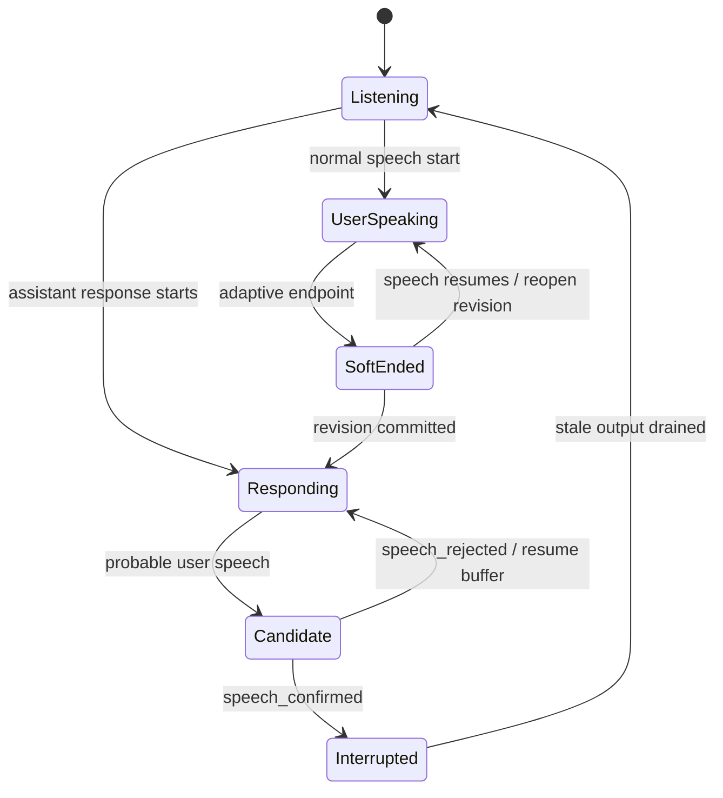

# 实时语音与情绪语音优化路线图

> 调研日期：2026-07-21。本文档记录当前实现、外部方案对比、目标接口和分阶段实施顺序，供后续开发使用；除明确标记为“已实现”的能力外，其余内容均不是当前产品承诺。

## 1. 结论摘要

本工程的火山后端是端到端实时语音模型，本地后端则是 VAD、ASR、LLM、TTS 级联管线。二者不应强行合并成同一种实现，但应通过统一的前端会话事件、播放缓冲和响应代号获得一致的打断体验。

最优先的问题不是替换模型，而是修正本地链路的时序：播报期间检测到疑似人声后，当前实现仍会继续播放，直到用户说完、累计 2 秒静音并完成整段 ASR 后才确认打断。这减少了误触，却不符合自然对话。目标方案采用“两阶段打断”：快速降音/暂停，随后确认并取消；误触时恢复。

情绪语音不能只靠增加一个 `emotion` 字段解决。当前能力应按后端区分：

- 火山文字 TTS 已支持 emotion 参数映射。
- CosyVoice 已支持复刻音色、自然语言 instruction 和语速调整，但实时路径仍需等待整段音频。
- Qwen3-TTS Base 能保持复刻音色并支持流式生成，但官方模型矩阵不支持 instruction。
- Qwen3-TTS 1.7B CustomVoice/VoiceDesign 支持自然语言情绪控制，但不能直接保持当前复刻音色。
- 火山端到端实时语音可用人设和会话级说话风格控制整体表现；逐句动态 emotion 是否可用必须以账号对应的官方协议为准。

因此默认路线是：保留复刻音色作为主路径，建立统一 `SpeechStyle`，对不同后端做能力映射；本地 Qwen Base 先验证多情绪参考 prompt，另提供 CustomVoice 作为高表现力可选项。

## 2. 当前语音架构

### 2.1 三条链路

| 链路 | 当前数据流 | 已实现 | 主要缺口 |
|---|---|---|---|
| 文字朗读 | `tts.js` -> Rust `/api/tts` -> 火山 / 本地服务 / CosyVoice | 文本情绪推断、火山 emotion、CosyVoice instruction/rate、缓存和计费信息 | 一次性合成，无法中途取消上游生成；Qwen Base 情绪控制弱 |
| 火山实时语音 | WebView PCM -> Rust WS 桥 -> 火山 RealtimeDialog -> PCM | 双向音频、AEC、二遍 ASR、热词、人设、复刻音色、服务端打断事件 | 模型版本固定；缺少可配置判停/说话风格；响应无 generation 标记 |
| 本地实时语音 | WebView PCM -> Python -> RMS VAD -> Whisper -> DeepSeek -> TTS | 旁路采集、ASR 验证后打断、Qwen/CosyVoice、过期结果丢弃 | 固定 2 秒判停；ASR/LLM/TTS 均以整段为主；LLM 固定 DeepSeek；打断确认过晚 |

本地语音服务的 WebSocket 端口当前为 `19876`，HTTP TTS 为 `19976`；CosyVoice 是通义云 TTS，由本机 Python 服务桥接，并非本地 CosyVoice 推理。

### 2.2 当前打断时序

本地链路在播报中使用较高 RMS 门槛和约 360ms 连续响声筛选候选。候选建立后不会立即通知前端，必须继续录到句尾，再执行 Whisper；只有 ASR 文本通过长度、幻觉、静音概率等校验后，才发出 `asr_start` 并清空前端播放。

该策略解决过“外放余音误打断”和“清空后丢失整段回复”的问题，但代价是用户开口后助手仍会说数秒。后续不能简单降低 RMS 或静音阈值，否则会重新引入误触；必须先让播放端具备可恢复的暂停缓冲。

### 2.3 当前音频前端

- `getUserMedia` 已开启 AEC、noise suppression 和 AGC，应继续保留。
- 麦克风 Worklet 当前按相位抽样到 16k，注释称线性插值，但没有抗混叠低通。
- 播放端为每个 PCM 包创建 `AudioBufferSourceNode`，适合短回复，但长通话会增加对象分配和调度抖动。
- 打断只能停止并销毁已排队节点，无法先暂停观察、误触后继续。

### 2.4 P0 可观测基线（已实现，2026-07-22）

桌面专用模块 `src/ai/realtime-trace.js` 已定义 provider-neutral v1 trace schema，并由 `realtime.js` 同时接入火山端到端与本地/CosyVoice 级联通话。每条事件包含 `sessionId`、可用时的 `turnId` / `responseId`、前端观测 generation、`provider`、`mode`、`eventType`、取消原因、允许列表中的数值/布尔指标，以及相对会话开始的 `performance.now()` 单调时间戳。`RealtimeSession.getTraceSnapshot()` 返回当前诊断快照和当前 generation 的 milestone/阶段耗时汇总；缺失的真实边界保持 `null`，不会估算或混用 wall clock。

已实现的运行时观测点如下：

| trace event | 当前来源 | 语义边界 |
|---|---|---|
| `session_started` / `session_ended` | 前端会话生命周期 | 本地开始尝试连接至结束；不是供应商 wall-clock 时间 |
| `mic_audio_input` | 采集 Worklet 首个上行 chunk | 只记录字节数，不记录 PCM |
| `speech_confirmed` | 现有 `asr_start` | 沿用当前后端确认语义，不新增候选打断行为 |
| `asr_partial` / `asr_final` | 现有 `asr` / `asr_end` | 不记录识别文本 |
| `llm_request` | `asr_end` 后的逻辑响应起点 | 是前端可观测边界，不冒充供应商内部排队起点 |
| `llm_first_token` | 火山首个 assistant delta | 本地级联当前整段返回，因此只记 `llm_response`，不虚报 first token |
| `llm_response` | assistant 完成；本地为整段 assistant 首包 | 不记录助手文本 |
| `tts_request` / `tts_first_audio` | assistant 完成或 speaking；首个下行 PCM | 只记录首包字节数 |
| `playback_queued` / `playback_started` / `playback_stopped` | 现有 Web Audio 调度与清空 | P0 只观测，不改变 source-node 播放策略 |
| `response_started` / `response_cancelled` | ASR 结束、确认插话或挂断 | generation 是前端观测代号，尚未贯穿供应商/本地后端队列 |

隐私与资源边界：默认内存队列最多 256 条（构造时可调，但硬上限 4096），溢出丢最旧事件并累计 `droppedEvents`；schema 不接受密钥、URL、persona、原始 PCM 或完整用户/助手文本，自由格式取消原因与未列入允许列表的指标会被丢弃。阶段耗时只能用 `timestampMs` 相减，禁止混用 wall clock。

P0 落地时的设计占位 `speech_candidate`、`speech_rejected`、`response_completed` 已在后续 P1 测试版接入运行时，详见下一节。0.2.14 已让本地级联控制事件和发送任务携带后端 generation，但火山二进制帧和本地裸 PCM wire payload 仍没有 generation；前端继续用确认后的 audio gate 隔离旧尾包。神经 VAD、流式 LLM/TTS 和 provider 切换仍属于 P2 或待实验范围。

无需真实账号、麦克风或模型的验证命令为 `npm test`。固定事件夹具覆盖正常问答、候选误触恢复、确认打断后旧 generation 音频拒绝、重连后旧 session 迟到事件隔离；0.2.13 又补充了合成 PCM 场景回放，详见 2.7。PR CI 会运行这些命令。

### 2.5 P1 可体验测试版（已实现，2026-07-22）

前端下行播放已迁移到常驻 `playback-worklet.js`：24k PCM 进入固定容量 ring buffer，由 Worklet 重采样到设备输出采样率；支持约 30ms duck 后暂停消费、约 60ms resume 淡入和确认时 clear。Worklet 每 500ms 上报 `queuedMs`、underrun、丢弃/已播放样本数，并写入有界 trace。默认暂停容量为 3 秒，用于兼容本地链路目前仍较慢的整段 ASR 确认；这是测试期上限，不是最终 120–250ms 正常排队目标。溢出时保留候选点之后最早的可恢复音频并拒绝新样本，不会无限增长。

两条链路的当前映射：

- **本地/CosyVoice 级联**：现有 RMS 连续响声门槛命中后立即发 `speech_candidate`；前端变黄色并 duck/暂停。整段 Whisper 校验通过后发 confirmed、清空 ring、取消旧回复；无效 ASR 发 rejected 并继续播放候选点后的缓冲。
- **火山端到端**：只把已有、已验证的 `EV_ASR_INFO` 映射为 candidate，不增加或修改任何火山协议常量；首个非空 ASR payload 作为安全 confirmed，若到 `asr_end` 仍无文本则 rejected。
- **旧音频隔离**：confirmed 后前端关闭下行 audio gate，直到新一轮 `speaking` 才重新开放，避免 clear 后旧 response 尾包重新进入 ring。
- **采集重采样**：`pcm-worklet.js` 改为跨 render quantum 保持相位的低通 + 线性插值，覆盖 48k 和 44.1k 等非整数比输入。
- **回退**：Worklet 加载失败会自动回退旧 source-node 调度；开发诊断时设置 `localStorage["kxyy.realtime.playback"] = "legacy"` 并重新接通可强制回退。

当前仍待实验：本地 confirmed 仍等待句尾和整段 Whisper，尚未达到 400–700ms 目标；3 秒暂停容量需在快速确认上线后收紧；候选阈值仍是现有 RMS，并非神经 VAD。测试版先让用户实际验证“开口即让声、误触可恢复、确认后无旧尾音”，再依据 trace 调参。

手测步骤：选择火山或本地实时语音后接通电话，让助手开始播报；在播报中正常插话时声波应先变黄色且助手迅速静音，识别确认后旧回复不再恢复，新回复可正常播放。用短促咳嗽/敲击制造无效候选时，黄色状态应退出且原回复从缓冲继续。无需账户的自动验证为 `npm test`（Worklet/ring/replay）和 `npm run test:python`（本地候选事件顺序）。

### 2.6 P2 soft endpoint 测试版（已实现，0.2.12）

本地级联链路已把固定 2000ms 句尾静音改为纯状态 `SoftEndpoint`：连续静音 480ms 时记录 `endpoint_soft_end`，随后保留 570ms reopen 窗口；窗口内重新检测到有效能量会记录 `endpoint_reopened`，保留同一段 PCM 和同一用户轮次。无续说时约 1050ms 记录 `endpoint_committed` 并提交现有整段 Whisper，比旧固定等待缩短约 950ms。三个事件只携带 `silenceMs` 数值并进入有界 provider-neutral trace，不含 PCM 或识别文本。

这是 **P2 的测试切片**，不是完整 adaptive endpoint：当前 voiced/quiet 仍使用既有 RMS 门槛，没有神经 VAD、噪声底自适应、推测式 ASR 或 partial transcript；提交后仍需等待整段 Whisper，因此不能宣称已达到 600ms 句尾目标。480/570ms 也是待实测参数，验证中文 300–900ms 句中停顿后再决定是否收紧。

手测重点：本地通话说完一句后，回复应比 0.2.11 约早 1 秒开始进入识别；说到一半停顿 300–900ms 再继续，应该仍形成一个用户气泡和一次回复，不应被拆成两个轮次。确定性测试用合成帧序列覆盖 soft-end、900ms reopen、再次 soft-end 和单次 commit，不依赖真实麦克风或模型。

### 2.7 P0/P2 基础补齐版（已实现，0.2.13）

ASR 输入已从“每轮创建临时 WAV → 写盘 → Whisper 再读盘 → 删除”改为内存数组：PCM16LE 截齐完整样本后直接归一化为单声道 `numpy.float32 [-1, 1)`，同一契约同时传给 MLX Whisper 和 OpenAI Whisper。macOS 安装脚本的模型预热也改为内存静音数组。单元测试用替身 adapter 验证两个后端收到的不是路径、归一化边界正确且奇数字节不会形成半个样本；测试不加载模型。

`tests/fixtures/realtime-pcm-replay.json` 定义了固定、可合法分发的合成 PCM 场景规范，测试在内存中物化 16k PCM 帧并回放给真实 `Session._on_frame`：正常说话、900ms 中文停顿、短咳嗽、键盘脉冲、低能量外放回声、连续两次插话。它用于锁定 RMS/soft-end/候选事件和单次 commit 的状态回归，不含真人录音、用户文本或模型输出。

边界必须明确：规则波形只能证明状态机和阈值没有机械回归，不能代表真实人声、房间回声、神经 VAD 准确率或“30 分钟误打断 <= 1 次”体验指标。真实或公开许可录音的声学回放集仍待建立。generation-tagged `CancelScope` 已在 0.2.14 补齐，下一项基础工作是统一 DeepSeek/Ollama adapter，再开始 LLM/TTS 流式化。

### 2.8 P2 generation CancelScope 基础版（已实现，0.2.14）

本地级联管线新增单调 generation 的显式 `GenerationCancelScope`，并把候选 ASR 与当前回复拆成两个取消域。新候选只取消旧 ASR，不会提前停止正在播放的回复；只有 ASR 校验有效后才以同一 scope 从 `asr` 提升为 `response`，取消旧回复并进入 LLM、TTS 和 PCM 发送。ASR、LLM、TTS 每个阻塞阶段返回后，以及每个 80ms PCM chunk 发送前都会检查 scope；取消后的迟到结果不得写入 history、控制事件或后续音频队列。旧任务的清理使用 scope 身份判断，不能清空新 generation 的播放状态。

本地控制事件会携带 `generation`，前端保存已见的最大后端 generation，并在 dispatch 前拒绝更旧的 assistant、speaking、usage、ASR 或 error 事件。队列仍保持既有上限：前端未启动时 PCM 暂存最多 64 个 chunk、播放 Worklet 暂停容量最多 3 秒、trace 最多 256 条、对话 history 最多固定消息数；本版本没有新增无界队列。确定性测试使用受控 Future 回放取消后才返回的 ASR/LLM/TTS，并覆盖旧任务清理与 PCM `send()` 竞态，不依赖账户、麦克风或模型。

已实现边界不能扩大解释：`run_in_executor` 中已经开始的 Python 阻塞线程无法被强制终止，只是其返回值会在 active checkpoint 被丢弃；一次已经进入 WebSocket `send()` 的裸 PCM chunk 可能成为至多一个在途尾包，binary wire payload 本身尚未携带 generation，仍由 scoped sender、generation 控制事件和 confirmed audio gate 联合阻断后续旧音频。火山端到端路径未增加或修改任何协议常量，也尚未获得同样的后端 generation。对话 history 仍在 TTS 前写入完整 assistant 文本，`audibleText` / interrupted history 修复属于后续设计，不能算本版本已完成。

## 3. 外部工程对比

调研基线：

- [huggingface/speech-to-speech@c766ba1](https://github.com/huggingface/speech-to-speech/tree/c766ba1edf0023fba514571a4c1b4e05e344929f)，2026-07-20。
- [QwenLM/Qwen3-TTS@022e286](https://github.com/QwenLM/Qwen3-TTS/tree/022e286b98fbec7e1e916cb940cdf532cd9f488e)，2026-03-17。
- [FunAudioLLM/CosyVoice@074ca6d](https://github.com/FunAudioLLM/CosyVoice/tree/074ca6dc9e80a2f424f1f74b48bdd7d3fea531cc)，2026-05-26。
- [FunAudioLLM/SenseVoice@cef383a](https://github.com/FunAudioLLM/SenseVoice/tree/cef383ace97fc0941cb6ae8f842c12a860fc9fb1)，2026-07-19。
- [火山端到端实时语音大模型 API 文档](https://www.volcengine.com/docs/6561/1594356)。商品版本和账号权限可能不同，实施前必须再次核验。

| 维度 | 本工程本地链路 | `speech-to-speech` | 借鉴结论 |
|---|---|---|---|
| VAD | RMS 固定阈值 | Silero VAD、短静音、soft-end/reopen | 借鉴状态机，不直接照搬 64ms 参数 |
| ASR | 句尾后整段 Whisper | 可替换 STT、partial transcript、内存音频 | 增加 adapter 和阶段事件 |
| LLM | DeepSeek 非流式 | OpenAI-compatible、本地/云端、流式 | 复用现有 DeepSeek/Ollama provider |
| TTS | 整段完成后发送 | 句子合并、流式 chunk、TTFA/RTF | 优先引入流式 Qwen/Cosy 输出 |
| 取消 | `gen_id` 在阶段边界检查 | generation-tagged `CancelScope` | generation 必须贯穿文本和音频队列 |
| 协议 | 私有 PCM + 精简 JSON | OpenAI Realtime 事件 | 先采用其语义子集，不急于完整兼容 |
| 前端音频 | source node 调度 | 常驻采集/播放 Worklet | 直接借鉴缓冲、clear、underrun 统计思路 |
| 测试 | 无语音状态机测试 | VAD、取消、生命周期、TTS 合并测试 | 先补录音回放和纯状态机测试 |

不建议整体引入该 Python 包作为默认后端。它的完整依赖和服务模型会与现有运行时、安装器和生命周期管理重叠；适合借鉴机制，或未来作为实验性 adapter。

## 4. 自然打断目标设计

### 4.1 体验目标

| 指标 | 目标 |
|---|---:|
| 用户开口到候选降音/暂停 | p95 <= 250ms |
| 用户开口到确认取消 | p95 <= 700ms |
| 确认后仍可听到的旧回复 | <= 100ms |
| 误候选恢复 | <= 300ms，无爆音或明显跳字 |
| 本地句尾判停 | p95 <= 600ms，不含固定 2 秒等待 |
| 外放与环境噪声回放 | 30 分钟确认级误打断 <= 1 次 |

“候选打断”和“句尾判停”是两个不同问题：前者决定助手多快让出说话权，后者决定何时把用户语音提交给 ASR/LLM。两者必须分别计时和调参。

### 4.2 两阶段状态机



1. **候选**：神经 VAD 或火山首字事件确认“很可能是人声”后，播放增益在约 30ms 内降到低音量并暂停读取环形缓冲，但不清空。
2. **确认**：持续人声达到 400–700ms，或快速 ASR 得到可信文本后，清空缓冲、递增 generation、取消当前 LLM/TTS，并发出 `response_cancelled(reason=turn_detected)`。
3. **拒绝**：候选不足、被判为回声/咳嗽/噪声时，恢复读取缓冲并在约 60ms 内淡入。
4. **新一轮**：保留打断前已经实际播放的 assistant 文本；未播放的尾句不得作为用户已知上下文。

### 4.3 目标事件语义

P0 trace schema 已采用下列事件语义；下面的控制协议载荷与真实音频 gate 仍是 P1/P2 目标，不代表两阶段打断已经上线：

```text
speech_candidate  { turnId, confidence }
speech_confirmed  { turnId }
speech_rejected   { turnId, reason }
response_started  { responseId, generation }
response_cancelled{ responseId, generation, reason }
response_completed{ responseId, generation, status }
```

当前只有前端观测事件关联 `responseId` 和 generation。后续音频 chunk、assistant 文本和阶段结束 sentinel 仍需在后端协议中携带同一标识；届时取消后的旧 generation 输出必须被真实丢弃，新 generation 不受旧 discard window 影响。

### 4.4 前端播放缓冲

新增常驻 AudioWorklet 播放器，维护有上限的 PCM 环形队列，支持：

- `audio`：追加 chunk。
- `duck`：渐降音量并暂停消费。
- `resume`：继续消费并淡入。
- `clear`：确认打断时清空。
- `stats`：上报 queuedMs、underrun、played samples。

目标排队深度为 120–250ms，超过上限时后端应背压而不是无限堆积。采集 Worklet 的 48k -> 16k 快速路径至少加入低通；44.1k 等非整数采样率使用有状态插值或质量可控的重采样器。

### 4.5 火山与本地适配

**火山端到端路径**

- 将服务端首字/用户开口事件映射为 candidate，确认事件映射为 confirmed。
- 核验并配置 `end_smooth_window_ms`、模型版本、二遍 ASR、`speaking_style` 或 `character_manifest`。
- 用户开口后对下行旧音频设 gate，避免前端 clear 后又收到上一轮尾包。
- O/SC 型号、复刻音色支持范围和逐轮控制能力必须使用当前账号官方文档及真实请求验证。

**本地级联路径**

- 用 Silero VAD 或等价神经 VAD 替代 RMS 作为最终人声判定；RMS 只保留作快速候选和电平信息。
- 建议初始判停 350–600ms，中文停顿通过约 1 秒 soft-end/reopen 修复，而不是恢复 2 秒硬等待。
- generation 贯穿 ASR、LLM、TTS 和发送队列；阻塞调用无法立刻停止时，结果返回后也不得进入当前队列。
- 上游 LLM/TTS 流式化后，每个 token/chunk 都检查取消域。

### 4.6 对话历史

本地链路当前在 TTS 播放前就写入完整 assistant 回复。后续应区分：

- `generatedText`：模型生成的完整文本，仅用于调试。
- `audibleText`：已经开始或完成播放的句子，用于下一轮上下文。
- `interrupted`：是否被用户打断及打断位置。

打断反馈不应每次都抱怨。只有上一轮已播放超过约 1 秒且在句中被截断时，下一轮才注入隐藏提示：“上一轮被打断，不要假设未播尾句已被用户听到；可按人设简短接话，但不要机械复述。”

## 5. 情绪语音方案

### 5.1 统一风格对象

```ts
type SpeechStyle = {
  emotion: "neutral" | "excited" | "angry" | "sad" | "shy" |
           "gentle" | "fearful" | "surprised";
  intensity: number; // 0..1
  pace: "slow" | "normal" | "fast";
  source: "llm" | "sticker" | "heuristic" | "default";
  confidence: number; // 0..1
};
```

该对象只描述意图，不包含供应商 instruction 字符串。后端 adapter 负责将它映射为各自参数，避免业务层长期绑定某家词表。

assistant 风格来源优先级：结构化 LLM 元数据 > 现有表情标记 > 文本/标点启发式 > neutral。用户语音的 SenseVoice 情绪是独立的 `UserAffect`，用于提示 LLM 如何共情，不能直接把“用户生气”映射成“助手也生气”。

### 5.2 后端能力矩阵

| 后端 | 音色一致性 | 动态情绪 | 当前状态 | 后续方案 |
|---|---|---|---|---|
| 火山文字 TTS | 复刻音色 | emotion + rate/pitch/volume | 已实现 emotion 映射和失败时中性回退 | 纳入统一 `SpeechStyle` adapter |
| CosyVoice 云 | 复刻音色 | 自然语言 instruction + rate | 已实现；实时路径仍整段收集 MP3 | 保持逐句 style，并直接流式转发音频 chunk |
| Qwen3 Base | 复刻音色最佳 | 无官方 instruction | 当前默认；整段生成 | 流式生成 + 多情绪参考 prompt 实验 |
| Qwen3 CustomVoice | 九种预设音色 | 1.7B 支持 instruction | 未接入 | 作为高表现力可选项，不冒充复刻音色 |
| Qwen3 VoiceDesign | 设计新音色 | 1.7B 支持 instruction | 未接入 | 用于离线设计参考音，不作为每句实时模型 |
| 火山端到端 | 由模型/复刻音色决定 | 语义、人设、会话级说话风格 | 已接基础人设，动态能力待核验 | 优先 SC2.0 角色控制；逐句参数以官方协议为准 |

### 5.3 Qwen 复刻音色的情绪实验

Qwen3-TTS Base 的官方能力表中 `Instruction Control` 为空，不能把 CustomVoice 的 `instruct` 参数直接套到 Base。推荐实验路径：

1. 从同一角色原声中准备 neutral/excited/sad/angry/gentle/shy 参考片段及逐字文案。
2. 为每类参考音预计算 voice clone prompt，运行时只切 prompt，不重复提取特征。
3. 使用同一组文本做盲测，比较角色相似度、情绪命中、自然度和 TTFA。
4. 情绪参考不足或置信度低时回退 neutral，不用激进 DSP 改音高冒充情绪。

若原始素材不足，可以用 VoiceDesign 生成风格参考再交给 Base clone，但它更适合设计新角色音色，不能保证保持现有真人声线，必须作为独立实验标记。

### 5.4 SenseVoice 的定位

SenseVoiceSmall 已发布 checkpoint 支持普通话、粤语、英语、日语、韩语，以及情绪和音频事件标签。官方基准描述为同参数量下快于 Whisper-Small 5 倍以上、快于 Whisper-Large 15 倍以上；不能把研究范围中的 50+ 语种当成已发布 Small checkpoint 的能力。

它适合：

- 句尾 final ASR。
- HAPPY/SAD/ANGRY/NEUTRAL/FEARFUL/DISGUSTED/SURPRISED 用户情绪标签。
- laughter、cry、cough 等事件识别，辅助区分打断和噪声。

它不应被描述为原生真流式 ASR。官方列出的第三方 streaming-sensevoice 使用截断注意力做伪流式并牺牲部分精度。初期应让独立 VAD 负责快速打断，SenseVoice 负责确认和 final transcript；partial transcript 另行选择真正流式模型。

## 6. 分阶段实施路线

### P0：测量和回归保护

- **已实现**：定义 provider-neutral 事件 schema，并在当前可观测边界记录 mic input、confirmed、ASR、LLM、TTS、playback 和 response 时间戳。
- **已实现**：为正常问答、误候选恢复、确认打断后的旧 generation 音频、断线重连后的旧 session 迟到事件补纯状态 reducer 与确定性事件回放测试。
- **后续已接入运行时**：candidate/rejected、response completed、旧音频 gate 和 endpoint 事件已分别在 P1/P2 测试版驱动真实状态。
- **已实现（0.2.13 合成基线）**：固定场景规范在内存中物化 PCM，覆盖正常说话、900ms 停顿、短咳嗽、键盘、低能量外放回声和连续插话。
- **待实验**：补充真实或公开许可录音，才能评估真实人声/房间回声和确认级误打断率；合成规则波形不能替代声学验收。

### P1：可恢复播放与两阶段打断

- **已实现（测试版）**：上线有界播放 AudioWorklet、队列/underrun 统计、duck/resume/clear 和采集端有状态低通重采样。
- **已实现（测试版）**：本地与火山现有事件均扩展 candidate/confirmed/rejected；confirmed 后 gate 旧音频，Worklet 失败或诊断开关可回退 legacy 播放。
- **待实测调参**：用正常插话、短噪声和外放回声验证候选误触率、恢复连续性与旧尾音；目前不能宣称达到 4.1 的 p95 指标。
- **后续进展**：P2 0.2.12 已先把本地固定 2 秒句尾等待降为约 1.05 秒 soft-end/reopen；3 秒播放暂停容量仍待更快确认后收紧。

### P2：本地低延迟管线

- **已实现（0.2.12 测试切片）**：基于现有 RMS 的 480ms soft-end + 570ms reopen，纯状态回放覆盖 900ms 中文停顿和单次 commit。
- **已实现（0.2.13 基础补齐）**：MLX/OpenAI Whisper 共用 16k float32 内存输入，移除每轮临时 WAV；macOS 预热也不再写临时音频。
- **已实现（0.2.14 基础补齐）**：generation-tagged `CancelScope` 覆盖本地 ASR、LLM、TTS、控制事件和 PCM sender；确定性回放证明迟到结果不会越代写入。
- **待实现**：神经 VAD、噪声自适应和满足 p95 600ms 目标的 adaptive endpoint；当前不能把 soft endpoint 测试切片称为完整方案。
- **待实现**：DeepSeek/Ollama 使用统一 OpenAI-compatible adapter；本地通话遵循 `textProvider`。
- **待实现**：LLM SSE、按稳定句送 TTS、Qwen/CosyVoice 音频流式下发。

### P3：情绪闭环

- 落地 `SpeechStyle` 和统一情绪映射。
- SenseVoice final ASR/SER 作为可选后端，先 A/B 再替换默认 Whisper。
- CosyVoice 逐句 instruction；Qwen Base 多参考 prompt 实验；CustomVoice 可选模式。
- 将 assistant style 同步给桌宠动作和表情，但保持一个权威映射源。

### P4：协议和能力扩展

- 将内部事件逐步对齐 OpenAI Realtime 语义子集。
- 评估结构化工具调用驱动桌宠动作，而不是继续扩展自由文本正则。
- 只有出现远程浏览器/移动端需求时才评估 WebRTC；localhost 保持 PCM WebSocket。

## 7. 验证矩阵

| 类别 | 必测场景 | 判定 |
|---|---|---|
| 打断 | 助手播报时正常插话 | 快速降音，确认后无旧尾音 |
| 误触 | 咳嗽、敲键盘、桌面通知声 | 候选可恢复，不产生新用户轮次 |
| 回声 | 音箱外放不同音量 | 不因助手自身声音确认打断 |
| 连续轮次 | 连续两次打断、上一轮 TTS 迟到 | 只播放最新 generation |
| 中文停顿 | 句中停顿 300–900ms 后继续 | soft-end 可 reopen，不拆成两轮 |
| 情绪 | 每种 style 的固定文本集 | 人工盲测 + 情绪分类器一致性 |
| 音色 | neutral 与情绪 prompt 对比 | CAM++ 相似度不显著低于 neutral 基线 |
| 性能 | 冷启动、热启动、首 token、首音频 | 记录 p50/p95、TTFA、RTF、内存/显存 |

情绪实验不能只看分类器。最终保留条件是：角色相似、情绪可辨、长句不发飘、打断后无爆音，并且首音频延迟满足实时通话预算。

## 8. 风险与边界

- 不用 Hugging Face 级联管线替换火山端到端路径；两者保留为不同 adapter。
- 不直接采用 `speech-to-speech` 默认 Parakeet TDT，因其默认模型不覆盖中文。
- 不因存在 WebRTC 示例就在本机链路引入 ICE/TURN/Opus 复杂度。
- 不叠加 DeepFilterNet 等服务端增强，除非录音回放证明浏览器 AEC/NS 不足；重复降噪可能损伤人声。
- Qwen 官方声称的最低合成延迟是特定条件下的模型指标，不能直接写成本工程端到端承诺。
- 火山模型版本、复刻音色类型、角色控制字段和动态更新事件存在账号/商品差异，实施前必须用当前账号文档和真实请求验证。
- 复制 Apache-2.0 项目代码时保留许可证、版权和修改说明；优先重新实现所需机制。

## 9. 推荐决策

1. 先完成播放 Worklet和两阶段打断，再调整 VAD 阈值。
2. 先解决本地固定 2 秒判停和全管线非流式，再更换 ASR 模型。
3. 情绪路线默认保证复刻音色；CosyVoice 作为“复刻 + instruction”的表现力基准，Qwen CustomVoice 作为可选模式。
4. SenseVoice 先作为 final ASR/SER 实验后端，不直接承担快速打断或 partial transcript。
5. 所有后续实现以本文件的指标和回放集为验收依据，不能只凭主观单次试听上线。
