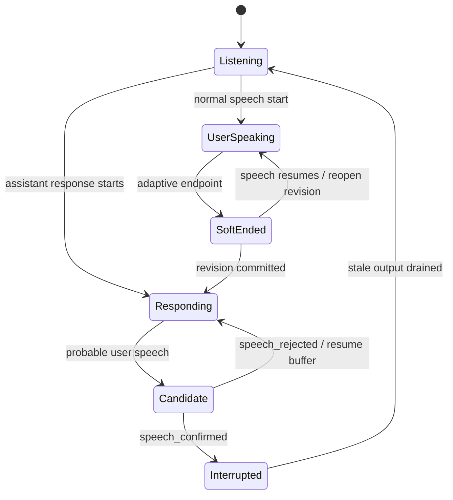

# 实时语音与情绪语音优化路线图

> 调研日期：2026-07-21。本文档记录当前实现、外部方案对比、目标接口和分阶段实施顺序，供后续开发使用；除明确标记为“已实现”的能力外，其余内容均不是当前产品承诺。

## 1. 结论摘要

本工程的火山后端是端到端实时语音模型，本地后端则是 VAD、ASR、LLM、TTS 级联管线。二者不应强行合并成同一种实现，但应通过统一的前端会话事件、播放缓冲和响应代号获得一致的打断体验。

可恢复播放与候选让声已经有测试版：本地链路检测到疑似人声会立即发 candidate 并由前端 duck/暂停，约 1.05 秒 soft-end/reopen 后才提交整段 Whisper。0.2.17–0.2.20 依次补齐可听历史、有界句级管线、`managed-v1` 下行身份与 candidate-bound 临时打断提示；0.2.21 又让 CosyVoice + Worklet 在独立协商后直接请求 24k raw PCM。0.2.22 为 macOS Apple Silicon 的 MLX Qwen 接入官方生成期 chunk，并复用同一单路有界 sender；0.2.23 提供有界、隐私安全的通话诊断导出与实测 runbook；0.2.24 补齐 512-sample VAD 组帧、概率迟滞、代际隔离、熔断和 synthetic-only provenance 校验的纯状态基础；0.2.25 再把该基础放入 dedicated、queue=1、全进程单 admission 的可注入 shadow worker，并保持默认 factory 关闭。Windows/Linux PyTorch、legacy、旧服务与火山保持原路径。当前主要瓶颈仍是 confirmed 等待句尾与整段 ASR；真实模型、公开许可录音、神经决策接管和字/音素级恢复仍是后续工作。CosyVoice 的真实字节序/TTFA/听感与 Qwen MLX 的真实 TTFA/接缝/取消资源恢复都需设备实测，不能只凭确定性 fake transport 宣称指标改善。

情绪语音不能只靠增加一个 `emotion` 字段解决。当前能力应按后端区分：

- 火山文字 TTS 已支持 emotion 参数映射。
- CosyVoice 已支持复刻音色、自然语言 instruction 和语速调整；0.2.21 的实时路径可协商原生 PCM 流式下发，真实账号效果待实验。
- Qwen3-TTS Base 能保持复刻音色；macOS MLX 实现支持流式生成，但官方模型矩阵不支持 instruction，Windows/Linux PyTorch 当前也没有公开音频流式 API。
- Qwen3-TTS 1.7B CustomVoice/VoiceDesign 支持自然语言情绪控制，但不能直接保持当前复刻音色。
- 火山端到端实时语音可用人设和会话级说话风格控制整体表现；逐句动态 emotion 是否可用必须以账号对应的官方协议为准。

因此默认路线是：保留复刻音色作为主路径，建立统一 `SpeechStyle`，对不同后端做能力映射；本地 Qwen Base 先验证多情绪参考 prompt，另提供 CustomVoice 作为高表现力可选项。

## 2. 当前语音架构

### 2.1 三条链路

| 链路 | 当前数据流 | 已实现 | 主要缺口 |
|---|---|---|---|
| 文字朗读 | `tts.js` -> Rust `/api/tts` -> 火山 / 本地服务 / CosyVoice | 文本情绪推断、火山 emotion、CosyVoice instruction/rate、缓存和计费信息 | 一次性合成，无法中途取消上游生成；Qwen Base 情绪控制弱 |
| 火山实时语音 | WebView PCM -> Rust WS 桥 -> 火山 RealtimeDialog -> PCM | 双向音频、AEC、二遍 ASR、热词、人设、复刻音色、服务端打断事件 | 模型版本固定；缺少可配置判停/说话风格；响应无 generation 标记 |
| 本地实时语音 | WebView PCM -> Python -> RMS VAD -> Whisper -> 桌面文字代理 -> TTS | 旁路采集、ASR 验证后打断、Qwen/CosyVoice、generation 取消、DeepSeek/Ollama 复用、LLM SSE、有界句级队列、有序播放、句级可听历史、`managed-v1` 下行身份、Worklet-only interrupted hint、CosyVoice 与 macOS MLX Qwen 原生 PCM 流式 adapter；另有默认关闭、可注入的 512-sample bounded VAD shadow worker | ASR 仍为整段；Windows/Linux Qwen 仍按稳定句整段合成；线上仍由 RMS 判定，未加载神经模型；字/音素级恢复未实现；两种流式 adapter 的真实指标待实验 |

本地语音服务的 WebSocket 端口当前为 `19876`，HTTP TTS 为 `19976`；CosyVoice 是通义云 TTS，由本机 Python 服务桥接，并非本地 CosyVoice 推理。

### 2.2 当前打断时序

本地链路在播报中使用较高 RMS 门槛和约 360ms 连续响声建立 candidate；candidate 会立即通知前端 duck/暂停，但不会清空可恢复缓冲。随后继续录到 soft endpoint，整段 Whisper 通过文本长度、幻觉和静音概率校验后才 confirmed、清空旧播放并取消旧 generation；无效 ASR 则 rejected 并恢复。

这已解决“用户开口时助手完全不让声”，但 confirmed 仍受句尾提交和整段 Whisper 延迟约束。后续不能只降低 RMS 阈值，需用真实声学回放验证神经 VAD/快速确认，并在此后收紧 3 秒暂停容量。

### 2.3 当前音频前端

- `getUserMedia` 已开启 AEC、noise suppression 和 AGC，应继续保留。
- 麦克风 Worklet 已使用跨 render quantum 的有状态低通 + 线性插值重采样到 16k，兼容 48k、44.1k 等输入。
- 播放端已使用常驻 AudioWorklet 和固定容量 ring buffer，支持 duck/resume/clear/stats；加载失败或诊断开关可回退旧 source-node 调度。
- 本地/CosyVoice 稳定句在 Worklet 实际消费完全部 PCM（legacy 则全部 source 正常结束）后才回传不含文本的 `generation + segmentId` 回执；候选期先冻结，rejected 才提交，confirmed/clear/overflow 均不提交。
- 0.2.20 的 Worklet 可按 candidate 返回当前正在消费句段的精确 source `playedSamples`。该快照只用于本地/CosyVoice 的 `candidate-snapshot-v1`，不从 managed chunk 比例推断文本，也不适用于 legacy 或火山。
- 默认暂停容量 3 秒仍是测试期上限，正常排队目标仍为 120–250ms。本地/CosyVoice 已可协商 `managed-v1`，其下行 chunk 带 generation/segment/sequence；火山与未协商的旧服务仍为无 envelope 的 raw PCM。

### 2.4 P0 可观测基线（已实现，2026-07-22）

桌面专用模块 `src/ai/realtime-trace.js` 已定义 provider-neutral v1 trace schema，并由 `realtime.js` 同时接入火山端到端与本地/CosyVoice 级联通话。每条事件包含 `sessionId`、可用时的 `turnId` / `responseId`、前端观测 generation、`provider`、`mode`、`eventType`、取消原因、允许列表中的数值/布尔指标，以及相对会话开始的 `performance.now()` 单调时间戳。`RealtimeSession.getTraceSnapshot()` 返回有界事件、最多 8 个 generation 的独立 milestone/阶段耗时和实际 runtime 协商摘要；缺失的真实边界保持 `null`，不会估算或混用 wall clock。0.2.23 的用户导出入口和二次隐私过滤见 2.17。

已实现的运行时观测点如下：

| trace event | 当前来源 | 语义边界 |
|---|---|---|
| `session_started` / `session_ended` | 前端会话生命周期 | 本地开始尝试连接至结束；不是供应商 wall-clock 时间 |
| `mic_audio_input` | 采集 Worklet 首个上行 chunk | 只记录字节数，不记录 PCM |
| `speech_confirmed` | 现有 `asr_start` | 沿用当前后端确认语义，不新增候选打断行为 |
| `asr_partial` / `asr_final` | 现有 `asr` / `asr_end` | 不记录识别文本 |
| `llm_request` | `asr_end` 后的逻辑响应起点 | 是前端可观测边界，不冒充供应商内部排队起点 |
| `llm_first_token` | 两条链路首个有效 assistant delta | 本地级联自 0.2.16 起是真实 SSE content delta；不记录文本 |
| `llm_response` | assistant 流结束 | 0.2.18 后通常不再等待普通句级播放，但有界句队列满时仍包含反压等待；不冒充上游模型内部完成时间 |
| `tts_request` / `tts_first_audio` | 火山 assistant 完成或本地 `tts_start`；首个下行 PCM | 本地 `tts_start` 在首个稳定句进入 TTS 前发出；只记录首包字节数 |
| `playback_queued` / `playback_started` / `playback_stopped` | 播放 Worklet ring 调度、清空和 drain | legacy source-node fallback 保留同一观测语义 |
| `response_started` / `response_cancelled` / `response_completed` | ASR 结束、确认插话、挂断或 TTS 生产结束后播放 drain | 本地控制/scoped sender 与 managed 下行已有后端 generation；火山/raw fallback 仍未贯穿 |

隐私与资源边界：默认内存队列最多 256 条（构造时可调，但硬上限 4096），溢出丢最旧事件并累计 `droppedEvents`；schema 不接受密钥、URL、persona、原始 PCM 或完整用户/助手文本，自由格式取消原因与未列入允许列表的指标会被丢弃。阶段耗时只能用 `timestampMs` 相减，禁止混用 wall clock。

P0 落地时的设计占位 `speech_candidate`、`speech_rejected`、`response_completed` 已在后续 P1 测试版接入运行时，详见下一节。0.2.14 已让本地级联控制事件和发送任务携带后端 generation，0.2.16 已接入 LLM SSE，0.2.19 又让协商后的本地/CosyVoice 下行 binary 携带同一 generation。火山二进制帧与 raw fallback 仍没有该身份，前端继续用确认后的 audio gate 隔离旧尾包。神经 VAD、Windows/Linux Qwen 真正音频流式和火山后端 generation 仍属于 P2 或待实验范围；CosyVoice 与 macOS MLX Qwen 真流式的实现/实验边界见 2.15–2.16。

无需真实账号、麦克风或模型的验证命令为 `npm test` 与 `npm run test:python`。固定事件夹具覆盖正常问答、候选误触恢复、确认打断后旧 generation 音频拒绝、断线重连后的旧 session 隔离、合成 PCM、SSE/分句/生产生命周期、播放完成/clear/overflow/挂起排序/可听历史回放、`managed-v1` 的固定 header/协商/严格身份校验、`provider-pcm-v1` 的 PCM 参数/首包/重切/取消/终点校验，以及 `candidate-snapshot-v1` 的 Worklet/legacy 协商、candidate id、1 秒阈值、clear 后迟到快照、50ms timeout、one-shot 与 history 隔离。PR CI 会运行这些命令。

### 2.5 P1 可体验测试版（已实现，2026-07-22）

前端下行播放已迁移到常驻 `playback-worklet.js`：24k PCM 进入固定容量 ring buffer，由 Worklet 重采样到设备输出采样率；支持约 30ms duck 后暂停消费、约 60ms resume 淡入和确认时 clear。Worklet 每 500ms 上报 `queuedMs`、underrun、丢弃/已播放样本数，并写入有界 trace。默认暂停容量为 3 秒，用于兼容本地链路目前仍较慢的整段 ASR 确认；这是测试期上限，不是最终 120–250ms 正常排队目标。溢出时保留候选点之后最早的可恢复音频并拒绝新样本，不会无限增长。

两条链路的当前映射：

- **本地/CosyVoice 级联**：现有 RMS 连续响声门槛命中后立即发 `speech_candidate`；前端变黄色并 duck/暂停。整段 Whisper 校验通过后发 confirmed、清空 ring、取消旧回复；无效 ASR 发 rejected 并继续播放候选点后的缓冲。
- **火山端到端**：只把已有、已验证的 `EV_ASR_INFO` 映射为 candidate，不增加或修改任何火山协议常量；首个非空 ASR payload 作为安全 confirmed，若到 `asr_end` 仍无文本则 rejected。
- **旧音频隔离**：confirmed 后前端关闭下行 audio gate，直到新一轮 `speaking` 才重新开放，避免 clear 后旧 response 尾包重新进入 ring。
- **采集重采样**：`pcm-worklet.js` 改为跨 render quantum 保持相位的低通 + 线性插值，覆盖 48k 和 44.1k 等非整数比输入。
- **回退**：Worklet 加载失败会自动回退旧 source-node 调度；开发诊断时设置 `localStorage["kxyy.realtime.playback"] = "legacy"` 并重新接通可强制回退。

当前仍待实验：本地 confirmed 仍等待句尾和整段 Whisper，尚未达到 400–700ms 目标；3 秒暂停容量需在快速确认上线后收紧；候选阈值仍是现有 RMS，并非神经 VAD。测试版先让用户实际验证“开口即让声、误触可恢复、确认后无旧尾音”，再依据 trace 调参。

手测步骤：选择火山或本地实时语音后接通电话，让助手开始播报；在播报中正常插话时声波应先变黄色且助手迅速静音，识别确认后旧回复不再恢复，新回复可正常播放。用短促咳嗽/敲击制造无效候选时，黄色状态应退出且原回复从缓冲继续。无需账户的自动验证为 `npm test`（Worklet/ring/replay）和 `npm run test:python`（本地候选事件顺序）。

### 2.6 P2 soft endpoint 测试版（已实现，0.2.12）

本地级联链路已把固定 2000ms 句尾静音改为纯状态 `SoftEndpoint`：连续静音 480ms 时记录 `endpoint_soft_end`，随后保留 570ms reopen 窗口；窗口内重新检测到有效能量会记录 `endpoint_reopened`，保留同一段 PCM 和同一用户轮次。无续说时约 1050ms 记录 `endpoint_committed` 并提交现有整段 Whisper，比旧固定等待缩短约 950ms。三个事件只携带 `silenceMs` 数值并进入有界 provider-neutral trace，不含 PCM 或识别文本。

这是 **P2 的测试切片**，不是完整 adaptive endpoint：当前 voiced/quiet 仍使用既有 RMS 门槛，没有神经 VAD、噪声底自适应、推测式 ASR 或 partial transcript；提交后仍需等待整段 Whisper，因此不能宣称已达到 600ms 句尾目标。480/570ms 也是待实测参数，验证中文 300–900ms 句中停顿后再决定是否收紧。

手测重点：本地通话说完一句后，回复应比 0.2.11 约早 1 秒开始进入识别；说到一半停顿 300–900ms 再继续，应该仍形成一个用户气泡和一次回复，不应被拆成两个轮次。确定性测试用合成帧序列覆盖 soft-end、900ms reopen、再次 soft-end 和单次 commit，不依赖真实麦克风或模型。

### 2.7 P0/P2 基础补齐版（已实现，0.2.13）

ASR 输入已从“每轮创建临时 WAV → 写盘 → Whisper 再读盘 → 删除”改为内存数组：PCM16LE 截齐完整样本后直接归一化为单声道 `numpy.float32 [-1, 1)`，同一契约同时传给 MLX Whisper 和 OpenAI Whisper。macOS 安装脚本的模型预热也改为内存静音数组。单元测试用替身 adapter 验证两个后端收到的不是路径、归一化边界正确且奇数字节不会形成半个样本；测试不加载模型。

`tests/fixtures/realtime-pcm-replay.json` 定义了固定、可合法分发的合成 PCM 场景规范，测试在内存中物化 16k PCM 帧并回放给真实 `Session._on_frame`：正常说话、900ms 中文停顿、短咳嗽、键盘脉冲、低能量外放回声、连续两次插话。它用于锁定 RMS/soft-end/候选事件和单次 commit 的状态回归，不含真人录音、用户文本或模型输出。

边界必须明确：规则波形只能证明状态机和阈值没有机械回归，不能代表真实人声、房间回声、神经 VAD 准确率或“30 分钟误打断 <= 1 次”体验指标。真实或公开许可录音的声学回放集仍待建立。generation-tagged `CancelScope`、文字 provider、LLM SSE/稳定句、句级可听历史、有界有序 TTS consumer、本地/CosyVoice 下行 identity 与 candidate-bound interrupted hint 已在 0.2.14–0.2.20 依次补齐；下一项基础工作是分别验证后端专用真流式 adapter。

### 2.8 P2 generation CancelScope 基础版（已实现，0.2.14）

本地级联管线新增单调 generation 的显式 `GenerationCancelScope`，并把候选 ASR 与当前回复拆成两个取消域。新候选只取消旧 ASR，不会提前停止正在播放的回复；只有 ASR 校验有效后才以同一 scope 从 `asr` 提升为 `response`，取消旧回复并进入 LLM、TTS 和 PCM 发送。ASR、LLM、TTS 每个阻塞阶段返回后，以及每个 80ms PCM chunk 发送前都会检查 scope；取消后的迟到结果不得写入 history、控制事件或后续音频队列。旧任务的清理使用 scope 身份判断，不能清空新 generation 的播放状态。

本地控制事件会携带 `generation`，前端保存已见的最大后端 generation，并在 dispatch 前拒绝更旧的 assistant、speaking、usage、ASR 或 error 事件。队列仍保持既有上限：前端未启动时 PCM 暂存最多 64 个 chunk、播放 Worklet 暂停容量最多 3 秒、trace 最多 256 条、对话 history 最多固定消息数；本版本没有新增无界队列。确定性测试使用受控 Future 回放取消后才返回的 ASR/LLM/TTS，并覆盖旧任务清理与 PCM `send()` 竞态，不依赖账户、麦克风或模型。

已实现边界不能扩大解释：`run_in_executor` 中已经开始的 Python 阻塞线程无法被强制终止，只是其返回值会在 active checkpoint 被丢弃；一次已经进入 WebSocket `send()` 的本地/CosyVoice chunk 仍可能成为至多一个在途尾包，但 0.2.19 的 managed header 会让前端按 generation 拒绝其进入当前句段。未协商的 raw fallback 仍由 scoped sender、generation 控制事件和 confirmed audio gate 联合阻断后续旧音频。火山端到端路径未增加或修改任何协议常量，也尚未获得同样的后端 generation。0.2.20 只增加固定、一次性的句中打断提示；句中音素/字级位置和部分文本恢复仍未实现。

### 2.9 P2 统一文字 provider 基础版（已实现，0.2.15）

本地/CosyVoice 实时通话不再由 Python 直接读取并调用 DeepSeek Key。Rust 拉起受托管语音子进程时只注入随机 loopback `/api/chat` 代理地址；Python 把 system role、最近有界 history 和当前用户文本以非流式 OpenAI-compatible 请求交给该代理。provider、模型、reasoning 参数、Ollama 生命周期与错误翻译继续由桌面端现有文字链路统一处理，因此设置中的 `textProvider`、`textModel`、`localTextModel` 与 `thinking` 同时作用于文字聊天和本地实时通话，切换 DeepSeek/Ollama 不需要复制一套 Key 或 provider 实现。

隐私与安全边界：Python 子进程环境不包含 DeepSeek Key；代理地址只接受 `http` loopback 且拒绝 userinfo、query、fragment 和非本机目标。请求与日志仍不记录 persona、完整用户文本或完整助手文本。固定测试通过假 loopback response 验证请求不含 `Authorization` / model / Key，并覆盖 provider label、usage 和非法代理地址；不依赖真实 Ollama、DeepSeek 账户或麦克风。

0.2.15 当时仍是整段 LLM 基础版：Python 使用 `stream: false`，取消中的 HTTP 请求只能在返回后由 0.2.14 CancelScope 丢弃。该限制中的 LLM SSE 与稳定句已由 0.2.16 取代，句级 audible history 已由 0.2.17 补齐，有界有序 TTS consumer 已由 0.2.18 补齐；真正音频流式仍未实现。Ollama 长时间空闲后的 keep-alive 继续复用桌面代理现有的 native touch。

### 2.10 P2 LLM SSE 与稳定句 TTS 测试版（已实现，0.2.16）

受托管本地语音服务现在以 `stream: true` 调用桌面 `/api/chat`。Rust 仅对携带 App 管理 secret、明确请求文字 provider 的 Python 请求直接透传上游 SSE；普通 WebView 请求继续使用带明确 `Content-Length` 的缓冲路径，并关闭 tiny_http 的 32KiB 自动 chunked 阈值，避免重新引入 Windows WebView2 空回复。直通响应只额外暴露 provider 与“是否可能含 reasoning”的布尔头；secret 不加入浏览器 CORS allow-list、不转发上游、不写日志。这个 secret 只用于同用户本机进程的误调用隔离，不是抵抗同账户恶意进程的安全边界。

Python producer 逐行解析 SSE，并通过最多 32 个事件的固定队列发送 `meta/delta/usage/done/error`。同时最多允许 2 个 LLM producer 和 2 个本轮 TTS 阻塞任务存活，避免连续取消把默认 executor 或网络读取任务无限堆积。`GenerationCancelScope` 增加跨线程 inactive event；producer 在每次有界 `put(timeout=50ms)` 前后检查，consumer、TTS 返回点和每个 80ms PCM chunk 继续检查 generation。reasoning 默认永不下发；只有桌面明确报告思考关闭、且整条流完全没有 `content` 时，才在流结束后把最多 4096 字的 reasoning 作为 Ollama 兼容正文回退，避免误播思维链。

纯状态 `StableSentenceBuffer` 以 `。！？!?；;` 和换行为强句末，达到 40 字时优先在 `，,、：:` 切分，60 字无断点时硬切，内部缓冲始终有界；短尾段在流结束时 flush。每个有效 content delta 立即作为 `assistant` delta 发送，首个稳定句在完整回复结束前触发现有 TTS；`tts_start` / `tts_end` 显式包住本轮后端音频生产期，前端只有在生产结束且播放 ring 已 drain 后才记录 response completed。0.2.16 当时 Qwen/CosyVoice 都是“每个稳定句整段合成 -> 既有 PCM chunk 发送”，**不是真正音频流式**；其 consumer 也会在逐句合成和发送期间停止消费后续 token。该 consumer 限制已由 0.2.18 的有界有序实现缩小，真流式则分别在 0.2.21/0.2.22 接入 CosyVoice/macOS MLX Qwen；句队列饱和时仍会反压。

取消和隐私边界：0.2.16 当时只在完整 SSE 成功且 scope 仍 active 时写 generated full reply；这一行为已由 0.2.17 的句级播放回执取代。已经阻塞在 socket read 或开始的 TTS 线程仍无法强杀，但并发准入、有界队列和 generation checkpoint 阻止迟到结果越代。队列只在内存中短暂持有 delta，不记录 secret、原始 PCM、persona 或完整用户/助手文本；日志仅含单调耗时、token/字符数和字节数。

无需账号、麦克风或模型的固定测试覆盖：SSE delta/usage、reasoning 隔离与兼容回退、满队列取消、6/40/60 分句、cancel 后不再产出、assistant delta/end、稳定句 TTS、usage 和旧 generation PCM 竞态。手测时选择本地或 CosyVoice 通话：用户气泡定稿后，助手文字应逐步出现，第一句有完整标点时应在后续文字尚未全部出现前开始播音；打断后不应继续出现旧文字或旧音频。0.2.17 对可听 history 的新增范围见下一节，0.2.18 的有界 consumer 见 2.12；真正音频流式和真实声学指标仍待实现/实验。

### 2.11 P2 句级可听历史基础版（已实现，0.2.17）

本地/CosyVoice 每个稳定句在发送 PCM 前登记有界 `generation + segmentId`，播放 Worklet 在该句全部 source samples 实际消费完后回报完成；legacy source-node 只在该句所有 source 正常结束后回报。AudioContext 挂起时 PCM 与 segment-end 共用同一个最多 64 项的有序暂存队列，避免控制帧越过尚未入 ring 的音频。Worklet 的 ring、span 与 segment ledger 均有界；clear、ring/暂存溢出或未知/旧 generation 不产生完成回执。0.2.19 又把这些句段身份下沉到协商后的每个 binary chunk，详见 2.13；未协商服务保持 0.2.17 的 raw 兼容语义。

Python `AudibleHistory` 最多保留 24 条上下文消息和 4 个待回执 turn，每轮最多 64 个句段。当前用户文本会保留；assistant 只有从第一段起连续完成的句段才插入下一轮 LLM history。候选打断期间刚完成的句段先冻结：误触 rejected 后提交，confirmed 后随 clear 丢弃。聊天气泡继续展示完整 `generatedText`，但本地/CosyVoice 的会话 history 与长期摘要只接收同一批已完成句段；火山端到端因没有句段边界，保持既有完整回复 history 行为。上行回执只含数值 ID 和固定状态，不含文本或 PCM；神态 cue 会在入 audible history 前按实际 TTS 清洗规则移除。

这是**句级保守语义**，不是字/音素级对齐：被打断的当前句整句不进入 `audibleText`，即使开头可能已经播放；英文极端 hard-split 的空白边界也不承诺逐字符重建。0.2.20 仅依据 Worklet 精确 source sample 进度注入固定临时提示，不恢复或保存部分句文本。手测可让助手生成两句，在第二句播放超过 1 秒后插话；下一轮可以使用完整播完的第一句，并自然承接打断事实，但不应引用第二句未播尾部。

### 2.12 P2 有界有序句级 TTS consumer（已实现，0.2.18）

本地/CosyVoice 的 LLM 事件消费、句级合成与 PCM 播放现在由 `BoundedOrderedTtsPipeline` 分离。稳定句输入队列最多 4 项，单轮最多 64 句；Qwen MLX/PyTorch 固定只允许 1 个合成任务，避免假设模型线程安全，CosyVoice 明确允许最多 2 个合成任务。播放始终只有 1 路，并严格按稳定句提交顺序发送；即使后一句先合成完成，也不能提前登记 segment、发送 PCM 或写入可听 history。LLM delta 与音频 sender 共用一个 send lock，排队后会再次检查 generation，防止取消期间的旧控制帧越代。Windows/Linux Qwen 的 TTS 与 ASR 使用不同 executor，可在当前句播放时合成下一句；macOS MLX 两者共用 `_mlx_pool`，因此明确关闭播放期间预取，让插话 ASR 不会排在下一句完整 TTS 后；CosyVoice 可有限预取第二个合成结果。

每个句级 PCM 结果必须是偶数字节的 24kHz mono s16le，且最多 60 秒；队列项数、并行合成数、单段字节和 segment ledger 都有显式上限。任一合成/播放错误会用固定安全文案结束本轮，并取消其余有界任务；已经进入阻塞 executor 的线程仍不能强杀，但全进程准入仍最多 2 个，迟到结果会被 generation checkpoint 丢弃。默认不记录 secret、persona、原始 PCM 或完整用户/助手文本，日志只保留单调耗时、字符/计费数和字节数。

`assistant_end` 现在表示文字流结束，可早于最后一句音频；`tts_end` 仍只在所有已接纳句子按序发送完后出现。因此 `llm_response` trace 通常不再包含普通播放 pacing，但句队列满时仍会包含有界反压，不能当作供应商纯模型耗时。0.2.18 此版仍是**逐句整段 TTS**，当时不是 Qwen/CosyVoice 真音频 streaming，也没有真实 trace 证明 TTFA 或句间空隙改善。固定测试覆盖倒序合成仍有序播放、Windows/Linux Qwen 播放/合成重叠、macOS MLX 播放期不预取、队满反压、取消/异常清理、无效/奇数/过长 PCM，以及 segment/history 顺序；真流式的后续状态见 2.15–2.16，真实体验仍须用本地模型和 CosyVoice 账户手测。

### 2.13 P2 managed-v1 下行音频身份基础版（已实现，0.2.19）

新前端只在本地 Qwen/CosyVoice 的 `start` 中提供 `downlinkAudio:["managed-v1"]`，Python `session` 响应明确回显选中的模式；任一方不支持或未选中时继续发送 raw 24kHz mono s16le PCM，因此新旧前后端可双向降级。火山 `start` 不携带该 capability，`src-tauri/src/realtime.rs` 和其中的火山协议常量没有改动。

`managed-v1` 是本项目私有的 `KXAU` v1 envelope：24 字节大端 header 仅含版本、generation、segmentId、chunkSequence 和 payload sample 数，后接原有 PCM16LE。每个 chunk 最多 80ms/1920 samples，每个 segment 最多 750 chunks/60 秒；前端 binary 永不推进 backend generation，只接受当前 generation、已由控制帧登记且当前活动的 segment，以及从 0 开始严格连续的 sequence，不设置重排队列。累计样本不得越过 `audio_segment_start.samples`，并必须在 segment end 精确相等。畸形、raw-after-negotiation、旧/未来代际、未知/重复/错序/缺失、样本不符或暂存溢出会让对应句段标记 dropped；非法 frame 本身不入队，挂起溢出后已暂存的同句 PCM 也不会在恢复时播放，结束标记仍闭合 Worklet ledger。此前已经正常消费的 chunk 不做字/音素回溯，但 dropped 句段绝不产生 audible completion receipt。前端 pending/segment ledger 继续各以 64 为上限。

隐私边界没有扩大：header 只有数值身份与计数，日志不新增 secret、persona、完整用户/助手文本、envelope payload 或原始 PCM。该协议提供本机链路的身份与完整性检查，不提供加密，也不是抵抗同账户恶意进程的安全边界。双端确定性测试锁定固定 big-endian 布局、协商/raw fallback、旧/未来代际、未知句段、错序/重复/缺失、样本总量、取消竞态、挂起溢出不播放和新代际恢复。此版仍是逐句整段 TTS 后切 80ms 发送；字/音素级恢复、Qwen/CosyVoice 真 streaming、神经 VAD、3 秒 ring 收紧和火山 envelope 均未实现。0.2.20 的 candidate-bound hint 是独立上层能力，见下一节。

### 2.14 P2 candidate-bound interrupted UX（已实现，0.2.20）

只有实际启用播放 Worklet 的本地 Qwen/CosyVoice 前端才在 `start.interruptionHint` 提供 `candidate-snapshot-v1`，Python 必须在 `session.interruptionHint` 精确回显后才启用。candidate、confirmed、rejected 使用同一单调 `candidateId`；Worklet 收到 candidate 快照请求时只返回当前正在消费的 `generation + segmentId + playedSamples`。前端保存该 candidate 建立时最多 64 个已登记、未 dropped/未 completed 的句段 key，所以 confirmed 清空音频 ledger 后，最多 50ms 内迟到的 Worklet 快照仍可凭数值身份安全回传。回执只含固定状态和数值，不含文本、PCM 或 persona。

Python 最多等待 50ms，并且只有 candidate 匹配、`speech_confirmed` 已成功发出、句段已登记且仍未 completed/cancelled、`playedSamples >= 24000`（24kHz 的 1 秒）时，才向当前 LLM 请求的 `history_snapshot` 副本追加一次固定 system hint：`上一轮语音在句中被用户打断。不要假设未播完的尾句已被用户听到；按当前人设自然承接即可，不要机械道歉、抱怨或复述未播内容。` 该提示不会进入 `AudibleHistory`、聊天 recap、长期记忆或日志，下一轮也不会继承。rejected、错 candidateId、未知/旧/已完成/已取消/重复句段、低于阈值、timeout 或连接发送失败均无提示。

实现边界必须保持：legacy source-node、旧前后端和火山都降级为无提示；managed chunk progress 不得用来推断用户听到了哪些字，当前也不做 byte/phoneme recovery。此版没有改变火山协议常量、神经 VAD、真正 TTS streaming 或整段 Whisper confirmed 时序。

### 2.15 P2 CosyVoice 原生 PCM 流式测试版（已实现，0.2.21）

0.2.21 当时只有 CosyVoice + 播放 Worklet 的新前端会在 `managed-v1` 之外提供 `ttsStream:["provider-pcm-v1"]`；Python 只有配置了流式 adapter、已选择 `managed-v1` 且客户端显式提供该能力时才回显。该版本的 Qwen、legacy、旧前后端、未协商会话与火山保持原有整句/原始 PCM 路径，KXAU 24-byte header 和火山协议常量均未改变。HTTP 朗读仍返回完整 MP3；0.2.22 的 Qwen 扩展见 2.16。

CosyVoice adapter 按官方 WebSocket 字段请求 `format:"pcm"`、`sample_rate:24000`。provider binary 不再先 join 为完整 MP3：最多 2 项的 WebSocket receive queue 对接单路 sender，跨 provider 边界只保留不足一个 80ms chunk 的 PCM，重新切成最多 1920 samples 后立即下发。首版关闭 CosyVoice 第二句预取；发送 pacing 使用 `time.perf_counter()` 单调时钟，把突发输出限制在约 1.33x 实时速度。每句仍最多 60 秒 / 750 chunks，稳定句队列仍为 4、每轮句段 ledger 仍为 64。

流式 `audio_segment_start` 只带 `streaming:true`，不伪造未知总样本；`audio_segment_end` 在成功 drain 后携最终 `status:"completed" + samples + chunks`。前端只在精确协商后接受该语义，并用实际累计值严格校验终点。provider 中途失败发送固定 `failed` 终点；取消会关闭 async generator/上游连接并释放全局准入。失败、取消、奇数 PCM 尾、错序、重复、旧 generation、超过 60 秒/750 chunks、ring/暂存溢出或终点不符均不得产生 audible completion receipt。CosyVoice Key、音色或模型保存后会用不透明指纹重启托管服务；日志不再展开参考文案或指纹原值。

**已验证**：fake WebSocket 证明 run-task 使用 PCM24k、binary 在 task-finished 前到达 consumer、provider 任意/奇数字节边界会被重组为 <=80ms chunk，并覆盖 usage、失败、取消释放、能力降级、首包早到、终点精确校验和可听历史隔离。trace 新增 `ttsRequestToFirstAudioMs`，含本地排队、provider 请求与本机 WS 传输，只表示 App 可观测 TTFA。

**待实验**：官方格式枚举与 browser demo 支持 24k mono 16-bit PCM，但公开材料没有规范性写明字节序；当前按官方 demo 的 `Int16Array` 消费方式和项目目标解释为桌面 s16le。合入/发布前仍需用当前账号对照 WAV 或已知短音频，确认字节序、音高、语速、首包延迟、句间空隙、取消计费与 v3.5 复刻音色兼容。没有真实 trace 前不能宣称 p95 或听感改善。Qwen 真流式不属于 0.2.21（macOS MLX 测试版已在 0.2.22 的 2.16 单独实现）；Cosy 多句流式预取、字/音素恢复、神经 VAD 与 3 秒 ring 收紧仍未实现。

### 2.16 P2 macOS MLX Qwen 原生 PCM 流式测试版（已实现，0.2.22）

本地 Qwen 与 CosyVoice 的 Worklet 前端现在都可在 `managed-v1` 上提供 `ttsStream:["provider-pcm-v1"]`；Python 仍只有在具体 adapter 已准备就绪时才回显。macOS Apple Silicon 固定运行时的 `mlx-audio==0.4.4` Base/ICL 克隆路径公开支持 `generate(..., stream=True, streaming_interval=0.32, max_tokens=750)`，因此接入真实生成期 `GenerationResult` chunk。Windows/Linux 当前官方 `qwen-tts==0.1.1` 的 `generate_voice_clone()` 仍在完整 codes 生成与完整 decode 后返回波形；`non_streaming_mode=False` 只模拟流式文本输入，不是真音频流式，所以该路径、旧 runtime、非 24k 模型、legacy 与旧服务均不协商并自动回退整句。HTTP 朗读也继续返回完整 WAV。

MLX adapter 没有新增音频队列：async consumer 每次只把同步 generator 的一次 `next()` 投递到与 Whisper 共用的单线程 `_mlx_pool`，收到约 0.32 秒 provider 音频后在同一 worker 转成显式 little-endian PCM16，再拆成最多 1920 samples / 80ms 交给既有 sender；若异常 runtime 单次返回超过 2 秒则在转 PCM 前后双重 fail closed。consumer 进行单调 pacing 时不预取下一次 `next()`，所以候选确认后的 ASR 最多排在当前一次无法强杀的 MLX 计算之后，而不是排在整句 TTS 之后。整个 stream 生命周期持有一个进程内 model gate；整句 realtime/HTTP 请求忙时快速失败，避免在有状态 decoder 挂起期间并发进入模型。HTTP executor 另有 2 项 admission，slot 只在实际 Future 完成时释放，handler timeout 不会把内部队列重新放大。

取消或 provider 异常无法中止正在执行的单次 `next()`；它返回后会在同一 `_mlx_pool` 依次执行 `generator.close()` 与 `decoder.reset_streaming_state()`，model gate 直到清理实际完成才释放。正常完成只以 `StopIteration` 判断，不依赖可能缺失的 `is_final_chunk`。之后仍复用 2.15 的单路/无下一句预取、60 秒/750 chunks、generation identity、精确 completed end 和无可听回执失败语义；KXAU header、火山协议常量与 PyTorch 私有接口均未改变。参考音日志只保留字符数，不再展开用户配置路径。

**已验证**：无需 NumPy/MLX/Torch/模型的固定测试覆盖新/旧/非 24k capability gate、0.32/750 调用参数、首 chunk 早于 provider exhaustion、yield 间零预取、PCM16LE/80ms 重切、错误采样率、取消/异常后的 close/reset/gate 释放、PyTorch 不注入 adapter，以及 local/CosyVoice/legacy/火山前端 offer 边界。既有 provider-neutral 测试继续覆盖 KXAU 顺序、终点总量、取消和 audible history 隔离。

**待实验**：必须在 Apple Silicon 的实际 MLX runtime 上记录 `ttsRequestToFirstAudioMs`，试听首包、chunk 接缝、长句音质和连续两句顺序，并在首 chunk 生成中、播放中及句末分别插话，确认 ASR 恢复和 decoder/model gate 释放。0.32 秒是官方示例参数，不是本工程已验证最优值；没有真实 trace 前不声称 TTFA、RTF 或打断 p95 改善。Windows/Linux 真流式需等待官方公开 audio iterator/callback，不能调用 `qwen_tts.core` 私有缓存或把完整音频后切块冒充实现。

### 2.17 P2 真实设备诊断入口（已实现，0.2.23）

0.2.23 把既有内存 trace 变成用户可取回的验证材料：开启设置中的“显示聊天界面调试信息”后，可在聊天 debug 区复制当前通话或最近一次已挂断通话的诊断 JSON。挂断路径会先等待 `RealtimeSession.stop()` 完成，再保存最终快照；只保留最近一份且不写磁盘。报告重新经过严格白名单构造，而不是直接序列化任意运行时对象。0.2.25 因新增固定枚举 `runtime.vadShadow` 将 `diagnosticSchemaVersion` 升为 2；事件 schema 仍为 v1，旧后端未返回字段时安全归为 `disabled`。

**已实现**：报告固定枚举实际协商结果：provider、`worklet|legacy|none`、`managed-v1|raw`、`provider-pcm-v1|none` 与 `candidate-snapshot-v1|none`。事件最多 256 条，独立延迟摘要最多 8 个 generation；连续 playback stats 会合并但保留 500ms 采样点中的 `queuedMs` 最高值及合并计数，避免长会话的统计挤掉 TTFA 生命周期边界。报告同时给出这些轮次的 p50/p95、candidate 到 confirmed/rejected、soft-end 到 reopen/commit、App 可观测 TTFA、采样队列最高值和丢样统计。所有阶段时间继续来自单调相对时钟。

**隐私边界**：导出不含设置对象、Key、persona、用户/助手文本、URL、文件/设备路径或 PCM；只含固定枚举、按报告重新编号的 session/turn/response ID、相对时间和允许列表数值。来源丢弃、导出截断、非法项拒绝与 stats 合并分别计数。`underruns` 仍包含自然 drain，报告明确标为 `includes-natural-drain`，不能把它当成 provider 流式断粮、Python queue depth 或 MLX model gate 精确释放时刻。`maxSampledQueuedMs` 也只是 500ms 观测点的最高值，不是每个音频 chunk 的精确 ring 峰值。

**实测 runbook**：分别在 CosyVoice 与 Apple Silicon MLX Qwen 下完成至少 8 个有效轮次：长句自然播放至少 3 轮，首包生成中插话、播放中插话、句末插话各至少 1 轮，连续两句至少 2 轮；挂断后复制 JSON，先确认 runtime 枚举确实为 Worklet + `managed-v1` + `provider-pcm-v1`，再结合试听记录 TTFA、采样队列最高值、接缝和下一轮 ASR 恢复。CosyVoice 另需核对已知短音频的字节序/音高/语速与取消计费。JSON 不含声学内容，接缝与音质仍需人工记录；在收齐真实数据前，神经 VAD、3 秒 ring 收紧、SpeechStyle 和阈值调整都保持待实现/待实验。

### 2.18 P2 VAD adapter 与合成声学 provenance 基础（已实现，0.2.24）

`scripts/local-realtime/vad_adapter.py` 新增纯标准库、同步且未接入 `Session` 的实验基础：`Pcm16FrameAssembler` 把任意切包、包含奇数字节边界的 16k PCM16LE 重组成 512 samples / 32ms frame，单次输入最多 64 frame，内部只保留 `<1024 bytes` 余量；`ProbabilityVadState` 用显式阈值和连续帧数产生 `candidate/confirmed/rejected/ended`；`NeuralVadPipeline` 只接受注入 scorer，要求显式单调 generation，并在 stale、reset、reentrant、异常/NaN/越界和幂等 close 路径保持隔离。provider 故障只产生一次固定 fallback，不保留或输出异常详情、路径、PCM 或文本。

**已实现的回归边界**：确定性 fake scorer 覆盖 480→512 cadence、任意切包与余量内容、批内部分成功后原子熔断、跨 generation 半帧/状态隔离和重入迟到结果。`tests/fixtures/realtime-acoustic-manifest.json` 的 schema v1 使用严格字段白名单，只接受仓库内 project-generated synthetic spec，并校验相对路径、大小、SHA-256、MIT/CC0/BSD 候选许可和 16k mono 元数据；当前唯一条目是既有合成规则 JSON，明确 `containsRecordedAudio:false`，不含录音、正文或 persona。

**设计占位，尚未上线**：`common.py::Session` 没有导入上述模块，默认 App 继续精确使用现有 480-sample / 30ms RMS 判定、soft endpoint 和 ASR 流程；fallback 也没有把 RMS 冒充为模型 probability。此版不分发 Silero 权重，不安装 ONNX Runtime，不修改 live 阈值、3 秒 ring、adaptive endpoint、provider 协议或火山常量。迟滞中间带保留 latch 的纯机械语义尚无真实声学超时参数，因此不能驱动前端 duck/confirmed。

**待实验**：公开许可真人/房间回声录音仍为零，加入前必须升级 schema 并独立审核具体音频的许可、署名、商业/衍生授权和声音同意，不能用 SPDX 名称或布尔值代替证据。未来 Silero 路径需固定官方 tag、权重 hash、许可证与 512-sample recurrent contract，并为 macOS arm64/x64、Windows、Python 3.10–3.14 分别验证 ORT wheel；真实推理必须放入独立单 worker/queue=1，不能阻塞 WebSocket event loop 或占用 `_mlx_pool`。在真实回放阈值和 candidate 最大时长验证前，线上 RMS 保持权威路径。

### 2.19 P2 bounded VAD shadow worker（已实现，0.2.25）

`VadShadowWorker` 将 0.2.24 的同步 pipeline 包在独立 daemon thread 中；factory、scorer、组帧、reset/feed/close 都只在该线程执行，不进入 WebSocket event loop，也不占 `_mlx_pool`。全进程 `BoundedSemaphore(1)` 只允许一个 shadow worker；等待队列固定为 1，最多同时存在一个 in-flight 和一个 waiting PCM job。producer 的 `offer()` 永不等待，单包在复制前限制为 64 个 512-sample frame。

**连续性与生命周期**：queue 满时使用 latest-wins，但会先递增 shadow epoch 并清除 waiting job，使旧 in-flight 结果 stale；新 job 必须在 worker 内 reset recurrent state 后才处理，绝不把缺口两侧 PCM 拼成连续 512-sample 输入。重复 start、每次 utterance commit、hangup/disconnect 分别负责 begin epoch 或幂等 close。阻塞 scorer 无法被强杀，close 不等待；admission 只在线程真正退出且 pipeline close 返回后释放，若 provider 永久卡住，后续 Session 自动无 shadow 而不是继续泄漏线程。

**观测和隐私**：worker 只维护饱和到 JS safe integer 的固定计数、4 类 shadow event 数与最多 64 个 `perf_counter` 推理耗时样本，不保存 observation 列表、每帧 probability、PCM、异常详情、文本、persona 或路径，也不逐帧写入 256 条主 trace。诊断 schema v2 目前只暴露固定能力枚举 `disabled|shadow-v1|unavailable`；默认 `run()` 没有 pipeline factory，因此发布版显示 `disabled`，不启动线程、不做概率计算。

**已验证**：真实 `Session.on_pcm` 的 8 个 320-sample / 20ms frontend chunk 会在 fake scorer 中形成 5 个连续 512-sample frame。blocking scorer 回放覆盖 queue overflow、waiting replacement、旧结果丢弃、non-blocking double close 和 admission 释放；factory 错误不泄露异常。既有六个合成 PCM 场景使用 always-high shadow 与无 shadow 做 A/B，WebSocket 控制事件、commit PCM、endpoint 与 RMS 状态完全一致。

**仍未实现/待实验**：本版不含 Silero/ORT/真实 scorer，没有用户可感知的打断改善，也不能把 `shadow-v1` fake 测试解释成模型准确率。官方 ORT wheel 无法用单一版本覆盖 macOS arm64/x64、Windows 与 Python 3.10–3.14，所以下一版必须采用 capability-gated optional runtime：支持组合才启用真实 shadow，不支持或故障明确 `unavailable`，且不影响语音服务启动。candidate 最大时长、阈值、真实许可录音和 live confirmed/rejected 接管继续待数据验证。

## 3. 外部工程对比

调研基线：

- [huggingface/speech-to-speech@c766ba1](https://github.com/huggingface/speech-to-speech/tree/c766ba1edf0023fba514571a4c1b4e05e344929f)，2026-07-20。
- [QwenLM/Qwen3-TTS@022e286](https://github.com/QwenLM/Qwen3-TTS/tree/022e286b98fbec7e1e916cb940cdf532cd9f488e)，2026-03-17。
- [Blaizzy/mlx-audio@a7ef986](https://github.com/Blaizzy/mlx-audio/tree/a7ef98604cfd752e9e5c9011bcee8ec8c67228be)，`mlx-audio` 0.4.4 的 Qwen3-TTS 流式 API/ICL 实现基线。
- [FunAudioLLM/CosyVoice@074ca6d](https://github.com/FunAudioLLM/CosyVoice/tree/074ca6dc9e80a2f424f1f74b48bdd7d3fea531cc)，2026-05-26。
- [FunAudioLLM/SenseVoice@cef383a](https://github.com/FunAudioLLM/SenseVoice/tree/cef383ace97fc0941cb6ae8f842c12a860fc9fb1)，2026-07-19。
- [火山端到端实时语音大模型 API 文档](https://www.volcengine.com/docs/6561/1594356)。商品版本和账号权限可能不同，实施前必须再次核验。

| 维度 | 本工程本地链路 | `speech-to-speech` | 借鉴结论 |
|---|---|---|---|
| VAD | RMS 固定阈值 | Silero VAD、短静音、soft-end/reopen | 借鉴状态机，不直接照搬 64ms 参数 |
| ASR | 句尾后整段 Whisper | 可替换 STT、partial transcript、内存音频 | 增加 adapter 和阶段事件 |
| LLM | DeepSeek/Ollama SSE；4 项句队列饱和时有界反压 | OpenAI-compatible、本地/云端、流式 | 已复用现有 provider 并分离有界 consumer；继续用 trace 验证反压 |
| TTS | CosyVoice 与 macOS MLX Qwen 可协商单路原生 PCM 流式；Windows/Linux Qwen 为串行整句；全部严格有序 | 句子合并、流式 chunk、TTFA/RTF | 先实测两种 adapter；等待 PyTorch 官方公开流式 API |
| 取消 | generation CancelScope 覆盖 SSE event、逐句 TTS 与 PCM checkpoint；managed binary 携带同一 generation；阻塞线程不可强杀 | generation-tagged `CancelScope` | 继续保持 raw fallback/audio gate，火山另行核验 |
| 协议 | 本地/CosyVoice `managed-v1` + raw fallback + 精简 JSON；火山仍为现有私有协议 | OpenAI Realtime 事件 | 先采用语义子集，不急于完整兼容，也不从 `KXAU` 推断火山常量 |
| 前端音频 | 常驻播放 Worklet + 有界 ring；保留 legacy fallback | 常驻采集/播放 Worklet | 继续用统计收紧 3 秒测试容量 |
| 测试 | reducer、合成 PCM、SSE、分句、有界 TTS 顺序/取消、managed identity、candidate-bound interrupted hint、Cosy/MLX Qwen 流式 fake adapter；真实许可录音待补 | VAD、取消、生命周期、TTS 合并测试 | 下一步补真实 provider/设备 trace 与声学指标 |

不建议整体引入该 Python 包作为默认后端。它的完整依赖和服务模型会与现有运行时、安装器和生命周期管理重叠；适合借鉴机制，或未来作为实验性 adapter。

## 4. 自然打断目标设计

### 4.1 体验目标

| 指标 | 目标 |
|---|---:|
| 用户开口到候选降音/暂停 | p95 <= 250ms |
| 用户开口到确认取消 | p95 <= 700ms |
| 确认后仍可听到的旧回复 | <= 100ms |
| 误候选恢复 | <= 300ms，无爆音或明显跳字 |
| 本地句尾判停 | p95 <= 600ms，不含固定 2 秒等待 |
| 外放与环境噪声回放 | 30 分钟确认级误打断 <= 1 次 |

“候选打断”和“句尾判停”是两个不同问题：前者决定助手多快让出说话权，后者决定何时把用户语音提交给 ASR/LLM。两者必须分别计时和调参。

### 4.2 两阶段状态机



1. **候选**：神经 VAD 或火山首字事件确认“很可能是人声”后，播放增益在约 30ms 内降到低音量并暂停读取环形缓冲，但不清空。
2. **确认**：持续人声达到 400–700ms，或快速 ASR 得到可信文本后，清空缓冲、递增 generation、取消当前 LLM/TTS，并发出 `response_cancelled(reason=turn_detected)`。
3. **拒绝**：候选不足、被判为回声/咳嗽/噪声时，恢复读取缓冲并在约 60ms 内淡入。
4. **新一轮**：保留打断前已经实际播放的 assistant 文本；未播放的尾句不得作为用户已知上下文。

### 4.3 目标事件语义

P0 trace schema 已采用下列事件语义；candidate/rejected/completed 与 confirmed audio gate 已在 P1/P2 测试版运行。0.2.19 已让本地/CosyVoice binary 使用 generation/segment/chunk identity，0.2.20 又为本地/CosyVoice 增加独立的 candidateId 快照握手；统一 responseId 与火山路径仍是目标：

```text
speech_candidate  { turnId, confidence }
speech_confirmed  { turnId }
speech_rejected   { turnId, reason }
response_started  { responseId, generation }
response_cancelled{ responseId, generation, reason }
response_completed{ responseId, generation, status }
```

本地控制事件、scoped sender 和协商后的 `managed-v1` binary 已关联后端 generation，前端 trace 另有 responseId；火山后端事件与 raw fallback 仍未携带同一标识。本地/CosyVoice 旧 generation chunk 现由协议层直接丢弃，但尚未把 responseId 写入 envelope。

### 4.4 前端播放缓冲

0.2.11 测试版已新增常驻 AudioWorklet 播放器，维护有上限的 PCM 环形队列，支持：

- `audio`：追加 chunk。
- `duck`：渐降音量并暂停消费。
- `resume`：继续消费并淡入。
- `clear`：确认打断时清空。
- `stats`：上报 queuedMs、underrun、played samples。

目标正常排队深度为 120–250ms；当前为兼容慢确认保留 3 秒暂停容量，超过上限拒绝新样本而不是无限堆积。采集 Worklet 已完成低通与有状态非整数比重采样。

### 4.5 火山与本地适配

**火山端到端路径**

- 将服务端首字/用户开口事件映射为 candidate，确认事件映射为 confirmed。
- 核验并配置 `end_smooth_window_ms`、模型版本、二遍 ASR、`speaking_style` 或 `character_manifest`。
- 用户开口后对下行旧音频设 gate，避免前端 clear 后又收到上一轮尾包。
- O/SC 型号、复刻音色支持范围和逐轮控制能力必须使用当前账号官方文档及真实请求验证。

**本地级联路径**

- 用 Silero VAD 或等价神经 VAD 替代 RMS 作为最终人声判定；RMS 只保留作快速候选和电平信息。
- 建议初始判停 350–600ms，中文停顿通过约 1 秒 soft-end/reopen 修复，而不是恢复 2 秒硬等待。
- generation 已贯穿 ASR、LLM SSE 事件、逐句 TTS 和 scoped sender；阻塞调用无法立刻停止时，结果返回后也不得进入当前队列。
- `managed-v1` 已把 generation/segment/chunk sequence 下沉到本地/CosyVoice 每个下行 PCM chunk，并保留旧服务 raw fallback；LLM 每个 delta、TTS 返回点与 PCM chunk 仍检查取消域。
- 神经 VAD 和真正 TTS 音频 chunk 流仍待实现。

### 4.6 对话历史

0.2.17 已让本地/CosyVoice history 区分生成展示与句级可听上下文，0.2.20 增加不持久化的打断提示：

- `generatedText`：模型生成的完整文本，用于气泡展示，不再直接写入本地级联下一轮上下文。
- `audibleText`：前端确认完整播完的连续稳定句，用于下一轮上下文；当前句中打断时整句保守排除。
- `interrupted hint`：只在 Worklet/local/CosyVoice、同 candidate confirmed、当前句已播放至少 1 秒时，向下一次请求注入固定 one-shot 提示；不进入任何持久上下文。

`managed-v1` 继续只负责 chunk 身份与完整性，不按 chunk 比例推断已听文本。0.2.20 的播放进度来自 Worklet 消费点，并与 candidate 绑定；固定提示为：“上一轮语音在句中被用户打断。不要假设未播完的尾句已被用户听到；按当前人设自然承接即可，不要机械道歉、抱怨或复述未播内容。”字/音素级位置、partial spoken text recovery、legacy/火山 parity 仍是未实现边界。

## 5. 情绪语音方案

### 5.1 统一风格对象

```ts
type SpeechStyle = {
  emotion: "neutral" | "excited" | "angry" | "sad" | "shy" |
           "gentle" | "fearful" | "surprised";
  intensity: number; // 0..1
  pace: "slow" | "normal" | "fast";
  source: "llm" | "sticker" | "heuristic" | "default";
  confidence: number; // 0..1
};
```

该对象只描述意图，不包含供应商 instruction 字符串。后端 adapter 负责将它映射为各自参数，避免业务层长期绑定某家词表。

assistant 风格来源优先级：结构化 LLM 元数据 > 现有表情标记 > 文本/标点启发式 > neutral。用户语音的 SenseVoice 情绪是独立的 `UserAffect`，用于提示 LLM 如何共情，不能直接把“用户生气”映射成“助手也生气”。

### 5.2 后端能力矩阵

| 后端 | 音色一致性 | 动态情绪 | 当前状态 | 后续方案 |
|---|---|---|---|---|
| 火山文字 TTS | 复刻音色 | emotion + rate/pitch/volume | 已实现 emotion 映射和失败时中性回退 | 纳入统一 `SpeechStyle` adapter |
| CosyVoice 云 | 复刻音色 | 自然语言 instruction + rate | 0.2.21 已实现可协商 PCM24k 单路流式；真实账号指标待测 | 保持逐句 style；实测字节序、TTFA、取消计费后再考虑多句预取 |
| Qwen3 Base | 复刻音色最佳 | 无官方 instruction | 当前默认；macOS MLX 0.2.22 可协商单路真流式，PyTorch 仍整段 | 实测 MLX TTFA/接缝；多情绪参考 prompt 实验；等待 PyTorch 公开流式 API |
| Qwen3 CustomVoice | 九种预设音色 | 1.7B 支持 instruction | 未接入 | 作为高表现力可选项，不冒充复刻音色 |
| Qwen3 VoiceDesign | 设计新音色 | 1.7B 支持 instruction | 未接入 | 用于离线设计参考音，不作为每句实时模型 |
| 火山端到端 | 由模型/复刻音色决定 | 语义、人设、会话级说话风格 | 已接基础人设，动态能力待核验 | 优先 SC2.0 角色控制；逐句参数以官方协议为准 |

### 5.3 Qwen 复刻音色的情绪实验

Qwen3-TTS Base 的官方能力表中 `Instruction Control` 为空，不能把 CustomVoice 的 `instruct` 参数直接套到 Base。推荐实验路径：

1. 从同一角色原声中准备 neutral/excited/sad/angry/gentle/shy 参考片段及逐字文案。
2. 为每类参考音预计算 voice clone prompt，运行时只切 prompt，不重复提取特征。
3. 使用同一组文本做盲测，比较角色相似度、情绪命中、自然度和 TTFA。
4. 情绪参考不足或置信度低时回退 neutral，不用激进 DSP 改音高冒充情绪。

若原始素材不足，可以用 VoiceDesign 生成风格参考再交给 Base clone，但它更适合设计新角色音色，不能保证保持现有真人声线，必须作为独立实验标记。

### 5.4 SenseVoice 的定位

SenseVoiceSmall 已发布 checkpoint 支持普通话、粤语、英语、日语、韩语，以及情绪和音频事件标签。官方基准描述为同参数量下快于 Whisper-Small 5 倍以上、快于 Whisper-Large 15 倍以上；不能把研究范围中的 50+ 语种当成已发布 Small checkpoint 的能力。

它适合：

- 句尾 final ASR。
- HAPPY/SAD/ANGRY/NEUTRAL/FEARFUL/DISGUSTED/SURPRISED 用户情绪标签。
- laughter、cry、cough 等事件识别，辅助区分打断和噪声。

它不应被描述为原生真流式 ASR。官方列出的第三方 streaming-sensevoice 使用截断注意力做伪流式并牺牲部分精度。初期应让独立 VAD 负责快速打断，SenseVoice 负责确认和 final transcript；partial transcript 另行选择真正流式模型。

## 6. 分阶段实施路线

### P0：测量和回归保护

- **已实现**：定义 provider-neutral 事件 schema，并在当前可观测边界记录 mic input、confirmed、ASR、LLM、TTS、playback 和 response 时间戳。
- **已实现**：为正常问答、误候选恢复、确认打断后的旧 generation 音频、断线重连后的旧 session 迟到事件补纯状态 reducer 与确定性事件回放测试。
- **后续已接入运行时**：candidate/rejected、response completed、旧音频 gate 和 endpoint 事件已分别在 P1/P2 测试版驱动真实状态。
- **已实现（0.2.13 合成基线）**：固定场景规范在内存中物化 PCM，覆盖正常说话、900ms 停顿、短咳嗽、键盘、低能量外放回声和连续插话。
- **已实现（0.2.24 合成 provenance）**：synthetic-only manifest v1 以严格白名单锁定既有生成规则的路径、大小、hash、许可和 16k mono 契约；它明确不含录音，也不接纳未经独立许可/声音同意审查的 public recording。
- **待实验**：补充真实或公开许可录音，才能评估真实人声/房间回声和确认级误打断率；合成规则波形不能替代声学验收。

### P1：可恢复播放与两阶段打断

- **已实现（测试版）**：上线有界播放 AudioWorklet、队列/underrun 统计、duck/resume/clear 和采集端有状态低通重采样。
- **已实现（测试版）**：本地与火山现有事件均扩展 candidate/confirmed/rejected；confirmed 后 gate 旧音频，Worklet 失败或诊断开关可回退 legacy 播放。
- **待实测调参**：用正常插话、短噪声和外放回声验证候选误触率、恢复连续性与旧尾音；目前不能宣称达到 4.1 的 p95 指标。
- **后续进展**：P2 0.2.12 已先把本地固定 2 秒句尾等待降为约 1.05 秒 soft-end/reopen；3 秒播放暂停容量仍待更快确认后收紧。

### P2：本地低延迟管线

- **已实现（0.2.12 测试切片）**：基于现有 RMS 的 480ms soft-end + 570ms reopen，纯状态回放覆盖 900ms 中文停顿和单次 commit。
- **已实现（0.2.13 基础补齐）**：MLX/OpenAI Whisper 共用 16k float32 内存输入，移除每轮临时 WAV；macOS 预热也不再写临时音频。
- **已实现（0.2.14 基础补齐）**：generation-tagged `CancelScope` 覆盖本地 ASR、LLM、TTS、控制事件和 PCM sender；确定性回放证明迟到结果不会越代写入。
- **已实现（0.2.15 基础补齐）**：本地实时语音通过桌面 `/api/chat` 代理复用 DeepSeek/Ollama、模型与 thinking 设置；Python 不再持有 DeepSeek Key。
- **已实现（0.2.16 测试切片）**：受信 SSE、32 项有界事件队列、真实 assistant delta、6/40/60 稳定句切分与逐句整段 TTS；取消覆盖 producer/consumer/TTS/PCM checkpoint。
- **已实现（0.2.17 基础补齐）**：本地/CosyVoice 句段播放完成回执、候选期冻结与 clear/overflow/旧 generation 隔离；下一轮和长期摘要只使用连续完整播完的稳定句。
- **已实现（0.2.18 基础补齐）**：4 项稳定句队列、有界合成与单路有序播放；Qwen 合成并发 1、CosyVoice 最多 2，PCM 单段上限 60 秒。仍是逐句整段合成，未声称真实延迟改善。
- **已实现（0.2.19 基础补齐）**：本地/CosyVoice 双向协商 `managed-v1`，每个下行 chunk 携带 generation/segment/sequence，严格拒绝旧代、错序、重复、缺失和样本不符；火山与旧服务继续 raw fallback。
- **已实现（0.2.20 基础补齐）**：Worklet-only 本地/CosyVoice 双向协商 `candidate-snapshot-v1`；同 candidate confirmed 且登记中的当前句已播放至少 1 秒时，只给单次 LLM history snapshot 注入固定提示。legacy、旧端和火山无提示降级，不恢复部分文本。
- **已实现（0.2.21 测试切片）**：CosyVoice + Worklet 双向协商 `provider-pcm-v1`，按官方字段请求 24k raw PCM 并以单路有界 sender 真流式下发；流式终点携最终 samples/chunks，失败或不匹配不产生可听完成回执。fake transport 已覆盖协议、反压边界、取消和降级，真实账号字节序/TTFA/听感仍待实验。
- **已实现（0.2.22 测试切片）**：macOS Apple Silicon 的 MLX Qwen + Worklet 复用 `provider-pcm-v1`，按官方 0.32 秒生成 chunk pull-based 下发；共享 MLX pool 每次只执行一个 `next()`，取消后同线程 close/reset，Windows/Linux PyTorch 与旧 runtime 自动整句回退。HTTP TTS 新增 2 项实际 Future 生命周期 admission。
- **已实现（0.2.23 验证基础）**：聊天 debug 区可复制当前/最近通话的有界隐私安全诊断 JSON；报告固定枚举实际协商模式，保留最多 8 轮独立 latency 与 p50/p95，并统计 candidate/endpoint/播放队列。它提供 App 端实测入口，不等于已经完成真实 provider/声学验收。
- **已实现（0.2.24 纯状态基础）**：有界 512-sample 组帧、显式概率迟滞、generation/reset/reentrant/fallback 隔离和 fake scorer 回放；模块未接 `Session`，不能称为神经 VAD 上线。
- **已实现（0.2.25 shadow 基础）**：dedicated single worker、queue=1、全进程 admission=1、overflow epoch/reset、迟到丢弃和 Session 生命周期旁路；默认无 factory，RMS 行为不变。
- **待实现**：capability-gated 模型/ORT、真实 shadow 数据、候选最大时长、噪声自适应和满足 p95 600ms 目标的 adaptive endpoint；当前不能把 soft endpoint、adapter 或 worker 基础称为神经 VAD 完整方案。
- **待实验**：实测 CosyVoice PCM 字节序/TTFA 与 macOS MLX Qwen TTFA/接缝/取消资源恢复；Windows/Linux 继续等待官方音频 iterator。不得把整段音频再切块冒充真 streaming。

### P3：情绪闭环

- 落地 `SpeechStyle` 和统一情绪映射。
- SenseVoice final ASR/SER 作为可选后端，先 A/B 再替换默认 Whisper。
- CosyVoice 逐句 instruction；Qwen Base 多参考 prompt 实验；CustomVoice 可选模式。
- 将 assistant style 同步给桌宠动作和表情，但保持一个权威映射源。

### P4：协议和能力扩展

- 将内部事件逐步对齐 OpenAI Realtime 语义子集。
- 评估结构化工具调用驱动桌宠动作，而不是继续扩展自由文本正则。
- 只有出现远程浏览器/移动端需求时才评估 WebRTC；localhost 保持 PCM WebSocket。

## 7. 验证矩阵

| 类别 | 必测场景 | 判定 |
|---|---|---|
| 打断 | 助手播报时正常插话 | 快速降音，确认后无旧尾音 |
| 误触 | 咳嗽、敲键盘、桌面通知声 | 候选可恢复，不产生新用户轮次 |
| 回声 | 音箱外放不同音量 | 不因助手自身声音确认打断 |
| 连续轮次 | 连续两次打断、上一轮 TTS 迟到 | 只播放最新 generation |
| 协议身份 | managed 协商/降级、旧/未来 generation、未知句段、错序/重复/缺失、样本总量不符 | 非法 frame 不入队，对应句段不产生 completed receipt；新代际可恢复 |
| 打断提示 | Worklet/legacy 协商、candidateId、1 秒上下阈值、confirm/clear 后迟到快照、重复/错 ID/timeout | 仅合格 candidate 产生一次 text-free receipt；hint 只存在于一次请求快照 |
| 中文停顿 | 句中停顿 300–900ms 后继续 | soft-end 可 reopen，不拆成两轮 |
| VAD adapter 基础 | 480→512 cadence、奇数字节切包、非法概率、批内故障、stale/reentrant generation、synthetic manifest 路径/hash/许可 | 余量与队列有界；故障只发一次固定 fallback；旧代不污染新代；schema v1 不接纳录音 |
| VAD shadow worker | 1 in-flight + 1 waiting、overflow epoch、blocked scorer late result、double close、admission、六场景 RMS A/B | producer 不阻塞；缺口不串帧；迟到不发布；默认无 scorer；控制事件/commit PCM 不变 |
| 情绪 | 每种 style 的固定文本集 | 人工盲测 + 情绪分类器一致性 |
| 音色 | neutral 与情绪 prompt 对比 | CAM++ 相似度不显著低于 neutral 基线 |
| 性能 | 冷启动、热启动、首 token、首音频 | 记录 p50/p95、TTFA、RTF、内存/显存 |

情绪实验不能只看分类器。最终保留条件是：角色相似、情绪可辨、长句不发飘、打断后无爆音，并且首音频延迟满足实时通话预算。

## 8. 风险与边界

- 不用 Hugging Face 级联管线替换火山端到端路径；两者保留为不同 adapter。
- 不直接采用 `speech-to-speech` 默认 Parakeet TDT，因其默认模型不覆盖中文。
- 不因存在 WebRTC 示例就在本机链路引入 ICE/TURN/Opus 复杂度。
- 不叠加 DeepFilterNet 等服务端增强，除非录音回放证明浏览器 AEC/NS 不足；重复降噪可能损伤人声。
- Qwen 官方声称的最低合成延迟是特定条件下的模型指标，不能直接写成本工程端到端承诺。
- 火山模型版本、复刻音色类型、角色控制字段和动态更新事件存在账号/商品差异，实施前必须用当前账号文档和真实请求验证。
- `KXAU`/`managed-v1` 只属于桌面本地/CosyVoice 级联协议，不能据此推断或修改火山帧布局、事件码或任何协议常量。
- 0.2.24/0.2.25 的 VAD adapter 与 bounded shadow 都没有真实模型或决策权；不得把 fake probability、shadow event count 或 RMS 数值写成神经模型效果，也不得在真实 scorer、candidate 超时和声学阈值验证前驱动线上打断。
- 复制 Apache-2.0 项目代码时保留许可证、版权和修改说明；优先重新实现所需机制。

## 9. 推荐决策

1. 播放 Worklet、两阶段打断测试版、candidate-bound interrupted UX、VAD adapter 与 bounded shadow 基础已完成；下一步加入 capability-gated optional Silero/ORT 真实 shadow，unsupported/fault 必须明确回退，再用真实声学回放决定候选超时和阈值，不能直接替换 RMS。
2. 固定 2 秒判停、LLM SSE、句级 audible history、有界有序 TTS consumer、本地/CosyVoice managed identity、一次性 interrupted hint、CosyVoice PCM、macOS MLX Qwen 真流式 adapter 与诊断导出入口已完成测试切片；继续按 2.17 runbook 用真实 CosyVoice 账号和 Apple Silicon runtime 分别验证 PCM/TTFA/接缝/取消恢复。Windows/Linux Qwen 在官方公开音频 iterator 前保持整句，3 秒 ring 在快速确认实测前不收紧。
3. 情绪路线默认保证复刻音色；CosyVoice 作为“复刻 + instruction”的表现力基准，Qwen CustomVoice 作为可选模式。
4. SenseVoice 先作为 final ASR/SER 实验后端，不直接承担快速打断或 partial transcript。
5. 所有后续实现以本文件的指标和回放集为验收依据，不能只凭主观单次试听上线。
